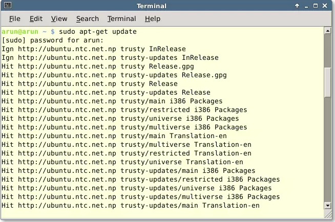
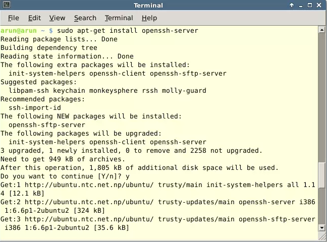
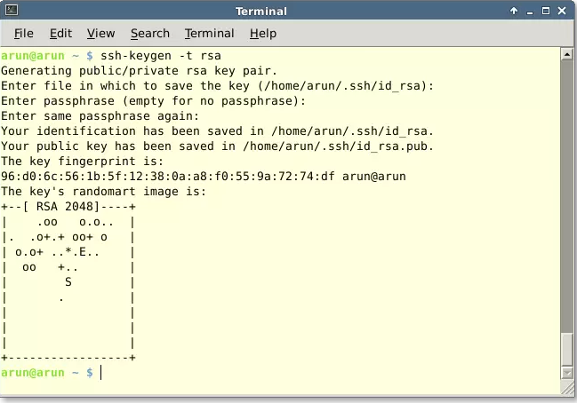

#SSH免密钥登录

##一 生产环境描述
正常情况下，我们需要连上SSH的控制台输入用户名及其密码才行。如果两者全部正确，我们就可以访问，反之访问被服务端拒绝。不过相比而言还有一种比用密码更安全的登录方式，我们可以在登录SSH时通过加密密钥进行无密码登录。

如果你想启用这个安全的方式，我们只需简单的禁用密码登录并只允许加密密钥登录即可。使用这种方式时，客户端计算机上会产生一对私钥和公钥。接着客户端得把公钥上传到SSH服务端的authorized_key文件中去。在授予访问前，服务器及客户端电脑会校验这个密钥对。如果服务器上的公钥与客服端提交的私钥匹配则授予访问权限，否则访问被拒绝。

这是认证到SSH服务器的非常安全的一种做法，如果你想为单一的SSH用户登录实现安全登录，这也是备受推崇的方式。这里快速的过一遍如何启用无密码登录SSH的配置过程。

###1 安装Openssh服务端
首先，我们需要更新我们的本地库索引。所以如下所见，我们需要先输入“apt-get update”

```
$ sudo apt-get update
```



现在我们可以通过以下命令安装openssh-server：

```
$ sudo apt-get install openssh-server
```


###2 开启openssh服务
在OpenSSH已经成功安装在Ubuntu14.04操作系统上了之后，我们要启动OpenSSH的服务。以下命令让你启动/开启服务。

```
$ sudo service ssh start
```

###3 配置密钥对
在我们安装并启动了OpenSSH服务以后。现在终于到了要我们搞定公私钥对的时候了，在终端中运行以下命令：

```
$ ssh-keygen -t rsa
```

在运行完以上命令了以后，我们需要回答一系列的问题。首先选择保存密钥的路径，按回车将会选择默认路径即家目录的一个隐藏的.ssh文件夹。下一个提示是请输入口令提醒。我个人将此留空（直接回车）。之后密钥对就会创建，大功告成。



在密钥对生成以后，我们需要将客户端上的公钥复制到SSH服务端或者主机，来创建对客户端的信任关系。运行以下命令复制客户端的公钥到服务端。

```
$ ssh-copy-id user@ip_address
```

在公钥上传之后，我们现在可以禁用通过密码登陆SSH的方式了。为此，我们需要通过以下命令用文本编辑器打开/etc/ssh/ssh_config。

```
$ sudo nano /etc/ssh/sshd_config
```

###4  重启SSH服务
最后，在我们配置完SSH服务端后，为了使改动生效我们需要重启SSH服务。在终端或控制台运行以下命令重启。

```
$ sudo service ssh restart
```

## SSH配置文件详解

```
# Site-wide defaults for various options
带“#”表示该句为注释不起作，该句不属于配置文件原文，意在说明下面选项均为系统初始默认的选项。说明一下，实际配置文件中也有很多选项前面加有“#”注释，虽然表示不起作用，其实是说明此为系统默认的初始化设置。
Host *
"Host"只对匹配后面字串的计算机有效，“*”表示所有的计算机。从该项格式前置一些可以看出，这是一个类似于全局的选项，表示下面缩进的选项都适用于该设置，可以指定某计算机替换*号使下面选项只针对该算机器生效。
ForwardAgent no
"ForwardAgent"设置连接是否经过验证代理（如果存在）转发给远程计算机。
ForwardX11 no
"ForwardX11"设置X11连接是否被自动重定向到安全的通道和显示集（DISPLAY set）。
RhostsAuthentication no
"RhostsAuthentication"设置是否使用基于rhosts的安全验证。
RhostsRSAAuthentication no
"RhostsRSAAuthentication"设置是否使用用RSA算法的基于rhosts的安全验证。
RSAAuthentication yes
"RSAAuthentication"设置是否使用RSA算法进行安全验证。
PasswordAuthentication yes
"PasswordAuthentication"设置是否使用口令验证。
FallBackToRsh no
"FallBackToRsh"设置如果用ssh连接出现错误是否自动使用rsh，由于rsh并不安全，所以此选项应当设置为"no"。
UseRsh no
"UseRsh"设置是否在这台计算机上使用"rlogin/rsh"，原因同上，设为"no"。
BatchMode no
"BatchMode"：批处理模式，一般设为"no"；如果设为"yes"，交互式输入口令的提示将被禁止，这个选项对脚本文件和批处理任务十分有用。
CheckHostIP yes
"CheckHostIP"设置ssh是否查看连接到服务器的主机的IP地址以防止DNS欺骗。建议设置为"yes"。
StrictHostKeyChecking no
"StrictHostKeyChecking"如果设为"yes"，ssh将不会自动把计算机的密匙加入"$HOME/.ssh/known_hosts"文件，且一旦计算机的密匙发生了变化，就拒绝连接。
IdentityFile ~/.ssh/identity
"IdentityFile"设置读取用户的RSA安全验证标识。
Port 22
"Port"设置连接到远程主机的端口，ssh默认端口为22。
Cipher blowfish
“Cipher”设置加密用的密钥，blowfish可以自己随意设置。
EscapeChar ~
“EscapeChar”设置escape字符。

Port 22
"Port"设置sshd监听的端口号。
ListenAddress 192.168.1.1
"ListenAddress”设置sshd服务器绑定的IP地址。
HostKey /etc/ssh/ssh_host_key
"HostKey”设置包含计算机私人密匙的文件。
ServerKeyBits 1024
"ServerKeyBits”定义服务器密匙的位数。
LoginGraceTime 600
"LoginGraceTime”设置如果用户不能成功登录，在切断连接之前服务器需要等待的时间（以秒为单位）。
KeyRegenerationInterval 3600
"KeyRegenerationInterval”设置在多少秒之后自动重新生成服务器的密匙（如果使用密匙）。重新生成密匙是为了防止用盗用的密匙解密被截获的信息。
PermitRootLogin no
"PermitRootLogin”设置是否允许root通过ssh登录。这个选项从安全角度来讲应设成"no"。
IgnoreRhosts yes
"IgnoreRhosts”设置验证的时候是否使用“rhosts”和“shosts”文件。
IgnoreUserKnownHosts yes
"IgnoreUserKnownHosts”设置ssh daemon是否在进行RhostsRSAAuthentication安全验证的时候忽略用户的"$HOME/.ssh/known_hosts”
StrictModes yes
"StrictModes”设置ssh在接收登录请求之前是否检查用户家目录和rhosts文件的权限和所有权。这通常是必要的，因为新手经常会把自己的目录和文件设成任何人都有写权限。
X11Forwarding no
"X11Forwarding”设置是否允许X11转发。
PrintMotd yes
"PrintMotd”设置sshd是否在用户登录的时候显示“/etc/motd”中的信息。
SyslogFacility AUTH
"SyslogFacility”设置在记录来自sshd的消息的时候，是否给出“facility code”。
LogLevel INFO
"LogLevel”设置记录sshd日志消息的层次。INFO是一个好的选择。查看sshd的man帮助页，已获取更多的信息。
RhostsAuthentication no
"RhostsAuthentication”设置只用rhosts或“/etc/hosts.equiv”进行安全验证是否已经足够了。
RhostsRSAAuthentication no
"RhostsRSA”设置是否允许用rhosts或“/etc/hosts.equiv”加上RSA进行安全验证。
RSAAuthentication yes
"RSAAuthentication”设置是否允许只有RSA安全验证。
PasswordAuthentication yes
"PasswordAuthentication”设置是否允许口令验证。
PermitEmptyPasswords no
"PermitEmptyPasswords”设置是否允许用口令为空的帐号登录。
AllowUsers admin
"AllowUsers”的后面可以跟任意的数量的用户名的匹配串，这些字符串用空格隔开。主机名可以是域名或IP地址。
```

## FAQ

###1、安装ssh

```
直接 sudo apt-get install openssh-server
```


###2、查看ssh运行状态 

```
ps -e | grep ssh
如果发现 sshd 和 ssh-agent 即表明 ssh服务基本运行正常
```

###3、生成公钥和私钥

```
ssh-keygen -t rsa -P ""
```

###4、将公钥追加到文件

```
cat ~/.ssh/id_rsa.pub >> ~/.ssh/authorized_keys
```

###5、测试ssh localhost

```
如果发现不用输入密码就可以登录那么 ssh无密码机制就算建立成功了。
```

###6、失败原因之一：.ssh及其下属子文件的权限问题：

```
首选.ssh目录权限是700， 两个dsa 和 rsa的 私钥权限是600，其余文件权限是644.
下面列出.ssh目录及子文件的权限表：
drwx------  2 hadoop hadoop 4096 2014-06-02 15:32 .
drwxr-xr-x 34 hadoop hadoop 4096 2014-06-02 15:06 ..
-rw-r--r--  1 hadoop hadoop 2252 2014-06-02 15:32 authorized_keys
-rw-------  1 hadoop hadoop  668 2014-06-02 15:11 id_dsa
-rw-r--r--  1 hadoop hadoop  615 2014-06-02 15:11 id_dsa.pub
-rw-------  1 hadoop hadoop 1675 2014-06-02 15:32 id_rsa
-rw-r--r--  1 hadoop hadoop  407 2014-06-02 15:32 id_rsa.pub
-rw-r--r--  1 hadoop hadoop  442 2014-06-02 15:08 known_hosts
```

7、.ssh的父目录的权限问题（我的问题就出现在这里）：

```
.ssh的父目录文件权限应该是755，即所属用户的 用户文件 （/home下属的一个用户文件）。
```

## FAQ2
StrictModes no #修改为no,默认为yes.如果不修改用key登陆是出现server refused our key(如果StrictModes为yes必需保证存放公钥的文件夹的拥有与登陆用户名是相同的.“StrictModes”设置ssh在接收登录请求之前是否检查用户家目录和rhosts文件的权限和所有权。这通常是必要的，因为新手经常会把自己的目录和文件设成任何人都有写权限。)（来源http://matt-u.iteye.com/blog/851158）