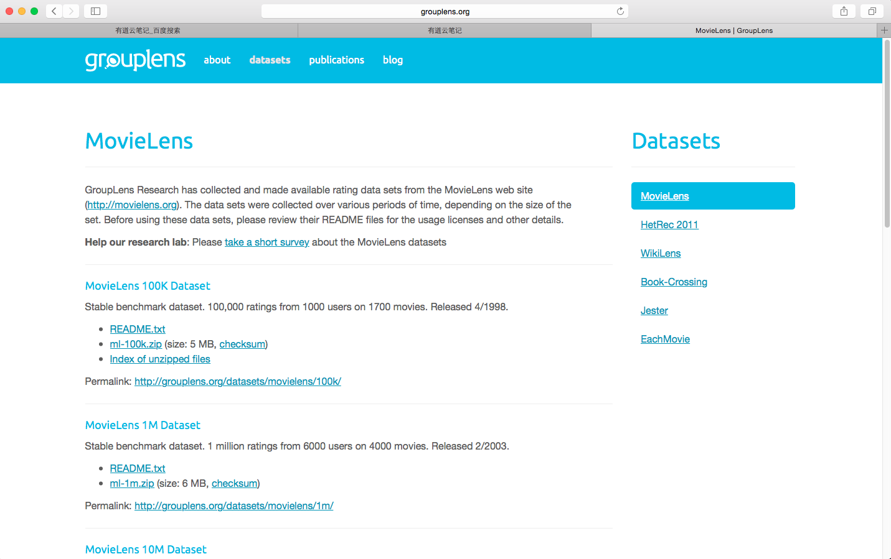

# Hive综合案例实战

## 一 数据源的准备工作

首先我们去一个网站下载相关的数据,之后通过hive导入进行实验.[http://grouplens.org/](http://grouplens.org/)



## 二 内部表

###1 创建内部表并载入数据

```
hadoop@hadoopmaster:~$ beeline -u jdbc:hive2://hadoopmaster:10000/

Beeline version 2.1.0 by Apache Hive
0: jdbc:hive2://hadoopmaster:10000/> show databases;
OK
+----------------+--+
| database_name  |
+----------------+--+
| default        |
| fincials       |
+----------------+--+
2 rows selected (1.038 seconds)
0: jdbc:hive2://hadoopmaster:10000/> use default;
OK
No rows affected (0.034 seconds)
0: jdbc:hive2://hadoopmaster:10000/> create table u_data (userid INT, movieid INT, rating INT, unixtime STRING) row format delimited fields terminated by '\t' lines terminated by '\n';
OK
No rows affected (0.242 seconds)
0: jdbc:hive2://hadoopmaster:10000/> LOAD DATA LOCAL INPATH '/home/hadoop/u.data' OVERWRITE INTO TABLE u_data;
Loading data to table default.u_data
OK
No rows affected (0.351 seconds)
0: jdbc:hive2://hadoopmaster:10000/> select * from u_data;
OK
+----------------+-----------------+----------------+------------------+--+
| u_data.userid  | u_data.movieid  | u_data.rating  | u_data.unixtime  |
+----------------+-----------------+----------------+------------------+--+
| 196            | 242             | 3              | 881250949        |
| 186            | 302             | 3              | 891717742        |
| 22             | 377             | 1              | 878887116        |
| 244            | 51              | 2              | 880606923        |
| 166            | 346             | 1              | 886397596        |
| 298            | 474             | 4              | 884182806        |
| 115            | 265             | 2              | 881171488        |
| 253            | 465             | 5              | 891628467        |
| 305            | 451             | 3              | 886324817        |
| 6              | 86              | 3              | 883603013        |
| 62             | 257             | 2              | 879372434        |
| 286            | 1014            | 5              | 879781125        |

```
### 2 查看占用的HDFS空间

```
hadoop@hadoopmaster:~$ hdfs dfs -ls /user/hive/warehouse/u_data
Found 1 items
-rwxrwxr-x   2 hadoop supergroup    1979173 2016-07-22 10:19 /user/hive/warehouse/u_data/u.data

```

### 3 写脚本反复导入100次

**先查看以前有多少行**

```
0: jdbc:hive2://hadoopmaster:10000/> select count(*) from u_data;
WARNING: Hive-on-MR is deprecated in Hive 2 and may not be available in the future versions. Consider using a different execution engine (i.e. tez, spark) or using Hive 1.X releases.
Query ID = hadoop_20160722102853_77aa1bc6-79c2-4916-9b07-a763d112ef41
Total jobs = 1
Launching Job 1 out of 1
Number of reduce tasks determined at compile time: 1
In order to change the average load for a reducer (in bytes):
  set hive.exec.reducers.bytes.per.reducer=<number>
In order to limit the maximum number of reducers:
  set hive.exec.reducers.max=<number>
In order to set a constant number of reducers:
  set mapreduce.job.reduces=<number>
Starting Job = job_1468978056881_0003, Tracking URL = http://hadoopmaster:8088/proxy/application_1468978056881_0003/
Kill Command = /usr/local/hadoop/bin/hadoop job  -kill job_1468978056881_0003
Hadoop job information for Stage-1: number of mappers: 1; number of reducers: 1
2016-07-22 10:28:58,786 Stage-1 map = 0%,  reduce = 0%
2016-07-22 10:29:03,890 Stage-1 map = 100%,  reduce = 0%, Cumulative CPU 0.89 sec
2016-07-22 10:29:10,005 Stage-1 map = 100%,  reduce = 100%, Cumulative CPU 1.71 sec
MapReduce Total cumulative CPU time: 1 seconds 710 msec
Ended Job = job_1468978056881_0003
MapReduce Jobs Launched: 
Stage-Stage-1: Map: 1  Reduce: 1   Cumulative CPU: 1.71 sec   HDFS Read: 1987050 HDFS Write: 106 SUCCESS
Total MapReduce CPU Time Spent: 1 seconds 710 msec
OK
WARNING: Hive-on-MR is deprecated in Hive 2 and may not be available in the future versions. Consider using a different execution engine (i.e. tez, spark) or using Hive 1.X releases.
+---------+--+
|   c0    |
+---------+--+
| 100000  |
+---------+--+
1 row selected (17.757 seconds)

hive用Mapreduce引擎计算真心在速度上不行,10W用了17秒,比关系型数据库差不少,还是要用Spark呀

```

**再我们需要了解如何用hive中的一次命令,我们可以这样用.**

```
hadoop@hadoopmaster:~$ hive -e "LOAD DATA LOCAL INPATH '/home/hadoop/u.data' INTO TABLE u_data;"

Loading data to table default.u_data
OK
Time taken: 1.239 seconds

```

**最后写脚本**

```
#!/bin/bash
for (( c=1; c<=10; c++ ))
do
         echo "正在写入第 $c 次数据..."
         hive -e "LOAD DATA LOCAL INPATH '/home/hadoop/u.data' INTO TABLE u_data;"
         wait
done


```

**插入完,检查查询成本**

```
0: jdbc:hive2://hadoopmaster:10000/> select count(*) from u_data;
WARNING: Hive-on-MR is deprecated in Hive 2 and may not be available in the future versions. Consider using a different execution engine (i.e. tez, spark) or using Hive 1.X releases.
Query ID = hadoop_20160722104633_18c3467d-9263-4785-8714-1570fc3bb9ae
Total jobs = 1
Launching Job 1 out of 1
Number of reduce tasks determined at compile time: 1
In order to change the average load for a reducer (in bytes):
  set hive.exec.reducers.bytes.per.reducer=<number>
In order to limit the maximum number of reducers:
  set hive.exec.reducers.max=<number>
In order to set a constant number of reducers:
  set mapreduce.job.reduces=<number>
Starting Job = job_1468978056881_0009, Tracking URL = http://hadoopmaster:8088/proxy/application_1468978056881_0009/
Kill Command = /usr/local/hadoop/bin/hadoop job  -kill job_1468978056881_0009
Hadoop job information for Stage-1: number of mappers: 1; number of reducers: 1
2016-07-22 10:46:39,037 Stage-1 map = 0%,  reduce = 0%
2016-07-22 10:46:46,190 Stage-1 map = 100%,  reduce = 0%, Cumulative CPU 1.82 sec
2016-07-22 10:46:52,310 Stage-1 map = 100%,  reduce = 100%, Cumulative CPU 2.67 sec
MapReduce Total cumulative CPU time: 2 seconds 670 msec
Ended Job = job_1468978056881_0009
MapReduce Jobs Launched: 
Stage-Stage-1: Map: 1  Reduce: 1   Cumulative CPU: 2.67 sec   HDFS Read: 77198770 HDFS Write: 107 SUCCESS
Total MapReduce CPU Time Spent: 2 seconds 670 msec
OK
WARNING: Hive-on-MR is deprecated in Hive 2 and may not be available in the future versions. Consider using a different execution engine (i.e. tez, spark) or using Hive 1.X releases.
+----------+--+
|    c0    |
+----------+--+
| 3900000  |
+----------+--+
1 row selected (20.173 seconds)

用了20秒,看起来Mapreduce的启动成本确实有点高了

hadoop@hadoopmaster:~$ hdfs dfs -ls /user/hive/warehouse/u_data
Found 39 items
-rwxrwxr-x   2 hadoop supergroup    1979173 2016-07-22 10:37 /user/hive/warehouse/u_data/u.data
-rwxrwxr-x   2 hadoop supergroup    1979173 2016-07-22 10:38 /user/hive/warehouse/u_data/u_copy_1.data
-rwxrwxr-x   2 hadoop supergroup    1979173 2016-07-22 10:40 /user/hive/warehouse/u_data/u_copy_10.data
-rwxrwxr-x   2 hadoop supergroup    1979173 2016-07-22 10:40 /user/hive/warehouse/u_data/u_copy_11.data
-rwxrwxr-x   2 hadoop supergroup    1979173 2016-07-22 10:41 /user/hive/warehouse/u_data/u_copy_12.data
-rwxrwxr-x   2 hadoop supergroup    1979173 2016-07-22 10:42 /user/hive/warehouse/u_data/u_copy_13.data
-rwxrwxr-x   2 hadoop supergroup    1979173 2016-07-22 10:42 /user/hive/warehouse/u_data/u_copy_14.data
-rwxrwxr-x   2 hadoop supergroup    1979173 2016-07-22 10:42 /user/hive/warehouse/u_data/u_copy_15.data
-rwxrwxr-x   2 hadoop supergroup    1979173 2016-07-22 10:42 /user/hive/warehouse/u_data/u_copy_16.data
-rwxrwxr-x   2 hadoop supergroup    1979173 2016-07-22 10:43 /user/hive/warehouse/u_data/u_copy_17.data
-rwxrwxr-x   2 hadoop supergroup    1979173 2016-07-22 10:43 /user/hive/warehouse/u_data/u_copy_18.data
-rwxrwxr-x   2 hadoop supergroup    1979173 2016-07-22 10:43 /user/hive/warehouse/u_data/u_copy_19.data
-rwxrwxr-x   2 hadoop supergroup    1979173 2016-07-22 10:39 /user/hive/warehouse/u_data/u_copy_2.data
-rwxrwxr-x   2 hadoop supergroup    1979173 2016-07-22 10:43 /user/hive/warehouse/u_data/u_copy_20.data
-rwxrwxr-x   2 hadoop supergroup    1979173 2016-07-22 10:43 /user/hive/warehouse/u_data/u_copy_21.data
-rwxrwxr-x   2 hadoop supergroup    1979173 2016-07-22 10:43 /user/hive/warehouse/u_data/u_copy_22.data
-rwxrwxr-x   2 hadoop supergroup    1979173 2016-07-22 10:43 /user/hive/warehouse/u_data/u_copy_23.data
-rwxrwxr-x   2 hadoop supergroup    1979173 2016-07-22 10:44 /user/hive/warehouse/u_data/u_copy_24.data
-rwxrwxr-x   2 hadoop supergroup    1979173 2016-07-22 10:44 /user/hive/warehouse/u_data/u_copy_25.data
-rwxrwxr-x   2 hadoop supergroup    1979173 2016-07-22 10:44 /user/hive/warehouse/u_data/u_copy_26.data
-rwxrwxr-x   2 hadoop supergroup    1979173 2016-07-22 10:44 /user/hive/warehouse/u_data/u_copy_27.data
-rwxrwxr-x   2 hadoop supergroup    1979173 2016-07-22 10:44 /user/hive/warehouse/u_data/u_copy_28.data
-rwxrwxr-x   2 hadoop supergroup    1979173 2016-07-22 10:44 /user/hive/warehouse/u_data/u_copy_29.data
-rwxrwxr-x   2 hadoop supergroup    1979173 2016-07-22 10:39 /user/hive/warehouse/u_data/u_copy_3.data
-rwxrwxr-x   2 hadoop supergroup    1979173 2016-07-22 10:45 /user/hive/warehouse/u_data/u_copy_30.data
-rwxrwxr-x   2 hadoop supergroup    1979173 2016-07-22 10:45 /user/hive/warehouse/u_data/u_copy_31.data
-rwxrwxr-x   2 hadoop supergroup    1979173 2016-07-22 10:45 /user/hive/warehouse/u_data/u_copy_32.data
-rwxrwxr-x   2 hadoop supergroup    1979173 2016-07-22 10:45 /user/hive/warehouse/u_data/u_copy_33.data
-rwxrwxr-x   2 hadoop supergroup    1979173 2016-07-22 10:45 /user/hive/warehouse/u_data/u_copy_34.data
-rwxrwxr-x   2 hadoop supergroup    1979173 2016-07-22 10:45 /user/hive/warehouse/u_data/u_copy_35.data
-rwxrwxr-x   2 hadoop supergroup    1979173 2016-07-22 10:45 /user/hive/warehouse/u_data/u_copy_36.data
-rwxrwxr-x   2 hadoop supergroup    1979173 2016-07-22 10:46 /user/hive/warehouse/u_data/u_copy_37.data
-rwxrwxr-x   2 hadoop supergroup    1979173 2016-07-22 10:46 /user/hive/warehouse/u_data/u_copy_38.data
-rwxrwxr-x   2 hadoop supergroup    1979173 2016-07-22 10:39 /user/hive/warehouse/u_data/u_copy_4.data
-rwxrwxr-x   2 hadoop supergroup    1979173 2016-07-22 10:39 /user/hive/warehouse/u_data/u_copy_5.data
-rwxrwxr-x   2 hadoop supergroup    1979173 2016-07-22 10:39 /user/hive/warehouse/u_data/u_copy_6.data
-rwxrwxr-x   2 hadoop supergroup    1979173 2016-07-22 10:39 /user/hive/warehouse/u_data/u_copy_7.data
-rwxrwxr-x   2 hadoop supergroup    1979173 2016-07-22 10:39 /user/hive/warehouse/u_data/u_copy_8.data
-rwxrwxr-x   2 hadoop supergroup    1979173 2016-07-22 10:40 /user/hive/warehouse/u_data/u_copy_9.data

```

## 三 外部表

###1 创建外部表并载入数据

```
0: jdbc:hive2://hadoopmaster:10000/> create external table  u_data_external_table  (userid INT, movieid INT, rating INT, unixtime STRING) row format delimited fields terminated by '\t' lines terminated by '\n';
OK
No rows affected (0.047 seconds)

0: jdbc:hive2://hadoopmaster:10000/> show tables;
OK
+------------------------+--+
|        tab_name        |
+------------------------+--+
| employees              |
| t_hive                 |
| t_hive2                |
| u_data                 |
| u_data_external_table  |
+------------------------+--+
5 rows selected (0.036 seconds)

```

### 2 导入数据

```
hive -e "LOAD DATA LOCAL INPATH '/home/hadoop/u.data' INTO TABLE u_data;"

```

### 3 内部表与外部表区别

```
我用drop table 命令删除刚才创建的二张表,一个内表一个外表之后结果是.

hadoop@hadoopmaster:~$ hdfs dfs -ls /user/hive/warehouse/
Found 5 items
drwxrwxr-x   - hadoop supergroup          0 2016-07-20 17:25 /user/hive/warehouse/employees
drwxrwxr-x   - hadoop supergroup          0 2016-07-21 15:52 /user/hive/warehouse/fincials.db
drwxrwxr-x   - hadoop supergroup          0 2016-07-20 09:50 /user/hive/warehouse/t_hive
drwxrwxr-x   - hadoop supergroup          0 2016-07-20 09:54 /user/hive/warehouse/t_hive2
drwxrwxr-x   - hadoop supergroup          0 2016-07-22 11:04 /user/hive/warehouse/u_data_external_table

内表的数据完全删除,而外表还有

```

最后归纳一下Hive中表与外部表的区别：

+ 在导入数据到外部表，数据并没有移动到自己的数据仓库目录下，也就是说外部表中的数据并不是由它自己来管理的！而表则不一样；
+ 在删除表的时候，Hive将会把属于表的元数据和数据全部删掉；而删除外部表的时候，Hive仅仅删除外部表的元数据，数据是不会删除的！
那么，应该如何选择使用哪种表呢？在大多数情况没有太多的区别，因此选择只是个人喜好的问题。但是作为一个经验，如果所有处理都需要由Hive完成，那么你应该创建表，否则使用外部表！

## 四 分区表

```
0: jdbc:hive2://hadoopmaster:10000/> create table  u_data_partitioned_table  (userid INT, movieid INT, rating INT, unixtime STRING) partitioned by(day int) row format delimited fields terminated by '\t' lines terminated by '\n';
OK
No rows affected (0.256 seconds)
0: jdbc:hive2://hadoopmaster:10000/> 

0: jdbc:hive2://hadoopmaster:10000/> LOAD DATA LOCAL INPATH '/home/hadoop/u.data' INTO TABLE u_data_partitioned_table partition(day=20160101);
Loading data to table default.u_data_partitioned_table partition (day=20160101)
OK
No rows affected (0.424 seconds)
0: jdbc:hive2://hadoopmaster:10000/> 

100,000 rows selected (4.653 seconds)
0: jdbc:hive2://hadoopmaster:10000/> LOAD DATA LOCAL INPATH '/home/hadoop/u.data' INTO TABLE u_data_partitioned_table partition(day=20160101);
Loading data to table default.u_data_partitioned_table partition (day=20160101)
OK
No rows affected (0.424 seconds)
0: jdbc:hive2://hadoopmaster:10000/> LOAD DATA LOCAL INPATH '/home/hadoop/u.data' INTO TABLE u_data_partitioned_table partition(day=20160102);
Loading data to table default.u_data_partitioned_table partition (day=20160102)
OK
No rows affected (0.499 seconds)
0: jdbc:hive2://hadoopmaster:10000/> 

hadoop@hadoopmaster:~$ hdfs dfs -ls /user/hive/warehouse/u_data_partitioned_table
Found 2 items
drwxrwxr-x   - hadoop supergroup          0 2016-07-22 13:51 /user/hive/warehouse/u_data_partitioned_table/day=20160101
drwxrwxr-x   - hadoop supergroup          0 2016-07-22 13:51 /user/hive/warehouse/u_data_partitioned_table/day=20160102


```

## 五 分桶表

```
0: jdbc:hive2://hadoopmaster:10000/> CREATE TABLE bucketed_data_user (userid INT, movieid INT, rating INT, unixtime STRING) CLUSTERED BY (userid) INTO 4 BUCKETS row format delimited fields terminated by '\t' lines terminated by '\n';
OK
No rows affected (0.045 seconds)
0: jdbc:hive2://hadoopmaster:10000/> 

0: jdbc:hive2://hadoopmaster:10000/> insert overwrite table bucketed_data_user select userid,movieid,rating,unixtime from u_data_partitioned_table;
WARNING: Hive-on-MR is deprecated in Hive 2 and may not be available in the future versions. Consider using a different execution engine (i.e. tez, spark) or using Hive 1.X releases.
Query ID = hadoop_20160722140142_c272bc07-b74d-4b5b-9689-0bec2ce71780
Total jobs = 1
Launching Job 1 out of 1
Number of reduce tasks determined at compile time: 4
In order to change the average load for a reducer (in bytes):
  set hive.exec.reducers.bytes.per.reducer=<number>
In order to limit the maximum number of reducers:
  set hive.exec.reducers.max=<number>
In order to set a constant number of reducers:
  set mapreduce.job.reduces=<number>
Starting Job = job_1468978056881_0010, Tracking URL = http://hadoopmaster:8088/proxy/application_1468978056881_0010/
Kill Command = /usr/local/hadoop/bin/hadoop job  -kill job_1468978056881_0010
Hadoop job information for Stage-1: number of mappers: 1; number of reducers: 4
2016-07-22 14:01:48,774 Stage-1 map = 0%,  reduce = 0%
2016-07-22 14:01:55,978 Stage-1 map = 100%,  reduce = 0%, Cumulative CPU 1.89 sec
2016-07-22 14:02:06,236 Stage-1 map = 100%,  reduce = 50%, Cumulative CPU 5.66 sec
2016-07-22 14:02:07,272 Stage-1 map = 100%,  reduce = 100%, Cumulative CPU 9.43 sec
MapReduce Total cumulative CPU time: 9 seconds 430 msec
Ended Job = job_1468978056881_0010
Loading data to table default.bucketed_data_user
MapReduce Jobs Launched: 
Stage-Stage-1: Map: 1  Reduce: 4   Cumulative CPU: 9.43 sec   HDFS Read: 5959693 HDFS Write: 5937879 SUCCESS
Total MapReduce CPU Time Spent: 9 seconds 430 msec
OK
WARNING: Hive-on-MR is deprecated in Hive 2 and may not be available in the future versions. Consider using a different execution engine (i.e. tez, spark) or using Hive 1.X releases.
No rows affected (26.251 seconds)
0: jdbc:hive2://hadoopmaster:10000/> 

0: jdbc:hive2://hadoopmaster:10000/> select count(*) from bucketed_data_user ;
WARNING: Hive-on-MR is deprecated in Hive 2 and may not be available in the future versions. Consider using a different execution engine (i.e. tez, spark) or using Hive 1.X releases.
Query ID = hadoop_20160722141056_eaf582be-4107-403a-bacd-0a18f567f576
Total jobs = 1
Launching Job 1 out of 1
Number of reduce tasks determined at compile time: 1
In order to change the average load for a reducer (in bytes):
  set hive.exec.reducers.bytes.per.reducer=<number>
In order to limit the maximum number of reducers:
  set hive.exec.reducers.max=<number>
In order to set a constant number of reducers:
  set mapreduce.job.reduces=<number>
Starting Job = job_1468978056881_0012, Tracking URL = http://hadoopmaster:8088/proxy/application_1468978056881_0012/
Kill Command = /usr/local/hadoop/bin/hadoop job  -kill job_1468978056881_0012
Hadoop job information for Stage-1: number of mappers: 1; number of reducers: 1
2016-07-22 14:11:04,156 Stage-1 map = 0%,  reduce = 0%
2016-07-22 14:11:09,331 Stage-1 map = 100%,  reduce = 0%, Cumulative CPU 0.94 sec
2016-07-22 14:11:15,488 Stage-1 map = 100%,  reduce = 100%, Cumulative CPU 1.78 sec
MapReduce Total cumulative CPU time: 1 seconds 780 msec
Ended Job = job_1468978056881_0012
MapReduce Jobs Launched: 
Stage-Stage-1: Map: 1  Reduce: 1   Cumulative CPU: 1.78 sec   HDFS Read: 5945855 HDFS Write: 106 SUCCESS
Total MapReduce CPU Time Spent: 1 seconds 780 msec
OK
WARNING: Hive-on-MR is deprecated in Hive 2 and may not be available in the future versions. Consider using a different execution engine (i.e. tez, spark) or using Hive 1.X releases.
+---------+--+
|   c0    |
+---------+--+
| 300000  |
+---------+--+
1 row selected (20.397 seconds)
0: jdbc:hive2://hadoopmaster:10000/> 

hadoop@hadoopmaster:~$ hdfs dfs -ls /user/hive/warehouse/bucketed_data_user
Found 4 items
-rwxrwxr-x   2 hadoop supergroup    1400994 2016-07-22 14:02 /user/hive/warehouse/bucketed_data_user/000000_0
-rwxrwxr-x   2 hadoop supergroup    1493856 2016-07-22 14:02 /user/hive/warehouse/bucketed_data_user/000001_0
-rwxrwxr-x   2 hadoop supergroup    1566738 2016-07-22 14:02 /user/hive/warehouse/bucketed_data_user/000002_0
-rwxrwxr-x   2 hadoop supergroup    1475931 2016-07-22 14:02 /user/hive/warehouse/bucketed_data_user/000003_0

```
