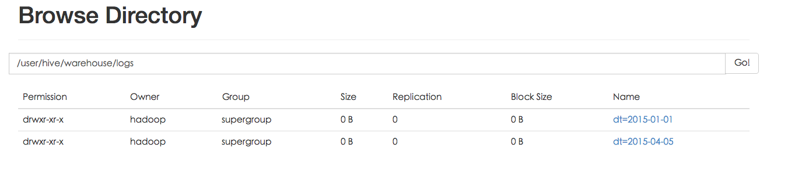
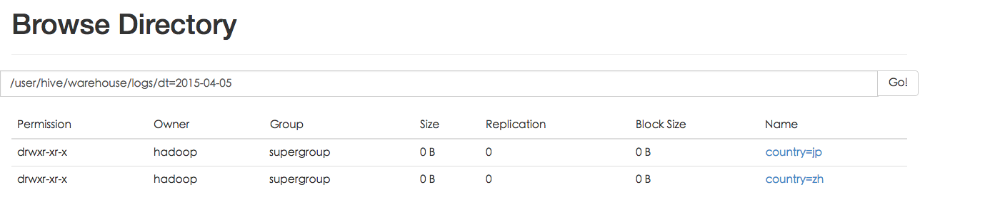

# Hive的存储架构与HQL语法
##一 概述

当然，Hive和传统的关系型数据库有很大的区别，Hive将外部的任务解析成一个MapReduce可执行计划，而启动MapReduce是一个高延迟的一件事，每次提交任务和执行任务都需要消耗很多时间，这也就决定Hive只能处理一些高延迟的应用（如果你想处理低延迟的应用，你可以去考虑一下Hbase）。

同时，由于设计的目标不一样，Hive目前还不支持事务；不能对表数据进行修改（不能更新、删除、插入；只能通过文件追加数据、重新导入数据）；不能对列建立索引（但是Hive支持索引的建立，但是不能提高Hive的查询速度。如果你想提高Hive的查询速度，请学习Hive的分区、桶的应用）。


### 1主要分为以下几个部分：

* 用户接口主要有三个：CLI，Client 和 WUI。其中最常用的是CLI，Cli启动的时候，会同时启动一个Hive副本。Client是Hive的客户端，用户连接至Hive Server。在启动 Client模式的时候，需要指出Hive Server所在节点，并且在该节点启动Hive Server。 WUI是通过浏览器访问Hive。
* Hive将元数据存储在数据库中，如mysql、derby。Hive中的元数据包括表的名字，表的列和分区及其属性，表的属性（是否为外部表等），表的数据所在目录等。
* 解释器、编译器、优化器完成HQL查询语句从词法分析、语法分析、编译、优化以及查询计划的生成。生成的查询计划存储在HDFS中，并在随后有MapReduce调用执行。
* Hive的数据存储在HDFS中，大部分的查询、计算由MapReduce完成（包含*的查询，比如select * from tbl不会生成MapRedcue任务）。

### 2 元数据存储模式
Hive中的元数据包括表的名字，表的列和分区及其属性，表的属性（是否为外部表等），表的数据所在目录等。由于Hive的元数据需要不断的更新、修改，而HDFS系统中的文件是多读少改的，这显然不能将Hive的元数据存储在HDFS中。目前Hive将元数据存储在数据库中，如Mysql、Derby中。我们可以通过以下的配置来修改Hive元数据的存储方式：配置mysql访问地址，用户名及密码

```
<property>
  <name>javax.jdo.option.ConnectionURL</name>
  <value>jdbc:mysql://192.168.1.178:3306/hive?createDatabaseIfNotExist=true</value>
  <description>JDBC connect string for a JDBC metastore</description>
</property>
<property>
  <name>javax.jdo.option.ConnectionDriverName</name>
  <value>com.mysql.jdbc.Driver</value>
  <description>Driver class name for a JDBC metastore</description>
</property>
<property>
  <name>javax.jdo.option.ConnectionUserName</name>
  <value>hive</value>
  <description>username to use against metastore database</description>
</property>
<property>
  <name>javax.jdo.option.ConnectionPassword</name>
  <value>hive</value>
  <description>password to use against metastore database</description>
</property>
```

**hive会把所有的源数据存储在mysql上**

```
chu888chu888@ubuntu-mysql:~$ mysql -u root -p
Enter password: 
Welcome to the MySQL monitor.  Commands end with ; or \g.
Your MySQL connection id is 60
Server version: 5.5.44-0ubuntu0.14.04.1 (Ubuntu)

Copyright (c) 2000, 2015, Oracle and/or its affiliates. All rights reserved.

Oracle is a registered trademark of Oracle Corporation and/or its
affiliates. Other names may be trademarks of their respective
owners.

Type 'help;' or '\h' for help. Type '\c' to clear the current input statement.

mysql> show databases;
+--------------------+
| Database           |
+--------------------+
| information_schema |
| hive               |
| hive_hadoop        |
| hivetestdb         |
| mysql              |
| performance_schema |
+--------------------+
6 rows in set (0.03 sec)

mysql> use hive;
Reading table information for completion of table and column names
You can turn off this feature to get a quicker startup with -A

Database changed
mysql> show tables;
+---------------------------+
| Tables_in_hive            |
+---------------------------+
| BUCKETING_COLS            |
| CDS                       |
| COLUMNS_V2                |
| DATABASE_PARAMS           |
| DBS                       |
| FUNCS                     |
| FUNC_RU                   |
| GLOBAL_PRIVS              |
| PARTITIONS                |
| PARTITION_KEYS            |
| PARTITION_KEY_VALS        |
| PARTITION_PARAMS          |
| PART_COL_STATS            |
| ROLES                     |
| SDS                       |
| SD_PARAMS                 |
| SEQUENCE_TABLE            |
| SERDES                    |
| SERDE_PARAMS              |
| SKEWED_COL_NAMES          |
| SKEWED_COL_VALUE_LOC_MAP  |
| SKEWED_STRING_LIST        |
| SKEWED_STRING_LIST_VALUES |
| SKEWED_VALUES             |
| SORT_COLS                 |
| TABLE_PARAMS              |
| TAB_COL_STATS             |
| TBLS                      |
| VERSION                   |
+---------------------------+
29 rows in set (0.00 sec)

mysql> 

```

##二 数据存储

首先，Hive 没有专门的数据存储格式，也没有为数据建立索引，用户可以非常自由的组织 Hive 中的表，只需要在创建表的时候告诉 Hive 数据中的列分隔符和行分隔符，Hive 就可以解析数据。
Hive中所有的数据都存储在HDFS中，存储结构主要包括数据库、文件、表和视图。 默认路径在HDFS的/user/hive/warehouse目录下Hive中包含以下数据模型：Table内部表，External Table外部表，Partition分区，Bucket桶。Hive默认可以直接加载文本文件，还支持sequence file 、RCFile。其次，Hive 中所有的数据都存储在 HDFS 中，Hive 中包含以下数据模型：Table，External Table，Partition，Bucket。

### 1）Hive数据库

Hive中的数据库的概念本质上仅仅是表的一个目录或者命名空间.然而,对于具有很多组和用户的大集群来说,这是非常有用的,因为这样可以避免命名冲突.通常会使用数据库来将生产表组织成逻辑组.

如果用户没有显式指定数据库,那么将会使用默认的数据库default.

```
简单示例命令行 
hive > create database test_database;
hive> show databases;
OK
default
test_database
```

如果数据库finacials已经存在的话,那么将会抛出一个错误信息,使用如下语句可以避免在这种情况下抛出错误信息:

```
0: jdbc:hive2://localhost:10000/default> create database if not exists fincials;
```
如果数据库非常多的话,那么可以使用正则表达式匹配来筛选出需要的数据库表名

```
0: jdbc:hive2://localhost:10000/default> show databases like 'd.*';
OK
+----------------+--+
| database_name  |
+----------------+--+
| default        |
+----------------+--+
1 row selected (0.052 seconds)

```
Hive会为每个数据创建一个目录,数据库中的表将会以这个数据库目录的子目录形式存储.有一个例外就是default数据库中的表,因为这个数据库本身没有自已的目录.当我们创建数据库financials时,Hive将会对应地创建一个目录/user/hive/warehouse/financials.db.这里请注意,数据库的文件目录名是以.db结尾的.

```
hadoop@hadoopmaster:~$ hdfs dfs -ls /user/hive/warehouse
Found 4 items
drwxrwxr-x   - hadoop supergroup          0 2016-07-20 17:25 /user/hive/warehouse/employees
drwxrwxr-x   - hadoop supergroup          0 2016-07-21 12:53 /user/hive/warehouse/fincials.db
drwxrwxr-x   - hadoop supergroup          0 2016-07-20 09:50 /user/hive/warehouse/t_hive
drwxrwxr-x   - hadoop supergroup          0 2016-07-20 09:54 /user/hive/warehouse/t_hive2
```

用户可以通过如下命令来修改这个默认的位置

```
0: jdbc:hive2://localhost:10000/default> create database financials2
. . . . . . . . . . . . . . . . . . . .> location '/user/hive/warehouse/fincials2.db';
OK
No rows affected (0.053 seconds)

```
基本的数据库操作

```
0: jdbc:hive2://localhost:10000/default> show databases;
OK
+----------------+--+
| database_name  |
+----------------+--+
| default        |
| financials2    |
| fincials       |
+----------------+--+
3 rows selected (0.029 seconds)
0: jdbc:hive2://localhost:10000/default> use fincials;
OK
No rows affected (0.041 seconds)
0: jdbc:hive2://localhost:10000/default> drop database if exists financials2;
OK
No rows affected (0.238 seconds)
0: jdbc:hive2://localhost:10000/default> 

```

### 2）内部表
Hive的内部表与数据库中的Table在概念上是类似。每一个Table在Hive中都有一个相应的目录存储数据。

例如一个表pvs，它在HDFS中的路径为/warehouse/pvs，其中wh是在hive-site.xml中由${hive.metastore.warehouse.dir} 指定的数据仓库的目录，所有的Table数据（不包括External Table）都保存在这个目录中。删除表时，元数据与数据都会被删除。

内部表简单示例：


```
hive> create table  test_inner_table (user_id int, cid string, ckid string, username string) row format delimited fields terminated by '\t' lines terminated by '\n';
```

导入数据表的数据格式是：字段之间是tab键分割，行之间是断行。
及要我们的文件内容格式：

```
100636 100890 c5c86f4cddc15eb7 yyyvybtvt
100612 100865 97cc70d411c18b6f gyvcycy
100078 100087 ecd6026a15ffddf5 qa000100
```

首先在/tmp/目录下面建一个文件load.txt

```
sudo nano load.txt
hive> load data local inpath '/tmp/load.txt' into table test_inner_table;
hive> select * from test_inner_table;
hive> select count(*) from test_inner_table;
```
Hive 中的 Table 和数据库中的 Table 在概念上是类似的，每一个 Table 在 Hive 中都有一个相应的目录存储数据。例如，一个表 pvs，它在 HDFS 中的路径为：/warehouse/pvs，其中，warehouse 是在 hive-site.xml 中由 ${hive.metastore.warehouse.dir} 指定的数据仓库的目录，所有的 Table 数据（不包括 External Table）都保存在这个目录中。

###3）外部表

外部表指向已经在HDFS中存在的数据，可以创建Partition。它和内部表在元数据的组织上是相同的，而实际数据的存储则有较大的差异。

内部表的创建过程和数据加载过程这两个过程可以分别独立完成，也可以在同一个语句中完成，在加载数据的过程中，实际数据会被移动到数据仓库目录中；之后对数据对访问将会直接在数据仓库目录中完成。删除表时，表中的数据和元数据将会被同时删除。而外部表只有一个过程，加载数据和创建表同时完成（CREATE EXTERNAL TABLE ……LOCATION），实际数据是存储在LOCATION后面指定的 HDFS 路径中，并不会移动到数据仓库目录中。当删除一个External Table时，仅删除该链接。

外部表简单示例：

```
hive> create external table  test_external_table (user_id int, cid string, ckid string, username string) row format delimited fields terminated by '\t' lines terminated by '\n';
```

导入数据表的数据格式是：字段之间是tab键分割，行之间是断行。
及要我们的文件内容格式：

```
100636 100890 c5c86f4cddc15eb7 yyyvybtvt
100612 100865 97cc70d411c18b6f gyvcycy
100078 100087 ecd6026a15ffddf5 qa000100
```

首先在/tmp/目录下面建一个文件load.txt

```
sudo nano load.txt
hive> load data local inpath '/tmp/load.txt' into table test_external_table;
hive> select * from test_external_table;
hive> select count(*) from test_external_table;
```

###4）分区表

数据分区的概念存在已久.其可以有多种形式,但是通常使用分区来水平分散压力,将数据从物理上转移到和使用最频繁的用户更近的地方,以及实现其他目的.

Hive中有分区表的概念.我们可以看到分区表具有重要的性能优势,而且分区表还可以将数据以一种符合逻辑的方式进行组织,比如分层存储.


Partition对应于数据库中的Partition列的密集索引，但是Hive中Partition的组织方式和数据库中的很不相同。在Hive中，表中的一个Partition对应于表下的一个目录，所有的Partition的数据都存储在对应的目录中。

例如logs表中包含ds和city两个Partition，则对应于ds = 20090801, ctry = US 的HDFS子目录为/wh/pvs/ds=20090801/ctry=US；对应于 ds = 20090801, ctry = CA 的HDFS子目录为/wh/pvs/ds=20090801/ctry=CA。

分区表简单示例：

```
hive> create table logs(ts bigint,line string) partitioned by(dt string,country string) row format delimited fields terminated by '$' lines terminated by '\n';

data.txt内容:
hadoop@hadoopmaster:/tmp$ more data1.txt
1$1
2$3
3$4

加载数据：
hive> load data local inpath '/tmp/data.txt' into table logs partition(dt='2015-01-01',country='zh');
hive> load data local inpath '/tmp/data.txt' into table logs partition(dt='2015-04-05',country='jp');
hive> load data local inpath '/tmp/data.txt' into table logs partition(dt='2015-04-05',country='zh');


查看数据：
0: jdbc:hive2://localhost:10000/default> select * from logs;
OK
+----------+------------+-------------+---------------+--+
| logs.ts  | logs.line  |   logs.dt   | logs.country  |
+----------+------------+-------------+---------------+--+
| 1        | 1          | 2015-04-05  | jp            |
| 2        | 3          | 2015-04-05  | jp            |
| 3        | 4          | 2015-04-05  | jp            |
| NULL     | NULL       | 2015-04-05  | jp            |
| 1        | 1          | 2015-04-08  | cn            |
| 2        | 3          | 2015-04-08  | cn            |
| 3        | 4          | 2015-04-08  | cn            |
| NULL     | NULL       | 2015-04-08  | cn            |
+----------+------------+-------------+---------------+--+
8 rows selected (0.091 seconds)


```
Partition 对应于数据库中的 Partition 列的密集索引，但是 Hive 中 Partition 的组织方式和数据库中的很不相同。在 Hive 中，表中的一个 Partition 对应于表下的一个目录，所有的 Partition 的数据都存储在对应的目录中。

例如：pvs 表中包含 ds 和 city 两个 Partition，则对应于 ds = 20090801, ctry = US 的 HDFS 子目录为：/wh/pvs/ds=20090801/ctry=US；对应于 ds = 20090801, ctry = CA 的 HDFS 子目录为；/wh/pvs/ds=20090801/ctry=CA,我们看一下物理存储的结构





###6) 外部分区表

外部表同样可以使用分区.事实上,用户可能会发现,这是管理大型生产型数据最常见的情况.这种结合给用户提供了一个可以和其他工具共享数据的方式,同时也可以优化查询性能.

因为用户可以自已定义目录结构,因此用户对于目录结构的使用具有更多的灵活性.

我们来举一个新例子,非常适合这种场景,即日志文件分析.对于日志文件信息,大多数的组织使用一种标准的格式,其中记录有时间戳,严重程度,也许还包含有服务器名称和进程ID,然后跟着一个可以为任何内容的文本信息.

```
create external table if not exists log_messages
(
	hms	INT,
	serverity STRING,
	server 	STRING,
	process_id INT,
	message	STRING
) partitioned by (year int,month int ,day int)
row format delimited fields terminated by '\t';

alter table log_message add partition(year=2012,month=1,day=2)
location 'hdfs://hadoopmaster/data/log/log_message/2012/01/02'

show partitions log_messages;
describe extended log_messages;

```

###5）桶
Buckets是将表的列通过Hash算法进一步分解成不同的文件存储。它对指定列计算hash，根据hash值切分数据，目的是为了并行，每一个Bucket对应一个文件。例如将user列分散至32个bucket，首先对user列的值计算hash，对应hash值为0的HDFS目录为/wh/pvs/ds=20090801/ctry=US/part-00000；hash值为20的HDFS目录为/wh/pvs/ds=20090801/ctry=US/part-00020。如果想应用很多的Map任务这样是不错的选择。


```
桶的简单示例：
创建数据文件：test_bucket_table.txt
创建表：按id划分4个桶
hive> CREATE TABLE bucketed_user (id INT, name STRING) CLUSTERED BY (id) INTO 4 BUCKETS row format delimited fields terminated by '\t' lines terminated by '\n';

加载数据：insert overwrite table bucketed_user select * from users;
查看数据：select * from bucket_user; set hive.enforce.bucketing = true;
```

Buckets 对指定列计算 hash，根据 hash 值切分数据，目的是为了并行，每一个 Bucket 对应一个文件。

将 user 列分散至 32 个 bucket，首先对 user 列的值计算 hash，对应 hash 值为 0 的 HDFS 目录为：/wh/pvs/ds=20090801/ctry=US/part-00000；hash 值为 20 的 HDFS 目录为：/wh/pvs/ds=20090801/ctry=US/part-00020


##四 HQL DDL语法

###1 前言
Hive 是基于Hadoop 构建的一套数据仓库分析系统，它提供了丰富的SQL查询方式来分析存储在Hadoop 分布式文件系统中的数据，

可以将结构化的数据文件映射为一张数据库表，并提供完整的SQL查询功能，可以将SQL语句转换为MapReduce任务进行运行，通过自己的SQL 去查询分析需要的内容，这套SQL 简称Hive SQL，使不熟悉mapreduce 的用户很方便的利用SQL 语言查询，汇总，分析数据。

而mapreduce开发人员可以把己写的mapper 和reducer 作为插件来支持Hive 做更复杂的数据分析。
它与关系型数据库的SQL 略有不同，但支持了绝大多数的语句如DDL、DML 以及常见的聚合函数、连接查询、条件查询。

HIVE不适合用于联机（online)事务处理，也不提供实时查询功能。它最适合应用在基于大量不可变数据的批处理作业。HIVE的特点：可伸缩（在Hadoop的集群上动态的添加设备），可扩展，容错，输入格式的松散耦合。

###2 DDL操作
* 建表
* 删除表
* 修改表结构
* 创建/删除视图
* 显示命令

####建表
1.建立一个简单的表


`hive> CREATE TABLE pokes (foo INT, bar STRING);`


2.创建表并创建索引字段ds


`hive> CREATE TABLE invites (foo INT, bar STRING) PARTITIONED BY (ds STRING);`


3.复制一个空表


`hive> CREATE TABLE empty_key_value_store LIKE testuser;`


4.建立一个需要导入数据的表

```
hive> create table  user_info (user_id int, cid string, ckid string, username string) row format delimited fields terminated by '\t' lines terminated by '\n';

导入数据表的数据格式是：字段之间是tab键分割，行之间是断行。
及要我们的文件内容格式：
100636 100890 c5c86f4cddc15eb7 yyyvybtvt
100612 100865 97cc70d411c18b6f gyvcycy
100078 100087 ecd6026a15ffddf5 qa000100

首先在/tmp/目录下面建一个文件load.txt
#sudo nano load.txt
hive> load data local inpath '/tmp/load.txt' into table user_info;
hive> select * from user_info;

```

5 显示所有表

`hive> show tables;`

6 按正则表达式显示表

`hive> show tables '.*s';`

7 给表增加一列

```
hive> ALTER TABLE pokes ADD COLUMNS (new_col INT);
OK
Time taken: 0.238 seconds
hive> desc pokes;
OK
foo                 	int                 	                    
bar                 	string              	                    
new_col             	int                 	                    
Time taken: 0.275 seconds, Fetched: 3 row(s)

```

8 给表添加一列并添加字段解析

```
hive> ALTER TABLE invites ADD COLUMNS (new_col2 INT COMMENT 'a comment');
OK
Time taken: 0.151 seconds
hive> desc invites;
OK
foo                 	int                 	                    
bar                 	string              	                    
new_col2            	int                 	a comment           
ds                  	string              	                    
	 	 
# Partition Information	 	 
# col_name            	data_type           	comment             
	 	 
ds                  	string              	                    
Time taken: 0.163 seconds, Fetched: 9 row(s)

```
9 更改表名字

```
hive> ALTER TABLE invites RENAME TO 3koobecaf;
OK
Time taken: 0.189 seconds
hive> show tables;
OK
3koobecaf
empty_key_value_store
pokes
testuser
user_info
Time taken: 0.045 seconds, Fetched: 5 row(s)

```

10 删除表


`hive> hive> DROP TABLE pokes;`


11 创建数据库


`hive> CREATE DATABASE chu888chu888;`


##五 DML DQL操作

hive不支持用insert语句一条一条的进行插入操作，也不支持update操作。数据是以load的方式加载到建立好的表中。数据一旦导入就不可以修改。

###1 DML包括：

* INSERT插入、UPDATE更新、DELETE删除
* 向数据表内加载文件
* 将查询结果插入到Hive表中
* 0.8新特性 insert into

向数据表内加载文件

* 相对路径，例如：project/data1
* 绝对路径，例如： /user/hive/project/data1
* 包含模式的完整 URI，例如：hdfs://namenode:9000/user/hive/project/data1

例如：
hive> LOAD DATA LOCAL INPATH './examples/files/kv1.txt' OVERWRITE INTO TABLE pokes;

###2 DQL操作

####基本的Select 操作

* 使用ALL和DISTINCT选项区分对重复记录的处理。默认是ALL，表示查询所有记录。DISTINCT表示去掉重复的记录
* Where 条件
* 类似我们传统SQL的where 条件
* 目前支持 AND,OR ,0.9版本支持between
* IN, NOT IN
* 不支持EXIST ,NOT EXIST

####ORDER BY与SORT BY的不同
* ORDER BY 全局排序，只有一个Reduce任务
* SORT BY 只在本机做排序

####Limit
* Limit 可以限制查询的记录数 SELECT * FROM t1 LIMIT 5
* 实现Top k 查询
* 下面的查询语句查询销售记录最大的 5 个销售代表。

```
SET mapred.reduce.tasks = 1 
SELECT * FROM test SORT BY amount DESC LIMIT 5
```

####REGEX Column Specification

```
SELECT 语句可以使用正则表达式做列选择，下面的语句查询除了 ds 和 hr 之外的所有列：
SELECT `(ds|hr)?+.+` FROM test
```


```
按先件查询
hive> SELECT a.foo FROM invites a WHERE a.ds='<DATE>';

将查询数据输出至目录：
hive> INSERT OVERWRITE DIRECTORY '/tmp/hdfs_out' SELECT a.* FROM invites a WHERE a.ds='<DATE>';

将查询结果输出至本地目录：
hive> INSERT OVERWRITE LOCAL DIRECTORY '/tmp/local_out' SELECT a.* FROM pokes a;

选择所有列到本地目录：
hive> INSERT OVERWRITE TABLE events SELECT a.* FROM profiles a;

hive> INSERT OVERWRITE TABLE events SELECT a.* FROM profiles a WHERE a.key < 100;
hive> INSERT OVERWRITE LOCAL DIRECTORY '/tmp/reg_3' SELECT a.* FROM events a;

hive> INSERT OVERWRITE DIRECTORY '/tmp/reg_4' select a.invites, a.pokes FROM profiles a;

hive> INSERT OVERWRITE DIRECTORY '/tmp/reg_5' SELECT COUNT(1) FROM invites a WHERE a.ds='<DATE>';
hive> INSERT OVERWRITE DIRECTORY '/tmp/reg_5' SELECT a.foo, a.bar FROM invites a;

hive> INSERT OVERWRITE LOCAL DIRECTORY '/tmp/sum' SELECT SUM(a.pc) FROM pc1 a;

将一个表的统计结果插入另一个表中：
hive> FROM invites a INSERT OVERWRITE TABLE events SELECT a.bar, count(1) WHERE a.foo > 0 GROUP BY a.bar;

hive> INSERT OVERWRITE TABLE events SELECT a.bar, count(1) FROM invites a WHERE a.foo > 0 GROUP BY a.bar;
JOIN

hive> FROM pokes t1 JOIN invites t2 ON (t1.bar = t2.bar) INSERT OVERWRITE TABLE events SELECT t1.bar, t1.foo, t2.foo;

将多表数据插入到同一表中：
FROM src
INSERT OVERWRITE TABLE dest1 SELECT src.* WHERE src.key < 100
INSERT OVERWRITE TABLE dest2 SELECT src.key, src.value WHERE src.key >= 100 and src.key < 200

INSERT OVERWRITE TABLE dest3 PARTITION(ds='2008-04-08', hr='12') SELECT src.key WHERE src.key >= 200 and src.key < 300

INSERT OVERWRITE LOCAL DIRECTORY '/tmp/dest4.out' SELECT src.value WHERE src.key >= 300;

将文件流直接插入文件：
hive> FROM invites a INSERT OVERWRITE TABLE events SELECT TRANSFORM(a.foo, a.bar) AS (oof, rab) USING '/bin/cat' WHERE a.ds > '2008-08-09';
```


###3 基于Partition的查询

* 一般 SELECT 查询会扫描整个表，使用 PARTITIONED BY 子句建表，查询就可以利用分区剪枝（input pruning）的特性
* Hive 当前的实现是，只有分区断言出现在离 FROM 子句最近的那个WHERE 子句中，才会启用分区剪枝

####Join

* Hive 只支持等值连接（equality joins）、外连接（outer joins）和（left semi joins）。Hive 不支持所有非等值的连接，因为非等值连接非常难转化到 map/reduce 任务
* LEFT，RIGHT和FULL OUTER关键字用于处理join中空记录的情况
* LEFT SEMI JOIN 是 IN/EXISTS 子查询的一种更高效的实现
* join 时，每次 map/reduce 任务的逻辑是这样的：reducer 会缓存 join 序列中除了最后一个表的所有表的记录，再通过最后一个表将结果序列化到文件系统
* 实践中，应该把最大的那个表写在最后

join 查询时，需要注意几个关键点

* 只支持等值join
* SELECT a.* FROM a JOIN b ON (a.id = b.id)
* SELECT a.* FROM a JOIN b 
ON (a.id = b.id AND a.department = b.department)
* 可以 join 多于 2 个表，例如

`SELECT a.val, b.val, c.val FROM a JOIN b 
ON (a.key = b.key1) JOIN c ON (c.key = b.key2)`

如果join中多个表的 join key 是同一个，则 join 会被转化为单个 map/reduce 任务
LEFT，RIGHT和FULL OUTER
`SELECT a.val, b.val FROM a LEFT OUTER JOIN b ON (a.key=b.key)`

* 如果你想限制 join 的输出，应该在 WHERE 子句中写过滤条件——或是在 join 子句中写
* 容易混淆的问题是表分区的情况


`SELECT c.val, d.val FROM c LEFT OUTER JOIN d ON (c.key=d.key) 
WHERE a.ds='2010-07-07' AND b.ds='2010-07-07‘`


如果 d 表中找不到对应 c 表的记录，d 表的所有列都会列出 NULL，包括 ds 列。也就是说，join 会过滤 d 表中不能找到匹配 c 表 join key 的所有记录。这样的话，LEFT OUTER 就使得查询结果与 WHERE 子句无关.解决办法

`SELECT c.val, d.val FROM c LEFT OUTER JOIN d 
ON (c.key=d.key AND d.ds='2009-07-07' AND c.ds='2009-07-07')`


####LEFT SEMI JOIN

* LEFT SEMI JOIN 的限制是， JOIN 子句中右边的表只能在 ON 子句中设置过滤条件，在 WHERE 子句、SELECT 子句或其他地方过滤都不行

```
SELECT a.key, a.value 
FROM a 
WHERE a.key in 
(SELECT b.key 
FROM B);
可以被重写为：
SELECT a.key, a.val 
FROM a LEFT SEMI JOIN b on (a.key = b.key)
```

####UNION ALL

* 用来合并多个select的查询结果，需要保证select中字段须

`select_statement UNION ALL select_statement UNION ALL select_statement`


###传统SQL与HQL的差别
Hive 视图与一般数据库视图
Hive视图与一般数据库视图作用角色相同，都是基于数据规模缩减或者基于安全机制下的某些条件查询下的数据子集。Hive视图只支持逻辑视图，不支持物化视图，即每次对视图的查询hive都将执行查询任务，因此视图不会带来性能上的提升。作为Hive查询优化的一部分，对视图的查询条件语句和视图的定义查询条件语句将会尽可能的合并成一个条件查询。
 
Hive索引与一般数据库索引
相比于传统数据库，Hive只提供有限的索引功能，通过在某些字段上建立索引来加速某些操作。通常当逻辑分区太多太细，partition无法满足时，可以考虑建立索引。Hive1.2.1版本目前支持的索引类型有CompactIndexHandler和Bitmap。
 
CompactIndexHandler 压缩索引
通过将列中相同的值得字段进行压缩从而减小存储和加快访问时间。需要注意的是Hive创建压缩索引时会将索引数据也存储在Hive表中。对于表tb_index (id int, name string) 而言，建立索引后的索引表中默认的三列一次为索引列（id）、hdfs文件地址(_bucketname)、偏移量(offset)。特别注意，offset列类型为array<bigint>。
 
Bitmap 位图索引
作为一种常见的索引，如果索引列只有固定的几个值，那么就可以采用位图索引来加速查询。利用位图索引可以方便的进行AND/OR/XOR等各类计算，Hive0.8版本开始引入位图索引，位图索引在大数据处理方面的应用广泛，比如可以利用bitmap来计算用户留存率（索引做与运算，效率远好于join的方式）。如果Bitmap索引很稀疏，那么就需要对索引压缩以节省存储空间和加快IO。Hive的Bitmap Handler采用的是EWAH（https://github.com/lemire/javaewah）压缩方式。


####Hive不支持等值连接

* SQL中对两表内联可以写成：

`select * from dual a,dual b where a.key = b.key;`

* Hive中应为

`select * from dual a join dual b on a.key = b.key;`

而不是传统的格式：

`SELECT t1.a1 as c1, t2.b1 as c2FROM t1, t2 WHERE t1.a2 = t2.b2`

###分号字符

* 分号是SQL语句结束标记，在HiveQL中也是，但是在HiveQL中，对分号的识别没有那么智慧，例如：
`select concat(key,concat(';',key)) from dual;`

* 但HiveQL在解析语句时提示：

`FAILED: Parse Error: line 0:-1 mismatched input '<EOF>' expecting ) in function specification`

* 解决的办法是，使用分号的八进制的ASCII码进行转义，那么上述语句应写成
`select concat(key,concat('\073',key)) from dual;`

###IS [NOT] NULL
　　SQL中null代表空值, 值得警惕的是, 在HiveQL中String类型的字段若是空(empty)字符串, 即长度为0, 那么对它进行IS NULL的判断结果是False.

####Hive不支持将数据插入现有的表或分区中，
仅支持覆盖重写整个表，示例如下：

```
INSERT OVERWRITE TABLE t1
SELECT * FROM t2; INSERT OVERWRITE TABLE t1SELECT * FROM t2;
```


####hive不支持INSERT INTO, UPDATE, DELETE操作

这样的话，就不要很复杂的锁机制来读写数据。
INSERT INTO syntax is only available starting in version 0.8。INSERT INTO就是在表或分区中追加数据。

