# 2.原理漫画

##HDFS存储原理
###1.发送写数据请求
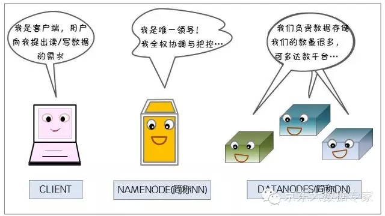
###2.文件切分
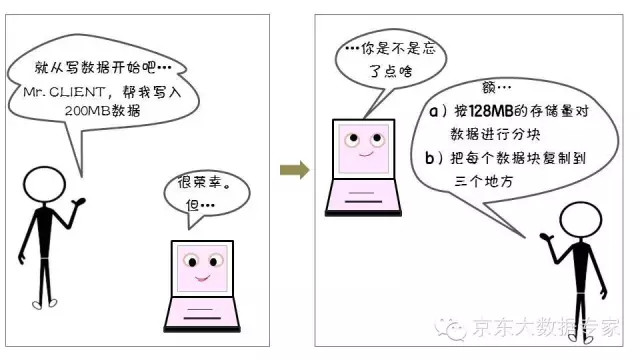
###3.DN分配
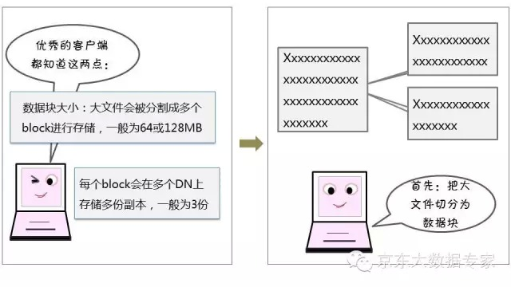
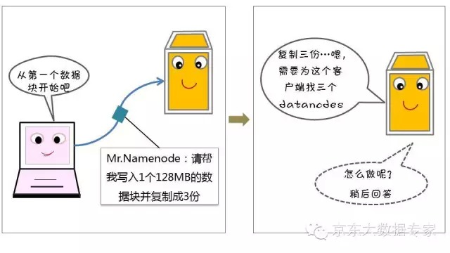
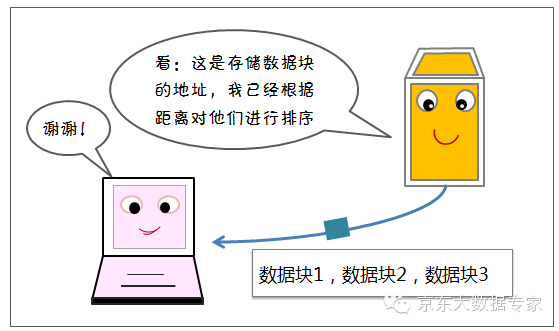
###4.数据写入
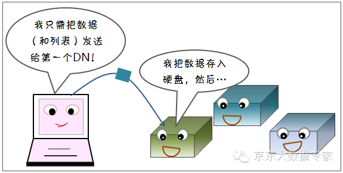
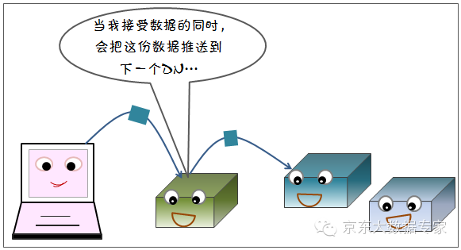
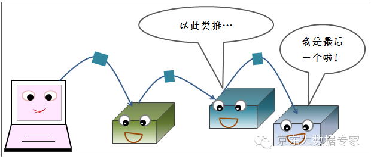
###5.完成写入
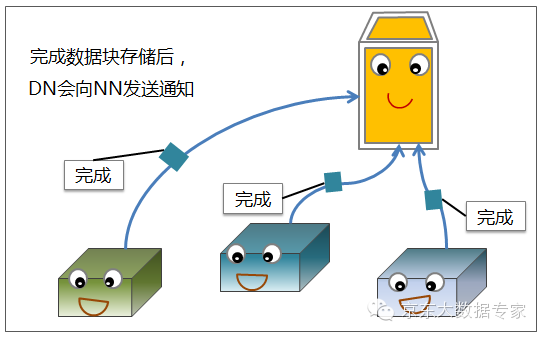
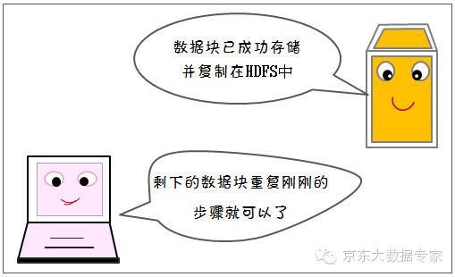
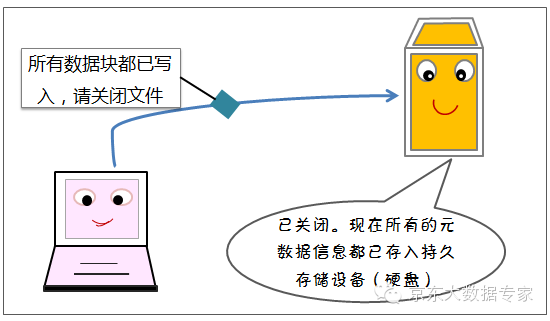
###6.用户读文件

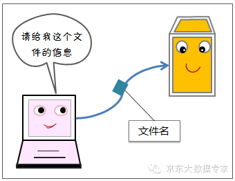
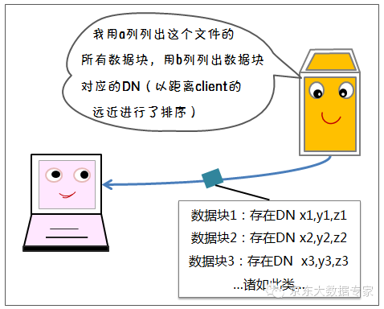
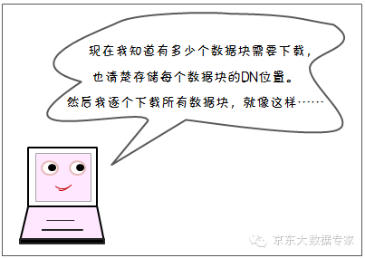
###7.下载数据
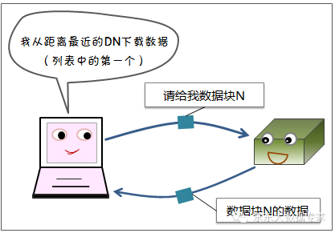
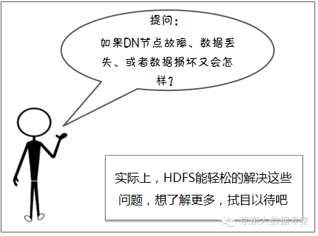
###8.HDFS容错机制
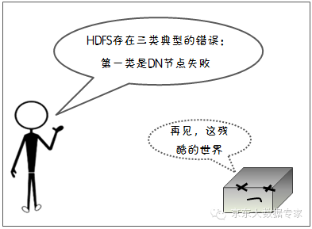
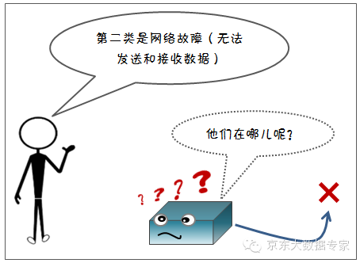
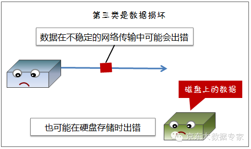
###9.节点监测机制
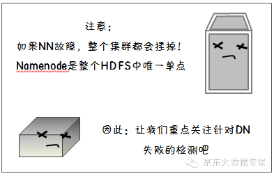
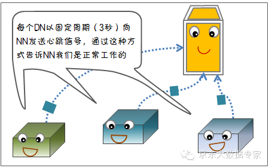
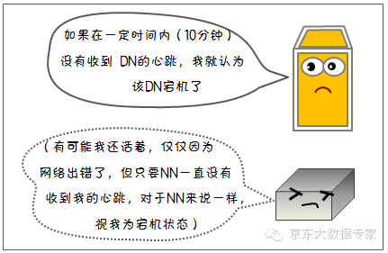
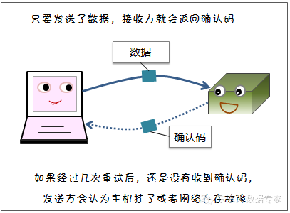
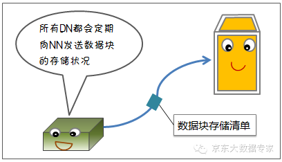
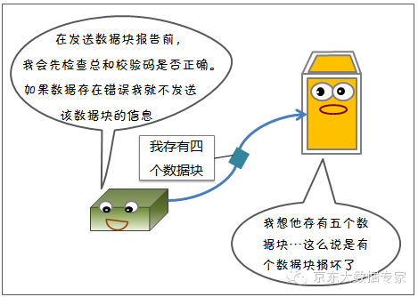
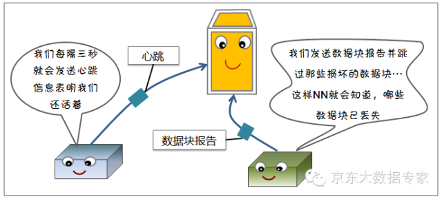
###10.写容错
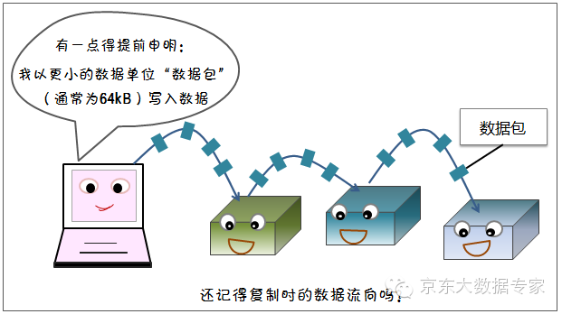
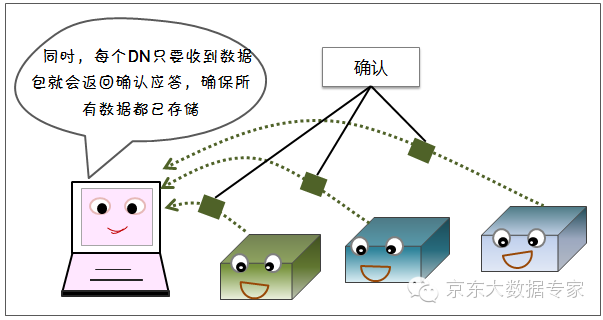
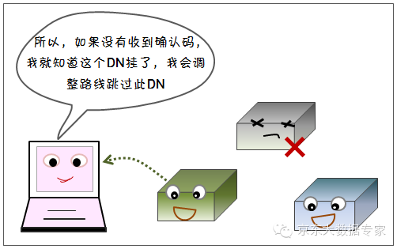
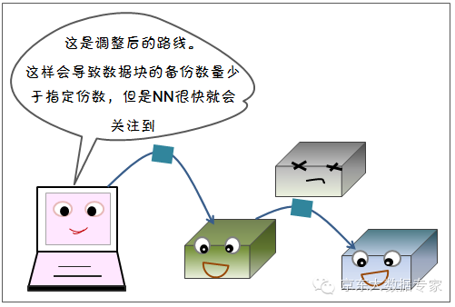
###11.读容错
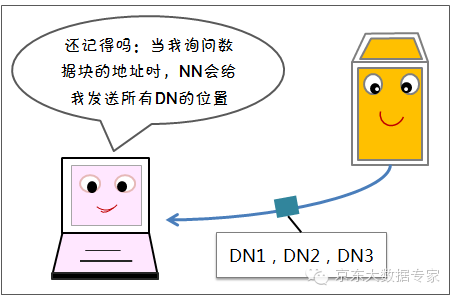
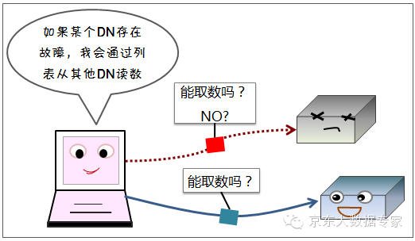
###12.DN失效
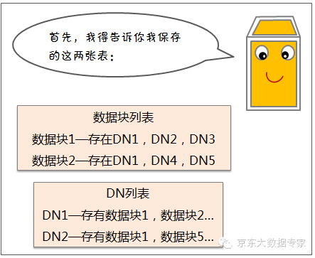
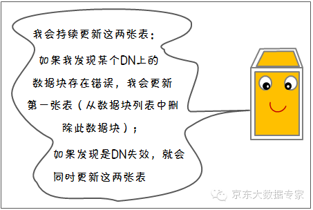
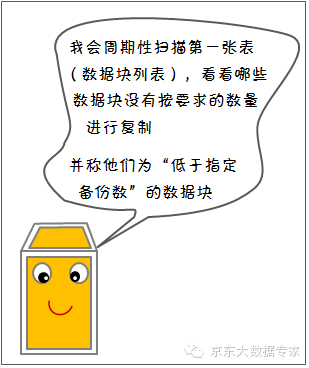
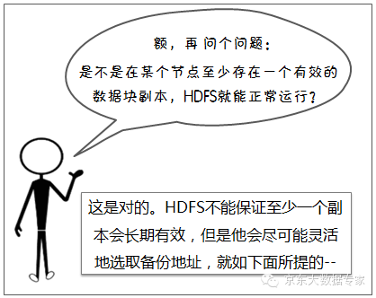
###13.备份规则
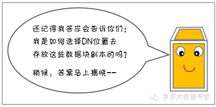
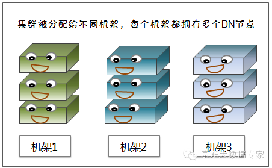
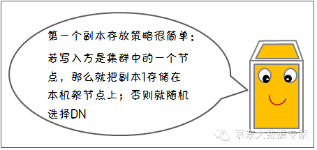
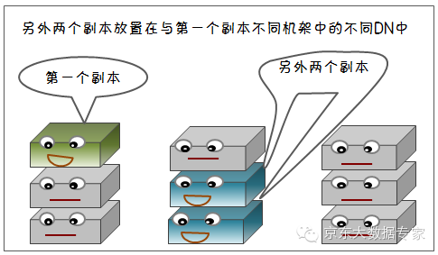