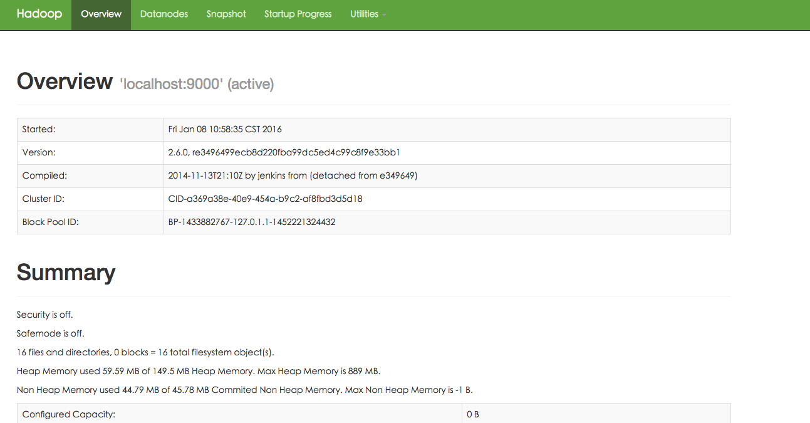
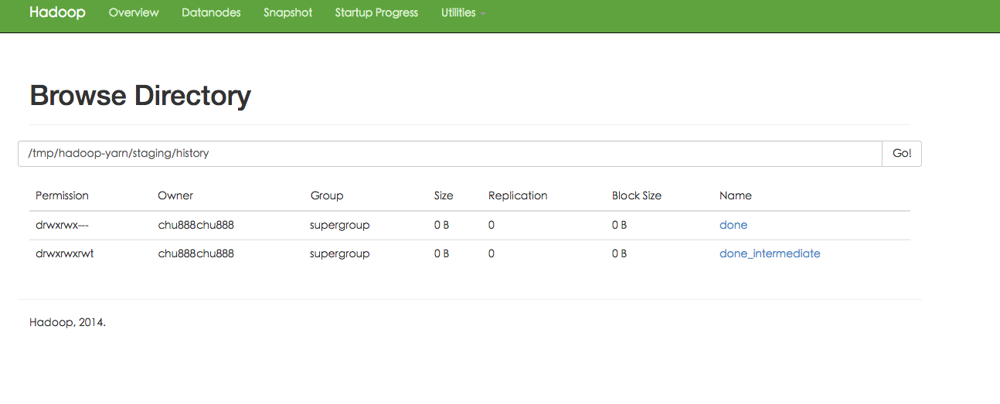
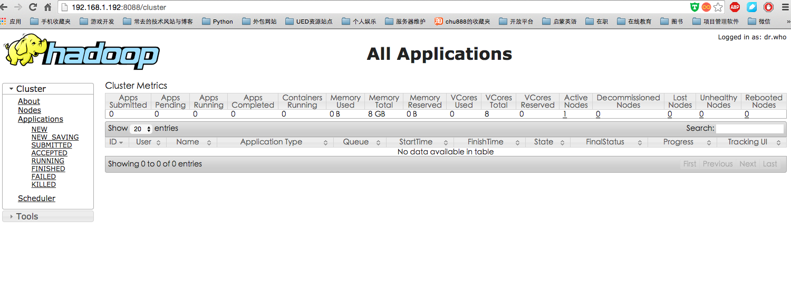

# 第三章 Hadoop的伪分布式搭建
##一 JDK的安装
1. 下载JDK安装包,建议去Oracle官方下载,地址自行百度
2. 下载Hadoop2.6的安装包,建议官方下载,地址自行百度
3. 如果是在Windows端进行终端操作,建议使用XFTP与XShell,有Free版本
4. 之后用XFTP将JDK安装包与Hadoop安装包上传到实验主机上
5. 将Java SDK解压,并将解压文件复制到/usr/lib/jvm中  
6. 配置环境变量
7. 如果系统中已经有默认的OpenJavaSDK的话,这里我们需要修改默认SDK
8. 检测JavaSDK是否成功安装

```
#新安装的服务器,建议更新一下安装源列表,同时安装nano,用VI编辑不是太方便
#sudo aptitude update
#sudo aptitude upgrade
#sudo aptitude install nano

chu888chu888@ubuntu1:~$ tar xvfz jdk-8u65-linux-x64.gz
chu888chu888@ubuntu1:~$ sudo cp -r jdk1.8.0_65/ /usr/lib/jvm/
chu888chu888@ubuntu1:/usr/lib/jvm$ sudo nano /etc/profile

#修改内容如下,注意大小写
#在环境变量中的配置中,有一点需要指出就是如果只是编辑~/.profile的话这个变量的生效只是针对当前用户的.
#如果想要其在全局生效的话,建议更新/etc/profile,这是一个全局的.

export JAVA_HOME=/usr/lib/jvm/
export JRE_HOME=${JAVA_HOME}/jre
export CLASSPATH=.:${JAVA_HOME}/lib:${JRE_HOME}/lib
export PATH=${JAVA_HOME}/bin:$PATH

chu888chu888@ubuntu1:/usr/lib/jvm$ source /etc/profile 
chu888chu888@ubuntu1:/usr/lib/jvm$ env
chu888chu888@ubuntu1:/usr/lib/jvm$ java -version
java version "1.8.0_65"
Java(TM) SE Runtime Environment (build 1.8.0_65-b17)
Java HotSpot(TM) 64-Bit Server VM (build 25.65-b01, mixed mode)

#有一种极端情况就是,如果在本机已经安装了OpenJavaSDK,怎么办?
sudo update-alternatives --install /usr/bin/java java /usr/lib/jvm/java/bin/java 300  
sudo update-alternatives --install /usr/bin/javac javac /usr/lib/jvm/java/bin/javac 300  
sudo update-alternatives --install /usr/bin/jar jar /usr/lib/jvm/java/bin/jar 300   
sudo update-alternatives --install /usr/bin/javah javah /usr/lib/jvm/java/bin/javah 300   
sudo update-alternatives --install /usr/bin/javap javap /usr/lib/jvm/java/bin/javap 300
sudo update-alternatives --config java
sudo update-alternatives --config javac


```

##二 Hadoop的用户创建
1. 创建hadoop用户组  
2. 创建hadoop用户
3. 给hadoop用户添加权限,打开/etc/sudoers文件

```
chu888chu888@ubuntu1:/$ sudo addgroup hadoop
chu888chu888@ubuntu1:/$ sudo adduser -ingroup hadoop hadoop
chu888chu888@ubuntu1:/$ sudo nano /etc/sudoers

root    ALL=(ALL:ALL) ALL
hadoop  ALL=(ALL:ALL) ALL
```

##三 SSH无密码登录

```
#第一次都要用ssh密码登录太麻烦,我们想办法采用无密码登录
chu888chu888@ubuntu2:~$ cd ~/.ssh/
chu888chu888@ubuntu2:~/.ssh$ ssh-keygen -t rsa
Generating public/private rsa key pair.
Enter file in which to save the key (/home/chu888chu888/.ssh/id_rsa): 
Enter passphrase (empty for no passphrase): 
Enter same passphrase again: 
Your identification has been saved in /home/chu888chu888/.ssh/id_rsa.
Your public key has been saved in /home/chu888chu888/.ssh/id_rsa.pub.
The key fingerprint is:
3a:51:9b:99:3e:65:9d:9a:b4:60:35:4f:79:d9:5b:89 chu888chu888@ubuntu2
The key's randomart image is:
+--[ RSA 2048]----+
|                 |
|             ..o.|
|        . o oEo.o|
|       . * = o  o|
|      . S + +  . |
|       = = +     |
|      o o +      |
|       . .       |
|                 |
+-----------------+
chu888chu888@ubuntu2:~/.ssh$ cat ./id_rsa.pub >>./authorized_keys
chu888chu888@ubuntu2:~/.ssh$ ssh localhost
#但是这里面有一个小问题就是,我是用chu888chu888这个用户做的,如果您想用
#hadoop用户登录的话,这个过程需要再来一次
hadoop@ubuntu2:~$ ssh hadoop@localhost

```

##四 Hadoop的基本安装
Hadoop 2 可以通过 
  
  地址1:http://mirror.bit.edu.cn/apache/hadoop/common/  
  地址2:http://mirrors.cnnic.cn/apache/hadoop/common/ 
  
  下载，本教程选择的是 2.6.0 版本，下载时请下载 hadoop-2.x.y.tar.gz 这个格式的文件，这是编译好的，另一个包含 src 的则是 Hadoop 源代码，需要进行编译才可使用。

下载时强烈建议也下载 hadoop-2.x.y.tar.gz.mds 这个文件，该文件包含了检验值可用于检查 hadoop-2.x.y.tar.gz 的完整性，否则若文件发生了损坏或下载不完整，Hadoop 将无法正常运行。

本文涉及的文件均通过浏览器下载，默认保存在 “下载” 目录中（若不是请自行更改 tar 命令的相应目录）。另外，如果你用的不是 2.6.0 版本，则将所有命令中出现的 2.6.0 更改为你所使用的版本。

```
# 列出md5检验值
# cat ~/下载/hadoop-2.6.0.tar.gz.mds | grep 'MD5'
# 2.7.1版本格式变了，可以用这种方式输出
# head -n 6 ~/下载/hadoop-2.7.1.tar.gz.mds 
# 计算md5值，并转化为大写，方便比较
# md5sum ~/下载/hadoop-2.6.0.tar.gz | tr "a-z" "A-Z" 

```


1. 将hadoop解压到/usr/local下
2. 修改bashrc的配置,加入内容
3. 修改hadoop-env.sh的配置
4. 测试

```
chu888chu888@ubuntu1:~$ sudo tar xvfz hadoop-2.6.0.tar.gz 
chu888chu888@ubuntu1:~$ sudo cp -r hadoop-2.6.0 /usr/local/hadoop
chu888chu888@ubuntu1:~$ sudo chmod -R 775 /usr/local/hadoop/
chu888chu888@ubuntu1:~$ sudo chown -R hadoop:hadoop /usr/local/hadoop
chu888chu888@ubuntu1:~$ sudo nano ~/.bashrc
#加入以下内容

#HADOOP VARIABLES START
export JAVA_HOME=/usr/lib/jvm/
export HADOOP_INSTALL=/usr/local/hadoop
export PATH=$PATH:$HADOOP_INSTALL/bin
export PATH=$PATH:$JAVA_HOME/bin
export PATH=$PATH:$HADOOP_INSTALL/sbin
export HADOOP_MAPRED_HOME=$HADOOP_INSTALL
export HADOOP_COMMON_HOME=$HADOOP_INSTALL
export HADOOP_HDFS_HOME=$HADOOP_INSTALL
export YARN_HOME=$HADOOP_INSTALL
export HADOOP_COMMON_LIB_NATIVE_DIR=$HADOOP_INSTALL/lib/native
export HADOOP_OPTS="-Djava.library.path=$HADOOP_INSTALL/lib"
#HADOOP VARIABLES END


chu888chu888@ubuntu1:~$ source ~/.bashrc
chu888chu888@ubuntu1:/usr/local/hadoop$ sudo nano /usr/local/hadoop/etc/hadoop/hadoop-env.sh
chu888chu888@ubuntu1:~$ cd /usr/local/hadoop/

#hadoop安装后的查看hadoop的版本
hadoop@ubuntu2:/usr/local/hadoop$ ./bin/hadoop version
Hadoop 2.6.0
Subversion https://git-wip-us.apache.org/repos/asf/hadoop.git -r e3496499ecb8d220fba99dc5ed4c99c8f9e33bb1
Compiled by jenkins on 2014-11-13T21:10Z
Compiled with protoc 2.5.0
From source with checksum 18e43357c8f927c0695f1e9522859d6a
This command was run using /usr/local/hadoop/share/hadoop/common/hadoop-common-2.6.0.jar
hadoop@ubuntu2:/usr/local/hadoop$ 

#实验一 Hadoop单机配置
Hadoop 默认模式为非分布式模式，无需进行其他配置即可运行。非分布式即单 Java 进程，方便进行调试。
现在我们可以执行例子来感受下 Hadoop 的运行。Hadoop 附带了丰富的例子（运行 ./bin/hadoop jar ./share/hadoop/mapreduce/hadoop-mapreduce-examples-2.6.0.jar 可以看到所有例子），包括 wordcount、terasort、join、grep 等。

在此我们选择运行 grep 例子，我们将 input 文件夹中的所有文件作为输入，筛选当中符合正则表达式 dfs[a-z.]+ 的单词并统计出现的次数，最后输出结果到 output 文件夹中。

chu888chu888@ubuntu1:/usr/local/hadoop$ sudo mkdir input
chu888chu888@ubuntu1:/usr/local/hadoop$ sudo cp README.txt input
chu888chu888@ubuntu1:/usr/local/hadoop$ bin/hadoop jar share/hadoop/mapreduce/sources/hadoop-mapreduce-examples-2.6.0-sources.jar org.apache.hadoop.examples.WordCount input output
#这里面有一个小插曲,其实就是权限的事件,如果出现问题的话,就是这个程序无法在当前目录创建,简单粗暴一点chmod -R 777 /usr/local/hadoop
#如果成功的话,那前目录就会有一个output目录自动生成
#目录内容如下
chu888chu888@ubuntu1:/usr/local/hadoop/output$ ls
part-r-00000  _SUCCESS

#查看输出结果
hadoop@ubuntu2:/usr/local/hadoop$ ls
bin  etc  include  input  lib  libexec  LICENSE.txt  NOTICE.txt  output  README.txt  sbin  share
hadoop@ubuntu2:/usr/local/hadoop$ cd output/
hadoop@ubuntu2:/usr/local/hadoop/output$ ls
part-r-00000  _SUCCESS
hadoop@ubuntu2:/usr/local/hadoop/output$ cd ..
hadoop@ubuntu2:/usr/local/hadoop$ cat ./output/*
(BIS),	1
(ECCN)	1
(TSU)	1
(see	1
5D002.C.1,	1
740.13)	1
<http://www.wassenaar.org/>	1

#注意，Hadoop 默认不会覆盖结果文件，因此再次运行上面实例会提示出错，需要先将 ./output 删除。

```

##五 开始伪分布式的配置文件修改

```
Hadoop 可以在单节点上以伪分布式的方式运行，Hadoop 进程以分离的 Java 进程来运行，节点既作为 NameNode 也作为 DataNode，同时，读取的是 HDFS 中的文件。

Hadoop 的配置文件位于 /usr/local/hadoop/etc/hadoop/ 中，伪分布式需要修改2个配置文件 core-site.xml 和 hdfs-site.xml 。Hadoop的配置文件是 xml 格式，每个配置以声明 property 的 name 和 value 的方式来实现。

修改配置文件 core-site.xml
chu888chu888@ubuntu1:/$ sudo nano /usr/local/hadoop/etc/hadoop/core-site.xml 


#内容如下
<configuration>
<property>
        <name>hadoop.tmp.dir</name>
        <value>file:/usr/local/hadoop/tmp</value>
        <description>Abase for other temporary directories.</description>
    </property>
    <property>
        <name>fs.defaultFS</name>
        <value>hdfs://localhost:9000</value>
    </property>
</configuration>

chu888chu888@ubuntu1:/$ sudo nano /usr/local/hadoop/etc/hadoop/hdfs-site.xml 
#内容如下
<configuration>
    <property>
        <name>dfs.replication</name>
        <value>1</value>
    </property>
    <property>
        <name>dfs.namenode.name.dir</name>
        <value>file:/usr/local/hadoop/tmp/dfs/name</value>
    </property>
    <property>
        <name>dfs.datanode.data.dir</name>
        <value>file:/usr/local/hadoop/tmp/dfs/data</value>
    </property>
</configuration>

hadoop@ubuntu2:/usr/local/hadoop$ ./bin/hdfs namenode -format
16/01/13 21:26:01 INFO namenode.NameNode: STARTUP_MSG: 
/************************************************************
STARTUP_MSG: Starting NameNode
STARTUP_MSG:   host = ubuntu2/127.0.1.1
STARTUP_MSG:   args = [-format]
STARTUP_MSG:   version = 2.6.0
16/01/13 21:26:02 INFO namenode.NNStorageRetentionManager: Going to retain 1 images with txid >= 0
16/01/13 21:26:02 INFO util.ExitUtil: Exiting with status 0
16/01/13 21:26:02 INFO namenode.NameNode: SHUTDOWN_MSG: 
/************************************************************
SHUTDOWN_MSG: Shutting down NameNode at ubuntu2/127.0.1.1
************************************************************/

成功的话，会看到 “successfully formatted” 和 “Exitting with status 0″ 的提示，若为 “Exitting with status 1″ 则是出错。

>>>注意
在这一步时若提示 Error: JAVA_HOME is not set and could not be found. 的错误，则需要在文件 ./etc/hadoop/hadoop-env.sh 中设置 JAVA_HOME 变量，即在该文件中找到：
export JAVA_HOME=${JAVA_HOME}
将这一行改为JAVA安装位置：
export JAVA_HOME=/usr/lib/jvm/
再重新尝试格式化即可。

#接着开启 NaneNode 和 DataNode 守护进程。
hadoop@ubuntu2:/usr/local/hadoop$ ./sbin/start-dfs.sh
16/01/13 21:29:20 WARN util.NativeCodeLoader: Unable to load native-hadoop library for your platform... using builtin-java classes where applicable
Starting namenodes on [localhost]
localhost: starting namenode, logging to /usr/local/hadoop/logs/hadoop-hadoop-namenode-ubuntu2.out
localhost: starting datanode, logging to /usr/local/hadoop/logs/hadoop-hadoop-datanode-ubuntu2.out
Starting secondary namenodes [0.0.0.0]
The authenticity of host '0.0.0.0 (0.0.0.0)' can't be established.
ECDSA key fingerprint is 87:f6:48:6b:0f:52:1f:27:3f:62:8c:c0:39:2d:87:e3.
Are you sure you want to continue connecting (yes/no)? yes
0.0.0.0: Warning: Permanently added '0.0.0.0' (ECDSA) to the list of known hosts.
0.0.0.0: starting secondarynamenode, logging to /usr/local/hadoop/logs/hadoop-hadoop-secondarynamenode-ubuntu2.out
16/01/13 21:29:39 WARN util.NativeCodeLoader: Unable to load native-hadoop library for your platform... using builtin-java classes where applicable


启动时可能会出现如下 WARN 提示：WARN util.NativeCodeLoader: Unable to load native-hadoop library for your platform… using builtin-java classes where applicable WARN 提示可以忽略，并不会影响正常使用。

启动完成后，可以通过命令 jps 来判断是否成功启动，若成功启动则会列出如下进程: “NameNode”、”DataNode” 和 “SecondaryNameNode”（如果 SecondaryNameNode 没有启动，请运行 sbin/stop-dfs.sh 关闭进程，然后再次尝试启动尝试）。如果没有 NameNode 或 DataNode ，那就是配置不成功，请仔细检查之前步骤，或通过查看启动日志排查原因。

hadoop@ubuntu2:/usr/local/hadoop$ jps
11841 NameNode
12309 Jps
12188 SecondaryNameNode
11998 DataNode
hadoop@ubuntu2:/usr/local/hadoop$ 


通过查看启动日志分析启动失败原因
有时 Hadoop 无法正确启动，如 NameNode 进程没有顺利启动，这时可以查看启动日志来排查原因，注意几点：

启动时会提示形如 “DBLab-XMU: starting namenode, logging to /usr/local/hadoop/logs/hadoop-hadoop-namenode-DBLab-XMU.out”，其中 DBLab-XMU 对应你的机器名，但其实启动日志信息是记录在 /usr/local/hadoop/logs/hadoop-hadoop-namenode-DBLab-XMU.log 中，所以应该查看这个后缀为 .log 的文件；
每一次的启动日志都是追加在日志文件之后，所以得拉到最后面看，看下记录的时间就知道了。
一般出错的提示在最后面，通常是写着 Fatal、Error 或者 Java Exception 的地方。
可以在网上搜索一下出错信息，看能否找到一些相关的解决方法。

成功启动后，可以访问 Web 界面 http://localhost:50070 查看 NameNode 和 Datanode 信息，还可以在线查看 HDFS 中的文件。
```



##运行伪分布式实例
1 上面的单机模式，grep 例子读取的是本地数据，伪分布式读取的则是 HDFS 上的数据。要使用 HDFS，首先需要在 HDFS 中创建用户目录：

```
hadoop@ubuntu2:/usr/local/hadoop$ ./bin/hdfs dfs -mkdir -p /user/hadoop
16/01/13 21:37:47 WARN util.NativeCodeLoader: Unable to load native-hadoop library for your platform... using builtin-java classes where applicable
hadoop@ubuntu2:/usr/local/hadoop$ 

```
2 接着将 ./etc/hadoop 中的 xml 文件作为输入文件复制到分布式文件系统中，即将 /usr/local/hadoop/etc/hadoop 复制到分布式文件系统中的 /user/hadoop/input 中。我们使用的是 hadoop 用户，并且已创建相应的用户目录 /user/hadoop ，因此在命令中就可以使用相对路径如 input，其对应的绝对路径就是 /user/hadoop/input:

```
#./bin/hdfs dfs -mkdir input
#./bin/hdfs dfs -put ./etc/hadoop/*.xml input
```
3 复制完成后，可以通过如下命令查看文件列表：

```
hadoop@ubuntu2:/usr/local/hadoop$ ./bin/hdfs dfs -ls input
16/01/13 21:41:21 WARN util.NativeCodeLoader: Unable to load native-hadoop library for your platform... using builtin-java classes where applicable
Found 8 items
-rw-r--r--   1 hadoop supergroup       4436 2016-01-13 21:40 input/capacity-scheduler.xml
-rw-r--r--   1 hadoop supergroup       1071 2016-01-13 21:40 input/core-site.xml
-rw-r--r--   1 hadoop supergroup       9683 2016-01-13 21:40 input/hadoop-policy.xml
-rw-r--r--   1 hadoop supergroup       1133 2016-01-13 21:40 input/hdfs-site.xml
-rw-r--r--   1 hadoop supergroup        620 2016-01-13 21:40 input/httpfs-site.xml
-rw-r--r--   1 hadoop supergroup       3523 2016-01-13 21:40 input/kms-acls.xml
-rw-r--r--   1 hadoop supergroup       5511 2016-01-13 21:40 input/kms-site.xml
-rw-r--r--   1 hadoop supergroup        690 2016-01-13 21:40 input/yarn-site.xml
hadoop@ubuntu2:/usr/local/hadoop$ 


```
4 伪分布式运行 MapReduce 作业的方式跟单机模式相同，区别在于伪分布式读取的是HDFS中的文件（可以将单机步骤中创建的本地 input 文件夹，输出结果 output 文件夹都删掉来验证这一点）。

```
hadoop@ubuntu2:/usr/local/hadoop$ ./bin/hadoop jar ./share/hadoop/mapreduce/hadoop-mapreduce-examples-*.jar grep input output 'dfs[a-z.]+'
hadoop@ubuntu2:/usr/local/hadoop$ ./bin/hdfs dfs -cat output/*
hadoop@ubuntu2:/usr/local/hadoop$ ./bin/hdfs dfs -cat output/*
16/01/13 21:42:55 WARN util.NativeCodeLoader: Unable to load native-hadoop library for your platform... using builtin-java classes where applicable
1	dfsadmin
1	dfs.replication
1	dfs.namenode.name.dir
1	dfs.datanode.data.dir


```

5 将结果取回本地

```
# rm -r ./output    
# 先删除本地的 output 文件夹（如果存在）
# ./bin/hdfs dfs -get output ./output     
# 将 HDFS 上的 output 文件夹拷贝到本机
# cat ./output/*
```
6 关闭hadoop

```
#./sbin/stop-dfs.sh
```
7 开启hadoop

```
下次启动 hadoop 时，无需进行 NameNode 的初始化，只需要运行 ./sbin/start-dfs.sh 就可以！
```

##六 启动YARN
1 （伪分布式不启动 YARN 也可以，一般不会影响程序执行）

有的读者可能会疑惑，怎么启动 Hadoop 后，见不到书上所说的 JobTracker 和 TaskTracker，这是因为新版的 Hadoop 使用了新的 MapReduce 框架（MapReduce V2，也称为 YARN，Yet Another Resource Negotiator）。

YARN 是从 MapReduce 中分离出来的，负责资源管理与任务调度。YARN 运行于 MapReduce 之上，提供了高可用性、高扩展性，YARN 的更多介绍在此不展开，有兴趣的可查阅相关资料。

上述通过 ./sbin/start-dfs.sh 启动 Hadoop，仅仅是启动了 MapReduce 环境，我们可以启动 YARN ，让 YARN 来负责资源管理与任务调度。

首先修改配置文件 mapred-site.xml，这边需要先进行重命名：

```
hadoop@ubuntu2:/usr/local/hadoop$ mv ./etc/hadoop/mapred-site.xml.template ./etc/hadoop/mapred-site.xml
hadoop@ubuntu2:/usr/local/hadoop$ nano ./etc/hadoop/mapred-site.xml 
hadoop@ubuntu2:/usr/local/hadoop$ 

<configuration>
    <property>
        <name>mapreduce.framework.name</name>
        <value>yarn</value>
    </property>
</configuration>
```
2 修改接着修改配置文件 yarn-site.xml：

```
<configuration>
    <property>
        <name>yarn.nodemanager.aux-services</name>
        <value>mapreduce_shuffle</value>
        </property>
</configuration>
```

3 启动YARN

```
hadoop@ubuntu2:/usr/local/hadoop$ ./sbin/start-yarn.sh
starting yarn daemons
starting resourcemanager, logging to /usr/local/hadoop/logs/yarn-hadoop-resourcemanager-ubuntu2.out
localhost: starting nodemanager, logging to /usr/local/hadoop/logs/yarn-hadoop-nodemanager-ubuntu2.out
hadoop@ubuntu2:/usr/local/hadoop$ ./sbin/mr-jobhistory-daemon.sh start historyserver
starting historyserver, logging to /usr/local/hadoop/logs/mapred-hadoop-historyserver-ubuntu2.out
hadoop@ubuntu2:/usr/local/hadoop$ 

```
4 查看进程
开启后通过 jps 查看，可以看到多了 NodeManager 和 ResourceManager 两个后台进程，如下图所示。
启动 YARN 之后，运行实例的方法还是一样的，仅仅是资源管理方式、任务调度不同。观察日志信息可以发现，不启用 YARN 时，是 “mapred.LocalJobRunner” 在跑任务，启用 YARN 之后，是 “mapred.YARNRunner” 在跑任务。启动 YARN 有个好处是可以通过 Web 界面查看任务的运行情况：http://localhost:8088/cluster，如下图所示。

```
hadoop@ubuntu2:/usr/local/hadoop$ jps
12880 ResourceManager
11841 NameNode
13329 JobHistoryServer
13398 Jps
13016 NodeManager
12188 SecondaryNameNode
11998 DataNode
hadoop@ubuntu2:/usr/local/hadoop$ 

```

但 YARN 主要是为集群提供更好的资源管理与任务调度，然而这在单机上体现不出价值，反而会使程序跑得稍慢些。因此在单机上是否开启 YARN 就看实际情况了。

不启动 YARN 需重命名 mapred-site.xml
如果不想启动 YARN，务必把配置文件 mapred-site.xml 重命名，改成 mapred-site.xml.template，需要用时改回来就行。否则在该配置文件存在，而未开启 YARN 的情况下，运行程序会提示 “Retrying connect to server: 0.0.0.0/0.0.0.0:8032″ 的错误，这也是为何该配置文件初始文件名为 mapred-site.xml.template。

5 关闭YARN

```
#./sbin/stop-yarn.sh
#./sbin/mr-jobhistory-daemon.sh stop historyserver
```

##Unable to load native-hadoop library for your platform错误
错误现象

```
hadoop@Master:~$ hadoop fs -ls input
16/01/27 18:52:02 WARN util.NativeCodeLoader: Unable to load native-hadoop library for your platform... using builtin-java classes where applicable
Found 9 items
-rw-r--r--   1 hadoop supergroup       4436 2016-01-25 22:10 input/capacity-scheduler.xml
-rw-r--r--   1 hadoop supergroup       1072 2016-01-25 22:10 input/core-site.xml
-rw-r--r--   1 hadoop supergroup       9683 2016-01-25 22:10 input/hadoop-policy.xml
-rw-r--r--   1 hadoop supergroup       1257 2016-01-25 22:10 input/hdfs-site.xml
-rw-r--r--   1 hadoop supergroup        620 2016-01-25 22:10 input/httpfs-site.xml
-rw-r--r--   1 hadoop supergroup       3523 2016-01-25 22:10 input/kms-acls.xml
-rw-r--r--   1 hadoop supergroup       5511 2016-01-25 22:10 input/kms-site.xml
-rw-r--r--   1 hadoop supergroup       1103 2016-01-25 22:10 input/mapred-site.xml
-rw-r--r--   1 hadoop supergroup        924 2016-01-25 22:10 input/yarn-site.xml

```
解决

```
1首先编辑core-site.xml
<property>
        <name>hadoop.native.lib</name>
        <value>true</value>
        <description>Should native hadoop libraries,if present,be used</description>
</property>
2之后修改环境变量
export JAVA_LIBRARY_PATH=/usr/local/hadoop/lib/native
```