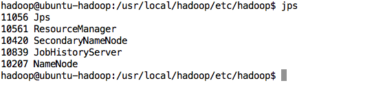
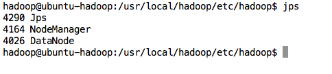
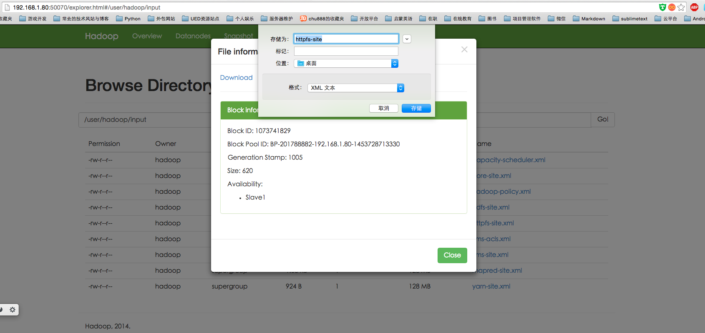
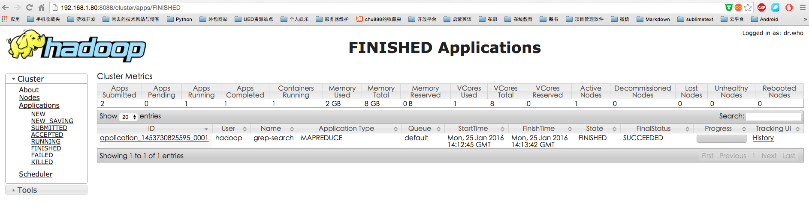

# 第四章 完全分布式搭建

##1网络拓扑
* 192.168.1.80 Master
* 192.168.1.82 Slave1
* 192.168.1.84 Slave2

##2安装JDK
所有实验主机都需要正确的安装JDK,具体操作方法  

```
chu888chu888@ubuntu1:~$ tar xvfz jdk-8u65-linux-x64.gz
chu888chu888@ubuntu1:~$ sudo cp -r jdk1.8.0_65/ /usr/lib/jvm/
chu888chu888@ubuntu1:/usr/lib/jvm$ sudo nano /etc/profile

#修改内容如下,注意大小写
#在环境变量中的配置中,有一点需要指出就是如果只是编辑~/.profile的话这个变量的生效只是针对当前用户的.
#如果想要其在全局生效的话,建议更新/etc/profile,这是一个全局的.

export JAVA_HOME=/usr/lib/jvm/
export JRE_HOME=${JAVA_HOME}/jre
export CLASSPATH=.:${JAVA_HOME}/lib:${JRE_HOME}/lib
export PATH=${JAVA_HOME}/bin:$PATH

chu888chu888@ubuntu1:/usr/lib/jvm$ source /etc/profile 
chu888chu888@ubuntu1:/usr/lib/jvm$ env
chu888chu888@ubuntu1:/usr/lib/jvm$ java -version
java version "1.8.0_65"
Java(TM) SE Runtime Environment (build 1.8.0_65-b17)
Java HotSpot(TM) 64-Bit Server VM (build 25.65-b01, mixed mode)

#有一种极端情况就是,如果在本机已经安装了OpenJavaSDK,怎么办?
sudo update-alternatives --install /usr/bin/java java /usr/lib/jvm/java/bin/java 300  
sudo update-alternatives --install /usr/bin/javac javac /usr/lib/jvm/java/bin/javac 300  
sudo update-alternatives --install /usr/bin/jar jar /usr/lib/jvm/java/bin/jar 300   
sudo update-alternatives --install /usr/bin/javah javah /usr/lib/jvm/java/bin/javah 300   
sudo update-alternatives --install /usr/bin/javap javap /usr/lib/jvm/java/bin/javap 300
sudo update-alternatives --config java
sudo update-alternatives --config javac
```

这里面我简单补充一下,其他相关知识,因为涉及到主机之间的安装文件传递,我们可以使用sftp命令进行.

```
chu888chu888@ubuntu-hadoop:~$ sftp chu888chu888@192.168.1.84
The authenticity of host '192.168.1.84 (192.168.1.84)' can't be established.
ECDSA key fingerprint is 6c:00:fb:9b:43:6c:3b:29:96:98:a8:28:d1:23:11:13.
Are you sure you want to continue connecting (yes/no)? yes
Warning: Permanently added '192.168.1.84' (ECDSA) to the list of known hosts.
chu888chu888@192.168.1.84's password: 
Connected to 192.168.1.84.
sftp> put jdk-8u65-linux-x64.gz 
Uploading jdk-8u65-linux-x64.gz to /home/chu888chu888/jdk-8u65-linux-x64.gz
jdk-8u65-linux-x64.gz                                                                                 100%  173MB  28.8MB/s   00:06    
sftp> 

```

##3Hadoop用户的创建

```
创建hadoop用户组
创建hadoop用户
给hadoop用户添加权限,打开/etc/sudoers文件
chu888chu888@ubuntu1:/$ sudo addgroup hadoop
chu888chu888@ubuntu1:/$ sudo adduser -ingroup hadoop hadoop chu888chu888@ubuntu1:/$ sudo nano /etc/sudoers
# User privilege specification
root    ALL=(ALL:ALL) ALL
hadoop  ALL=(ALL:ALL) ALL
```
##4hosts文件修改

**所有的主机的hosts都需要修改,在这里我吃了一个大亏,如果在etc配置文件中直接用Ip的话,可能会出现Datanode链接不上Namenode的现象.**

```
hadoop@ubuntu-hadoop:/usr/local/hadoop/etc/hadoop$ more /etc/hosts
127.0.0.1	localhost
192.168.1.80    Master
192.168.1.82    Slave1

# The following lines are desirable for IPv6 capable hosts
::1     localhost ip6-localhost ip6-loopback
ff02::1 ip6-allnodes
ff02::2 ip6-allrouters
hadoop@ubuntu-hadoop:/usr/local/hadoop/etc/hadoop$ 

```
##5SSH无密码登录
所有的主机都要进行操作

```
这个操作是要让Master节点可以在无密码的状态下SSH登录到各个Slave节点上
首先生成Master节点的公钥,在Master节点的终端中执行

#如果没有该目录,先执行一次ssh localhost
$ cd ~/.ssh
#删除之前生成的公钥
$ rm ./id_rsa*
#一直按回车就可以了
$ ssh-keygen -t rsa

让Master节点需能无密码的SSH本机,在Master节点上执行
$cat ./id_rsa.pub>>./authorized_keys
完成后可执行ssh Master验证一下,接着需要把Master节点的公钥上传输到Slave1节点上
$sftp hadoop@Slave1

接着在Slave1节点上,将ssh公钥加入授权
$mkdir ~/.ssh
$cat ~/id_rsa.pub>>~/.ssh/authorized_keys
$rm ~/id_rsa.pub
如果有其他的Slave节点,也要执行将Master公钥传输到Slave节点,在Slave节点加入授权这两步.
这样,在Master节点就可以无密码SSH到各个Slave节点了.

```
###6 Hadoop的安装

```
chu888chu888@ubuntu1:~$ sudo tar xvfz hadoop-2.6.0.tar.gz 
chu888chu888@ubuntu1:~$ sudo cp -r hadoop-2.6.0 /usr/local/hadoop
chu888chu888@ubuntu1:~$ sudo chmod -R 775 /usr/local/hadoop/
chu888chu888@ubuntu1:~$ sudo chown -R hadoop:hadoop /usr/local/hadoop
```
这里面有一个小的体验技巧,我建议将所有需要的环境变量配置加入到/etc/profile中,这是全局变量.

```
export JAVA_HOME=/usr/lib/jvm/
export JRE_HOME=${JAVA_HOME}/jre
export CLASSPATH=.:${JAVA_HOME}/lib:${JRE_HOME}/lib
export PATH=${JAVA_HOME}/bin:$PATH

#HADOOP VARIABLES START
export JAVA_HOME=/usr/lib/jvm/
export HADOOP_INSTALL=/usr/local/hadoop
export PATH=$PATH:$HADOOP_INSTALL/bin
export PATH=$PATH:$JAVA_HOME/bin
export PATH=$PATH:$HADOOP_INSTALL/sbin
export HADOOP_MAPRED_HOME=$HADOOP_INSTALL
export HADOOP_COMMON_HOME=$HADOOP_INSTALL
export HADOOP_HDFS_HOME=$HADOOP_INSTALL
export YARN_HOME=$HADOOP_INSTALL
export HADOOP_COMMON_LIB_NATIVE_DIR=$HADOOP_INSTALL/lib/native
export HADOOP_OPTS="-Djava.library.path=$HADOOP_INSTALL/lib"
#HADOOP VARIABLES END


还有一个问题就是,在启动hadoop的时候经常会出现,找不到JAVA_HOME的问题,这个问题可以通过修改hadoop环境变量来解决,直接写死变量就可以了.

$ more hadoop-env.sh
export JAVA_HOME=/usr/lib/jvm/

```

###6配置集群环境192.168.1.80 NameNode
集群/分布式模式需要修改 /usr/local/hadoop/etc/hadoop 中的5个配置文件，更多设置项可点击查看官方说明，这里仅设置了正常启动所必须的设置项： slaves、core-site.xml、hdfs-site.xml、mapred-site.xml、yarn-site.xml 。

###7文件slaves
文件 slaves，将作为 DataNode 的主机名写入该文件，每行一个，默认为 localhost，所以在伪分布式配置时，节点即作为 NameNode 也作为 DataNode。分布式配置可以保留 localhost，也可以删掉，让 Master 节点仅作为 NameNode 使用。  
本教程让 Master 节点仅作为 NameNode 使用，因此将文件中原来的 localhost 删除，只添加一行内容：Slave1。

```
hadoop@ubuntu-hadoop:~$ cd /usr/local/hadoop/etc/hadoop/
hadoop@ubuntu-hadoop:/usr/local/hadoop/etc/hadoop$ sudo nano slaves 
[sudo] password for hadoop: 
hadoop@ubuntu-hadoop:/usr/local/hadoop/etc/hadoop$ more slaves 
Slave1

hadoop@ubuntu-hadoop:/usr/local/hadoop/etc/hadoop$ 
```
###8文件 core-site.xml 改为下面的配置：

```
<configuration>
    <property>
        <name>fs.defaultFS</name>
        <value>hdfs://Master:9000</value>
    </property>
    <property>
        <name>hadoop.tmp.dir</name>
        <value>file:/usr/local/hadoop/tmp</value>
        <description>Abase for other temporary directories.</description>
    </property>
</configuration>

```
###9文件 hdfs-site.xml，dfs.replication 一般设为 3，但我们只有一个 Slave 节点，所以 dfs.replication 的值还是设为 1：

```
<configuration>
    <property>
        <name>dfs.namenode.secondary.http-address</name>
        <value>Master:50090</value>
    </property>
    <property>
        <name>dfs.replication</name>
        <value>1</value>
    </property>
    <property>
        <name>dfs.namenode.name.dir</name>
        <value>file:/usr/local/hadoop/tmp/dfs/name</value>
    </property>
    <property>
        <name>dfs.datanode.data.dir</name>
        <value>file:/usr/local/hadoop/tmp/dfs/data</value>
    </property>
</configuration>
```
###10文件 mapred-site.xml （可能需要先重命名，默认文件名为 mapred-site.xml.template），然后配置修改如下：

```
<configuration>
    <property>
        <name>mapreduce.framework.name</name>
        <value>yarn</value>
    </property>
    <property>
        <name>mapreduce.jobhistory.address</name>
        <value>Master:10020</value>
    </property>
    <property>
        <name>mapreduce.jobhistory.webapp.address</name>
        <value>Master:19888</value>
    </property>
</configuration>
```
###11文件 yarn-site.xml：

```
<configuration>
    <property>
        <name>yarn.resourcemanager.hostname</name>
        <value>Master</value>
    </property>
    <property>
        <name>yarn.nodemanager.aux-services</name>
        <value>mapreduce_shuffle</value>
    </property>
</configuration>
```

###在其他Slave节点需要做的
首先通过sftp把Master配置好的hadoop打包,之后转输到Slave节点上,配置好环境变量JDK PATH SSH 基本上与Master是一样的.  
配置好后，将 Master 上的 /usr/local/Hadoop 文件夹复制到各个节点上。因为之前有跑过伪分布式模式，建议在切换到集群模式前先删除之前的临时文件。  
在 Master 节点上执行：  

```
cd /usr/local
# 删除 Hadoop 临时文件
sudo rm -r ./hadoop/tmp
# 删除日志文件
sudo rm -r ./hadoop/logs/*  
# 先压缩再复制
tar -cvfz ~/hadoop.master.tar.gz ./hadoop   


```
在Slave节点上执行:

```
sudo rm -r /usr/local/hadoop    # 删掉旧的（如果存在）
sudo tar -xvfz ~/hadoop.master.tar.gz -C /usr/local
sudo chown -R hadoop:hadoop /usr/local/hadoop

```

###开始启动集群

```
hdfs namenode -format       # 首次运行需要执行初始化，之后不需要
在Master上执行:
$start-dfs.sh
$start-yarn.sh
$mr-jobhistory-daemon.sh start historyserver

Centos6.X需要关闭防火墙
sudo service iptables stop   # 关闭防火墙服务
sudo chkconfig iptables off  # 禁止防火墙开机自启，就不用手动关闭了
Cent7
systemctl stop firewalld.service    # 关闭firewall
systemctl disable firewalld.service # 禁止firewall开机启动

```
之后分别在Master与Slave上执行jps,会看到不同的结果.缺少任一进程都表示出错。另外还需要在 Master 节点上通过命令 hdfs dfsadmin -report 查看 DataNode 是否正常启动，如果 Live datanodes 不为 0 ，则说明集群启动成功。例如我这边一共有 1 个 Datanodes：

```
$jps
$hdfs dfsadmin -report

可以访问http://192.168.1.80:50070/ 查看结果
```





#执行分布式的实验-分布式存储

```
执行分布式实例过程与伪分布式模式一样，首先创建 HDFS 上的用户目录：
$ hdfs dfs -mkdir -p /user/hadoop
将 /usr/local/hadoop/etc/hadoop 中的配置文件作为输入文件复制到分布式文件系统中：
$ hdfs dfs -mkdir input
$ hdfs dfs -put /usr/local/hadoop/etc/hadoop/*.xml input

```
通过查看 DataNode 的状态（占用大小有改变），输入文件确实复制到了 DataNode 中，如下图所示：


#执行分布式的实验-MapReduce
执行MapReduce作业

```
hadoop jar /usr/local/hadoop/share/hadoop/mapreduce/hadoop-mapreduce-examples-*.jar grep /user/hadoop/input /user/hadoop/output 'dfs[a-z.]+'
查看http://192.168.1.80:8088/cluster看结果
```
运行时的输出信息与伪分布式类似，会显示 Job 的进度。

可能会有点慢，但如果迟迟没有进度，比如 5 分钟都没看到进度，那不妨重启 Hadoop 再试试。若重启还不行，则很有可能是内存不足引起，建议增大虚拟机的内存，或者通过更改 YARN 的内存配置解决。   
同样可以通过 Web 界面查看任务进度 http://master:8088/cluster，在 Web 界面点击 “Tracking UI” 这一列的 History 连接，可以看到任务的运行信息，如下图所示：



```
关闭集群
stop-yarn.sh
stop-dfs.sh
mr-jobhistory-daemon.sh stop historyserver
```