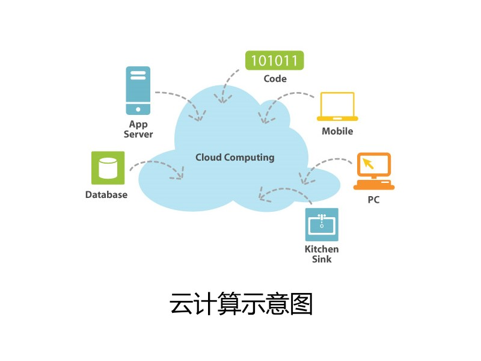

# 概述

大家知道什么叫做云计算吗？事实上，目前并没有一个确定的定义。然而概括来讲，所谓的云计算，指的就是把你的软件和服务统一部署在数据中心，统一管理，从而实现高伸缩性。
###云计算具有以下特性:
+ 虚拟化和自动化
+ 服务器，存储介质，网络等资源都可以随时替换
+ 所有的资源都由云端统一管理
+ 高度的伸缩性以满足业务需求
+ 集中于将服务传递给业务.

##云计算的部署方式
从部署方式来说，总共有两类云计算
+ 私有云：数据中心部署在企业内部，由企业自行管理。微软为大家提供了Dynamic Data Center Toolkit，来方便大家管理自己的数据中心。
+ 公共云：数据中心由第三方的云计算供应商提供，供应商帮助企业管理基础设施（例如硬件，网络，等等）。企业将自己的软件及服务部属在供应商提供的数据中心，并且支付一定的租金。WindowsAzure正是这样一个公共云平台。
###云计算的运营方式
从运营方式来说，总共有三类云计算：
+ 软件即服务（SaaS）：云计算运营商直接以服务的形式供应软件，供最终用户使用。有些服务还提供了SDK，从而使得第三方开发人员可以进行二次开发。在这种运营模式下，开发人员通常只能针对现有的产品开发插件，而无法充分挖掘平台和操作系统的特点，不过他们可以在现有产品的基础上添加新的功能，而不必从头开始实现。微软的Bing，Windows Live，Microsoft Business Productivity Online等产品就属于这一类型。
+ 平台即服务（PaaS）：云计算运营商将自己的开发及部署平台提供给第三方开发人员，第三方开发人员在这个平台上开发自己的软件和服务，供自己或其它用户使用。在这种运营模式下，开发人员有了更多的自由，可以发挥出平台的强大功能，而不受现有产品的束缚。Windows Azure正是这样一个产品。
+ 基础设施即服务（IaaS）：云计算运营商提供但不管理基础设施，第三方开发人员将开发好的软件和服务交给自己公司的IT管理员，由IT管理员负责部署及管理。在这种运营模式下，开发人员和IT管理员有最大限度的自由，然而由于必须自行管理部分基础设施，因此成本通常也会较大，对管理员的要求也会较高。目前微软尚未提供IaaS的云计算运营模式，不过我们正在考虑如何给予开发人员和IT管理员更多的自由。

###总结 
&nbsq;云计算指的就是把你的软件和服务统一部署在数据中心，统一管理，从而实现高伸缩性。从部署方式来说，云计算可以分为私有云和公共云。从运营方式来说，云计算可以分成SaaS，PaaS，IaaS三类。