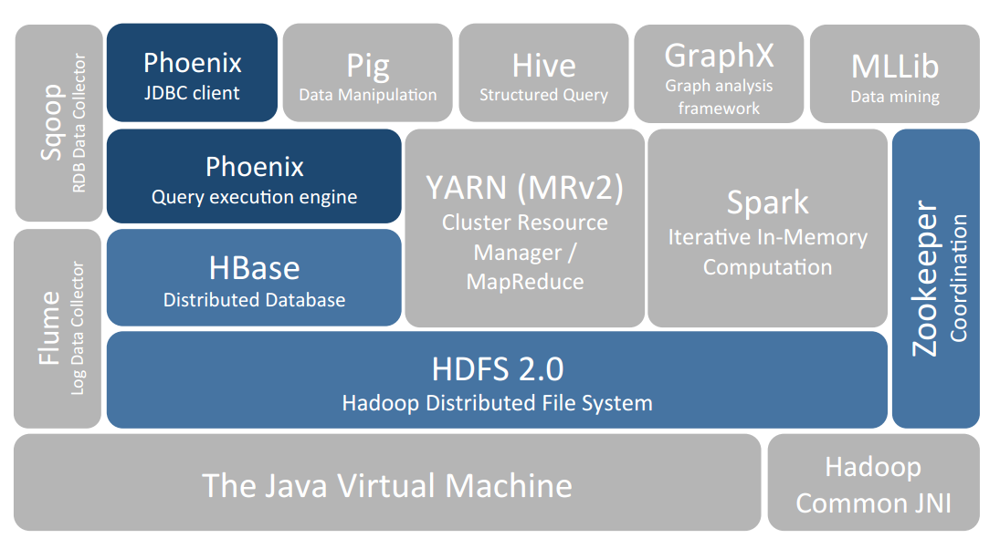
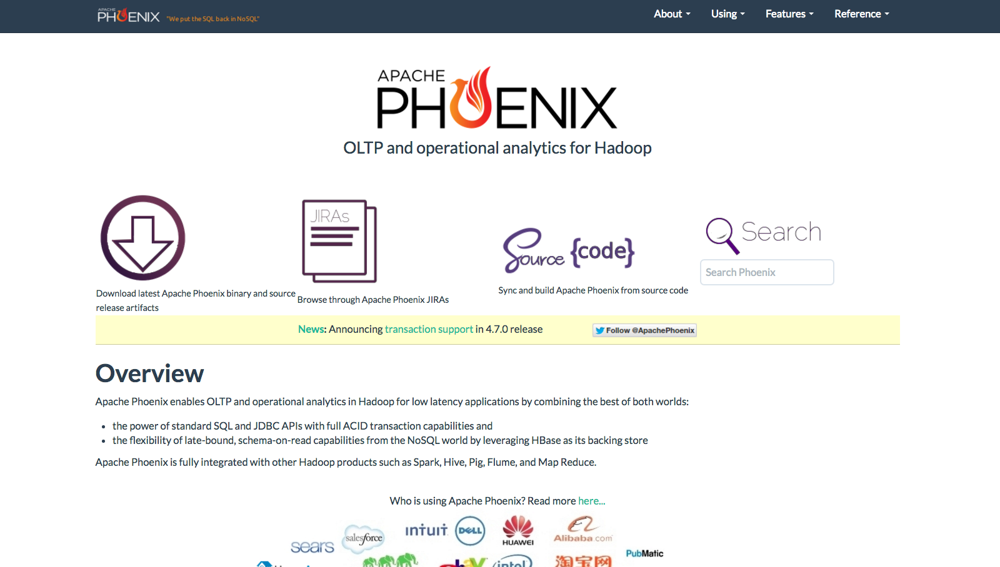

# 2.Phoenix的安装与使用
##概述
Apache Phoenix是构建在HBase之上的关系型数据库层，作为内嵌的客户端JDBC驱动用以对HBase中的数据进行低延迟访问。Apache Phoenix会将用户编写的sql查询编译为一系列的scan操作，最终产生通用的JDBC结果集返回给客户端。数据表的元数据存储在HBase的表中被会标记版本号，所以进行查询的时候会自动选择正确的schema。直接使用HBase的API，结合协处理器（coprocessor）和自定义的过滤器的话，小范围的查询在毫秒级响应，千万数据的话响应速度为秒级。


##(1)下载
访问Phoenix的官方网站进行下载.下载地址:[http://www.apache.org/dyn/closer.lua/phoenix/](http://www.apache.org/dyn/closer.lua/phoenix/)

##(2)安装
**在Master上面的操作**
```
#sudo tar xvfz phoenix-4.7.0-HBase-1.1-bin.tar.gz 
#sudo chown -R hadoop:hadoop phoenix-4.7.0-HBase-1.1
#sudo chmod -R 775 phoenix-4.7.0-HBase-1.1
#sudo mv phoenix-4.7.0-HBase-1.1 /usr/local/phoenix
#sudo cp /usr/local/phoenix/*.jar /usr/local/hbase/lib/
#sudo cp /usr/local/hbase/conf/hbase-site.xml /usr/local/phoenix/bin/
```

**在Slave上面的操作**
```
#sudo tar xvfz phoenix-4.7.0-HBase-1.1-bin.tar.gz 
#sudo chown -R hadoop:hadoop phoenix-4.7.0-HBase-1.1
#sudo chmod -R 775 phoenix-4.7.0-HBase-1.1
#sudo mv phoenix-4.7.0-HBase-1.1 /usr/local/phoenix
#sudo cp /usr/local/phoenix/*.jar /usr/local/hbase/lib/
```

完成以上步骤,基本上Phoenix就安装成功了.

##(3)基本使用
###验证操作
```
hadoop@Master:/usr/local/phoenix/bin$ ./sqlline.py localhost
执行SQL语句
CREATE TABLE IF NOT EXISTS us_population2 (
      state CHAR(2) NOT NULL,
      city VARCHAR NOT NULL,
      population BIGINT
      CONSTRAINT my_pk2 PRIMARY KEY (state, city));
      
插入操作

upsert into us_population2(state, city, population) values('NY', 'New York', 8143197);
upsert into us_population2(state, city, population) values('CA', 'Chicago', 2842518);
upsert into us_population2(state, city, population) values('TX', 'Houston', 2016582);
upsert into us_population2(state, city, population) values('TX', 'San Antonio', 1256509);
upsert into us_population2(state, city, population) values('CA', 'San Jose', 912332);

执行操作

SELECT state as "State",count(city) as "City Count",sum(population) as "Population Sum"
FROM us_population2
GROUP BY state
ORDER BY sum(population) DESC;

0: jdbc:phoenix:localhost> SELECT state as "State",count(city) as "City Count",sum(population) as "Population Sum"
. . . . . . . . . . . . .> FROM us_population2
. . . . . . . . . . . . .> GROUP BY state
. . . . . . . . . . . . .> ORDER BY sum(population) DESC;
+--------+-------------+-----------------+
| State  | City Count  | Population Sum  |
+--------+-------------+-----------------+
| NY     | 1           | 8143197         |
| CA     | 2           | 3754850         |
| TX     | 2           | 3273091         |
+--------+-------------+-----------------+
3 rows selected (0.087 seconds)
0: jdbc:phoenix:localhost> 


```

###语法索引
[http://phoenix.apache.org/language/index.html](http://phoenix.apache.org/language/index.html)


