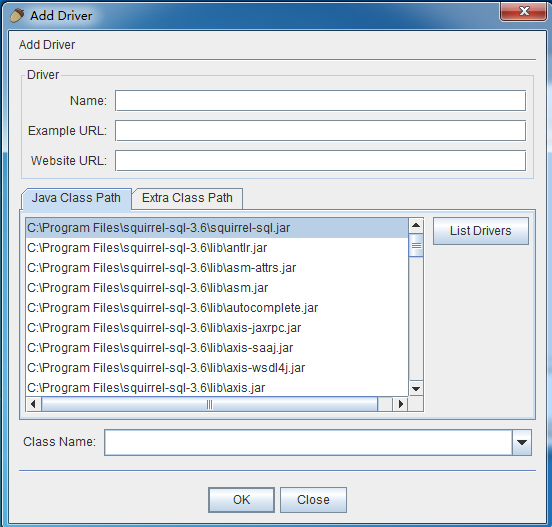
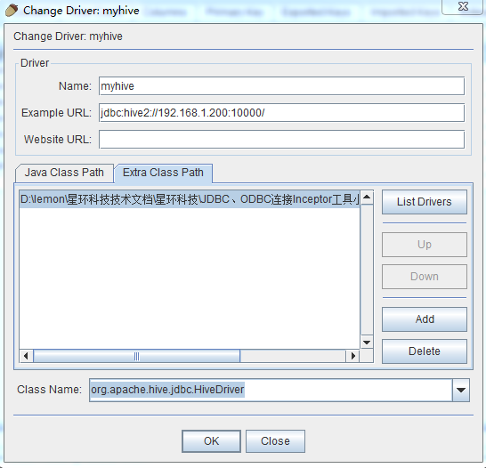
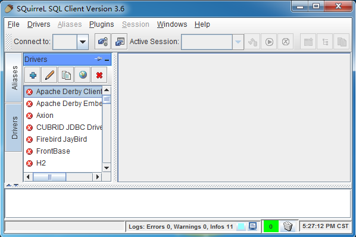
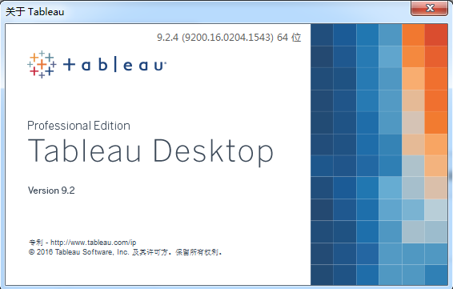
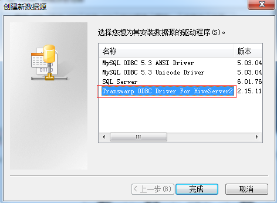
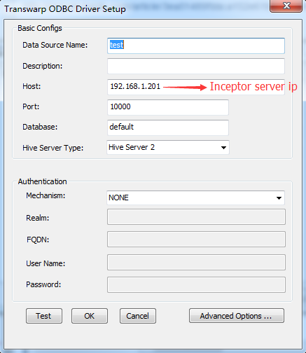

# 3.使用JDBC、ODBC工具连接Inceptor

##一、squirrel工具
介绍：是一个用Java编写的开源数据库工具，可以用来查看/编辑数据库的内容、发出SQL 命令。它可以支持兼容JDBC的数据库，可以使用统一的界面处理不同的数据库，本例为使用小松鼠连接Inceptor

###安装步骤：
1、确认windows系统的电脑上安装了jdk1.7或以上

2、打开CMD，输入
```
java -jar squirrel-sql-3.6-standard.jar
```
（待安装好后进入windows安装目录下运行squirrel-sql.bat）

3、连接数据库需要填写驱动信息，Name：myhive（随意起名）
URL：jdbc:hive2://[Inceptor server ip]:10000/ (/后面不写数据库名代表默认的default数据库)最后在Extra Class Path里添加外部JDBC的jar包，将inceptor-driver-4.2.2.jar添加进去，点击List Drivers，下面的Class Name就会出现默认的org.apache.hive.jdbc.HiveDriver，选中即可进行下一步





4、完成安装，添加别名，进行查询




##二、Tableau工具
1、在官网上下载Tableau软件



安装完成后需要先注册，再使用datestopper工具进行破解，具体教程请参考

<http://jingyan.baidu.com/article/3ea51489fbbca152e61bbad2.html>

2、安装ODBC驱动程序 

根据自己的机器安装64位/32位的Hive2驱动包


3、添加ODBC驱动程序

在CMD中输入odbc，单击添加，找到刚刚安装好的驱动并填写连接参数





点击Test，测试成功后点击OK即可

