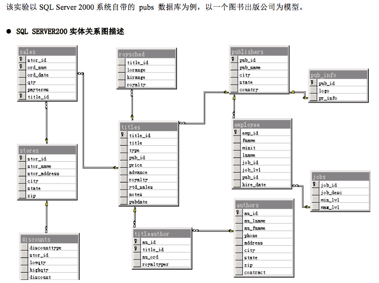
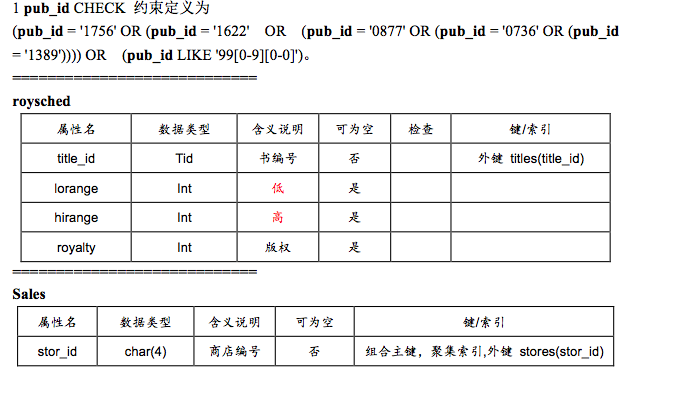
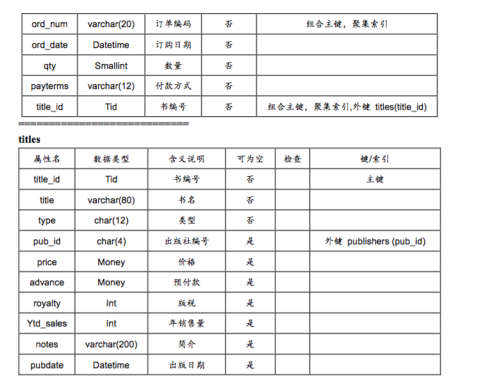
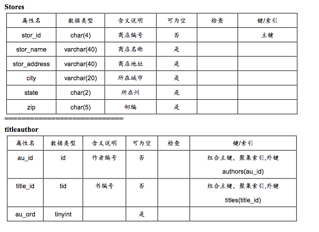
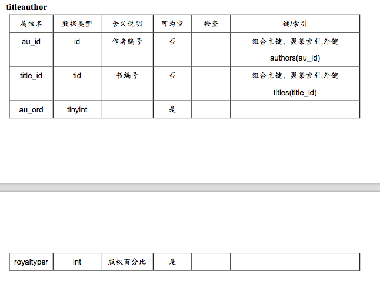

# 第四章 SQL语法练习













##SQL 练习

###目的1：
1.	加深对表间关系的理解。
2.	理解数据库中数据的查询方法和应用。
3.	学会各种查询的异同及相互之间的转换方法。

###内容1：
1.	查询所有作者的作者号、姓名信息
2.	查询所有作者的姓名、作者号信息，并在每个作者的作者号前面显示字符串“身份证号：”，表明显示的信息是身份证信息
3.	查询在CA州的作者姓名和城市
4.	查询出版日期在1992.1.1-2000.12.31之间的书名和出版日期(查询1991年出版的书)
5.	查询每个出版社出版的书
6.	查询某店销售某书的数量
7.	查询有销售记录的所有书信息，包括书的编号、书名、类型和价格
8.	查询已销售书的信息
9.	显示所有的书名（无销售记录的书也包括在内）
10.	查询已销售书的信息（书号、书名、作者等）
11. 查询所有出版商业（business）书籍的出版社的名称

###目的2：
1.	理解数据库中数据的其他查询方法和应用；
2.	学会各种查询要求的实现。

###内容2：
在实验1的基础上，练习查询语句的使用，包括计算列、求和、最大、最小值、各类选择条件、字符匹配、分组和排序，体会各种查询的执行过程，为简单综合应用打下良好的基础。
1.	查询书名以T开头或者出版社号为0877，而且价格大于16的书的信息。
2.	按照类型的升序和价格的降序（在类型相同时）显示书的信息（书名、作者、出版社、类型、价格）
3.	查询销售量大于30的书名及销售数量
4.	查询在2002.1.1到2002.10.31间，每本书的销售总额
5.	查询所有作者的所在城市和州名，要求没有重复信息
6.	计算多少种书已被订价
7.	查询每本书的书名、作者及它的售书总量
8.	计算所有书的平均价格
9.	查询价格最高的书的书名、作者及价格

###目的3：
1.	加深对数据库相关性质的理解；
2.	各种约束性理解；
3.	学会数据库中数据的更新的方法。

###内容3：
1.	参照以上各表给出的主键、外键设置的设置要求，在自己创建的表中进行相应的设置。
2.	向authors表中插入一行作者信息（具体值自定）
3.	数量超过100的商店增加10%的折扣
4.	删除2001.10.3的订单
5.	删除1中所建立的索引
6.	建立CA州作者所著书的视图（包括作者号、姓名、所在州、书名、价格、出版日期）
7.	建立付款方式是现金（cash）的订单视图
8.	建立CA州的所有商店的视图


###目的4：
1.	在查询分析器中，练习使用IN、比较符、ANY或ALL等操作符进行查询。
2.	练习使用EXISTS操作符进行嵌套查询操作

###内容4：
1.	在pubs数据库的titleauthor和中，用IN谓词查询来自‘CA’州(在authors表中)的作家的全部作品（title_id）和作家的代号(au_id)。
2.	在pubs数据库中，用比较运算符引出的子查询找出在名称为“Algodata Infosystems”的出版社所在城市中的作者的姓名（au_lname, au_fname）
3.	在pubs数据库中的titles表中，查询价格大于所有类型(TYPE)为“business”的图书价格的书名（title）和价格(price)
4.	在pubs数据库的sales表中查找所有销售量大于所有图书平均销售量avg（qty））的书的代号(title_id)及销售量（qty）。
5.	用带有IN的嵌套查询，查询来自城市（city）为“London”的客户所订的订单信息（customers和orders表）。
6.	用带有IN的嵌套查询，查询Northwind数据库中的产品表（Products）中来自国家为“Germany” （在供应商表（Suppliers）表中）的供货商供应的产品信息（包括Productid，Productname， categoryid, unitprice）。
7.	使用EXISTS子查询在Pubs数据库titles 表及publishers表中查询New Moon Books出版社所出版的图书名称（title)

###目的5：
1.	分类汇总。

###内容5：
1.	找出pubs数据库titles表中计算机类图书中价格最高的图书的价格。
2.	查询titles表中有几类图书。
3.	按照州进行分类，查找每个州有几名作者。
4.	要求按照出版商id进行分类，查找每个出版商的书到目前为止的销售额总和（ytd_sales）。
5.	在pubs数据库的titles表中，找出平均价格大于18美元的书的种类。
6.	在pubs数据库的titles表中，找出最高价大于20美元的书的种类。
7.	找出title_id和pub_name的对应关系。
8.	找出title_id, title和pub_name的对应关系。
9.	查询每个作者的编号，姓名，所出的书的编号，并对结果排序。
10.	从authors表中选择state,city列，从publisher表中选择state,city列，并把两个查询的结果合并为一个结果集，并对结果集按city列、state列进行排序。
11.	对上面的查询语句作修改，保留所有重复的记录。
12.	显示所有来自CA州的作家的全部作品和作家代号。（使用IN，和连接两种方法）
13.	查找由位于以字母 B 开头的城市中的任一出版商出版的书名：(使用exists和in两种方法)


##SQL具体操作练习

###简单查询学生选课数据问题
1. 列出全部学生的信息。
2. 列出信息系全部学生的学号及姓名。
3. 列出所有已被选修的选修课的课号。
4. 求c01号课成绩大于80分的学生的学号及成绩，并按成绩由高到低列出。
5. 列出非信息系学生的名单。
6. 查询成绩在70~80分之间的学生选课得分情况
7. 列出选修c01号课或c03号课的全体学生的学号和成绩。
8. 列出所有95级学生的学生成绩情况。
9. 列出成绩为空值(或不为空值)的学生的学号和课号。
10. 求出所有学生的总成绩。
11. 列出每个学生的平均成绩。
12. 列出各科的平均成绩、最高成绩、最低成绩和选课人数。

###简单查询学生选课数据问题答案

```
1. SELECT * FROM 学生
2. SELECT 学号,姓名 FROM 学生 WHERE 专业=’信息系’
3. SELECT DISTINCT 课号 FROM 选修课
4. SELECT 学号,成绩 FROM 选课 WHERE 课号=’01’ AND 成绩>80 ORDER BY 成绩 DESC
5. 方法一：SELECT 姓名 FROM 学生 WHERE 专业<>’信息系’
   方法二：SELECT 姓名 FROM 学生 WHERE NOT 专业=’信息系’
   方法三：SELECT 姓名 FROM 学生 WHERE 专业!=’信息系’
6. 方法一：SELECT * FROM 选课 WHERE 成绩>=70 AND 成绩<=80
   方法二：SELECT * FROM 选课 WHERE 成绩 BETWEEN 70 AND 80
   不在此范围内的查询：（注意写出和以下语句等价的语句）
   SELECT * FROM 选课 WHERE 成绩 NOT BETWEEN 70 AND 80
7. 方法一：SELECT 学号,成绩 FROM 选课 WHERE 课号=’c01’ OR 课号=’c03’
   方法二：SELECT 学号,成绩 FROM 选课 WHERE 课号 IN (‘c01’,’c03’)
   相反条件查询：SELECT 学号,成绩 FROM 选课 WHERE 课号 NOT IN (‘c01’,’c03’)
8. SELECT * FROM 选课 WHERE 学号 LIKE ‘95%’
   SELECT * FROM 选课 WHERE 学号 LIKE ‘95_ _ _ _’
   相反条件查询：SELECT * FROM 选课 WHERE 学号 NOT LIKE ‘98%’
9. 答案一：SELECT 学号,课号 FROM 选课 WHERE 成绩 IS NULL
   答案二：SELECT 学号,课号 FROM 选课 WHERE 成绩 IS NOT NULL
10. SELECT SUM(成绩) AS 总成绩 FROM 选课
11. SELECT 学号,AVG(成绩) AS 平均成绩 FROM 选课 GROUP BY 学号
12. SELECT 课号,AVG(成绩) AS 平均成绩,MAX(成绩) AS 最高分,
MIN(成绩) AS 最低分,COUNT(学号) AS 选课人数 FROM 选课 GROUP BY 课号
```


###目的4：
1.	在查询分析器中，练习使用IN、比较符、ANY或ALL等操作符进行查询。
2.	练习使用EXISTS操作符进行嵌套查询操作

###请完成以下习题：
1. 在pubs数据库的titleauthor和中，用IN谓词查询来自‘CA’州(在authors表中)的作家的全部作品（title_id）和作家的代号(au_id)。

```	
select title_id,au_id from titleauthor
                      where au_id in (select au_id from authors where  state='CA')  
           
在pubs数据库中，用比较运算符引出的子查询找出在名称为“Algodata Infosystems”的出版社所在城市中的作者的姓名（au_lname, au_fname）

select au_lname, au_fname
from authors 
where  city= (select city
         from publishers
        where pub_name='Algodata Infosystems')
        
在pubs数据库中的titles表中，查询价格大于所有类型(TYPE)为“business”的图书价格的书名（title）和价格(price)

select title,price
from titles
where price>all (select price
         from titles
         where type='business')
         
在pubs数据库的sales表中查找所有销售量大于所有图书平均销售量avg（qty））的书的代号(title_id)及销售量（qty）。
 select title_id ,qty
from sales
where qty>all(select avg(qty)
from sales
)

用带有IN的嵌套查询，查询来自城市（city）为“London”的客户所订的订单信息（customers和orders表）。
select *
from orders
where customerID in (select customerID
from customers
where city='london')

用带有IN的嵌套查询，查询Northwind数据库中的产品表（Products）中来自国家为“Germany” （在供应商表（Suppliers）表中）的供货商供应的产品信息（包括Productid，Productname， categoryid, unitprice）。
SELECT Productid,Productname, categoryid,unitprice
from Products
where Productid in(select supplierID
from Suppliers
where country='Germany')

```

###提高操作实验


```
练习使用EXISTS操作符进行嵌套查询操作。请完成以下习题：
使用EXISTS子查询在Pubs数据库titles 表及publishers表中查询New Moon Books出版社所出版的图书名称（title)

select title
        from titles
        where exists (select *
        from publishers
        where pub_name='New Moon Books')


T-SQL高级查询课堂练习及答案
--练习1
--找出pubs数据库titles表中计算机类图书中价格最高的图书的价格。
USE pubs
GO
SELECT max(price) FROM titles
where type='popular_comp'
GO

--练习2
--查询titles表中有几类图书。
USE pubs
GO
SELECT count(distinct type) FROM titles
GO

--练习3
--按照州进行分类，查找每个州有几名作者。
USE pubs
GO
SELECT state, count(*) FROM authors
group by state
order by 1
GO


--练习4
--要求按照出版商id进行分类，查找每个出版商的书到目前为止的销售额总和（ytd_sales）。
USE pubs
GO
SELECT pub_id, sum(ytd_sales) FROM titles
group by pub_id
order by 1
GO

--练习5
--在pubs数据库的titles表中，找出平均价格大于18美元的书的种类。
USE pubs
GO
SELECT pub_id,avg(price) '平均价格' FROM titles
GROUP BY pub_id
HAVING avg(price) > 18
GO


--练习6
--在pubs数据库的titles表中，找出最高价大于20美元的书的种类。
USE pubs
GO
SELECT type,max(price) '平均价格' FROM titles
GROUP BY type
HAVING max(price) > 20
GO

--练习7
--
找出title_id和pub_name的对应关系。
Use pubs
go
Select titles.title_id, publishers.pub_name
From titles JOIN publishers
ON titles.pub_id=publishers.pub_id
Go

--练习8
--找出title_id, title和pub_name的对应关系。
Use pubs
go
Select titles.title_id, titles.title, publishers.pub_name
From titles JOIN publishers
ON titles.pub_id=publishers.pub_id
Go

--练习9
--查询每个作者的编号，姓名，所出的书的编号，并对结果排序。
Use pubs
go
Select authors.au_id,
       authors.au_fname + '.' + authors.au_lname 'name',
       titleauthor.title_id
From authors JOIN titleauthor
ON authors.au_id=titleauthor.au_id
order by authors.au_id
go


--练习10 
--从authors表中选择state,city列，从publisher表中选择state,city列，并把两个查询的结果合并为一个结果集，并对结果集按city列、state列进行排序。
use pubs
go
select state,city from publishers
union 
select state,city from authors
order by 1,2


--练习11
--对上面的查询语句作修改，保留所有重复的记录。
use pubs
go
select state,city from publishers
union all
select state,city from authors
order by 1,2


--练习12
--显示所有来自CA州的作家的全部作品和作家代号。（使用IN，和连接两种方法）
use pubs
go
select title_id,au_id
from titleauthor
where au_id in
( select au_id from authors
where state = 'CA')
order by title_id
go

use pubs
go
select t.title_id,t.au_id
from titleauthor t join authors a
on t.au_id = a.au_id
where a.state = 'CA'
order by title_id
go

--练习13
--查找由位于以字母 B 开头的城市中的任一出版商出版的书名：(使用exists和in两种方法)

USE pubs
GO
SELECT title
FROM titles
WHERE EXISTS
   (SELECT *
   FROM publishers
   WHERE pub_id = titles.pub_id
   AND city LIKE 'B%')
GO


USE pubs
GO
SELECT title
FROM titles
WHERE pub_id IN
   (SELECT pub_id
   FROM publishers
   WHERE city LIKE 'B%')
GO


```