# 第十八章 数据采集与爬虫
##一 数据采集概念
任何完整的大数据平台，一般包括以下的几个过程：
* 数据采集
* 数据存储
* 数据处理
* 数据展现（可视化，报表和监控）
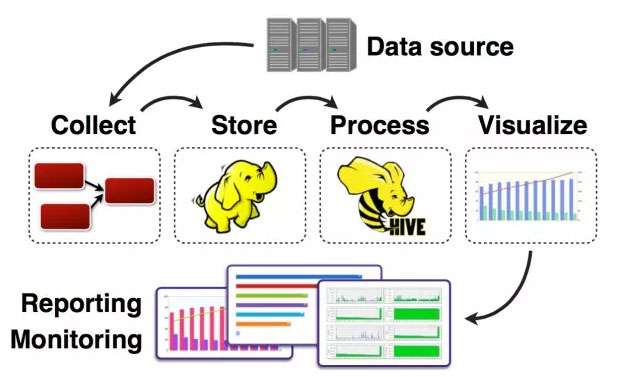

其中，数据采集是所有数据系统必不可少的，随着大数据越来越被重视，数据采集的挑战也变的尤为突出。这其中包括：
* 数据源多种多样
* 数据量大，变化快
* 如何保证数据采集的可靠性的性能
* 如何避免重复数据
* 如何保证数据的质量

我们今天就来看看当前可用的六款数据采集的产品，重点关注它们是如何做到高可靠，高性能和高扩展。

###1 Apache Flume

**官网：https://flume.apache.org/**

Flume 是Apache旗下的一款开源、高可靠、高扩展、容易管理、支持客户扩展的数据采集系统。 Flume使用JRuby来构建，所以依赖Java运行环境。

Flume最初是由Cloudera的工程师设计用于合并日志数据的系统，后来逐渐发展用于处理流数据事件。

Flume设计成一个分布式的管道架构，可以看作在数据源和目的地之间有一个Agent的网络，支持数据路由。
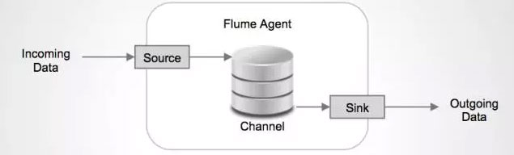
每一个agent都由Source，Channel和Sink组成。

**Source**

Source负责接收输入数据，并将数据写入管道。Flume的Source支持HTTP，JMS，RPC，NetCat，Exec，Spooling Directory。其中Spooling支持监视一个目录或者文件，解析其中新生成的事件。

**Channel**

Channel 存储，缓存从source到Sink的中间数据。可使用不同的配置来做Channel，例如内存，文件，JDBC等。使用内存性能高但不持久，有可能丢数据。使用文件更可靠，但性能不如内存。

**Sink**

Sink负责从管道中读出数据并发给下一个Agent或者最终的目的地。Sink支持的不同目的地种类包括：HDFS，HBASE，Solr，ElasticSearch，File，Logger或者其它的Flume Agent。
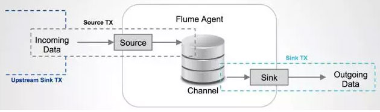

Flume在source和sink端都使用了transaction机制保证在数据传输中没有数据丢失。
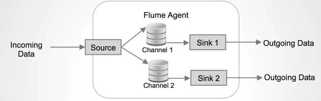

Source上的数据可以复制到不同的通道上。每一个Channel也可以连接不同数量的Sink。这样连接不同配置的Agent就可以组成一个复杂的数据收集网络。通过对agent的配置，可以组成一个路由复杂的数据传输网络。

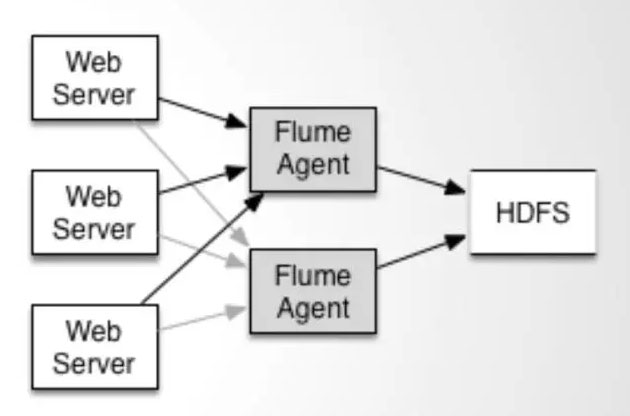

配置如上图所示的agent结构，Flume支持设置sink的Failover和Load Balance，这样就可以保证即使有一个agent失效的情况下，整个系统仍能正常收集数据。
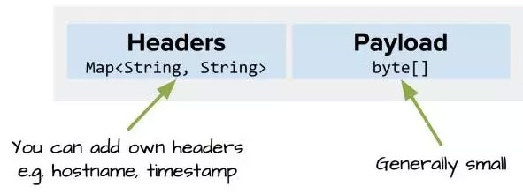

Flume中传输的内容定义为事件（Event），事件由Headers（包含元数据，Meta Data）和Payload组成。

Flume提供SDK，可以支持用户定制开发：

Flume客户端负责在事件产生的源头把事件发送给Flume的Agent。客户端通常和产生数据源的应用在同一个进程空间。常见的Flume客户端有Avro，log4J，syslog和HTTP Post。另外ExecSource支持指定一个本地进程的输出作为Flume的输入。当然很有可能，以上的这些客户端都不能满足需求，用户可以定制的客户端，和已有的FLume的Source进行通信，或者定制实现一种新的Source类型。

同时，用户可以使用Flume的SDK定制Source和Sink。似乎不支持定制的Channel。

### 2、Fluentd

**官网：http://docs.fluentd.org/articles/quickstart**

Fluentd是另一个开源的数据收集框架。Fluentd使用C/Ruby开发，使用JSON文件来统一日志数据。它的可插拔架构，支持各种不同种类和格式的数据源和数据输出。最后它也同时提供了高可靠和很好的扩展性。Treasure Data, Inc 对该产品提供支持和维护。
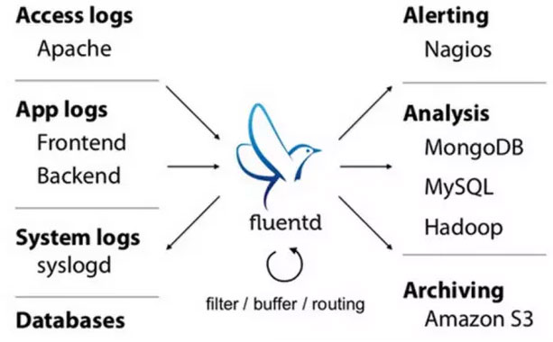

Fluentd的部署和Flume非常相似：
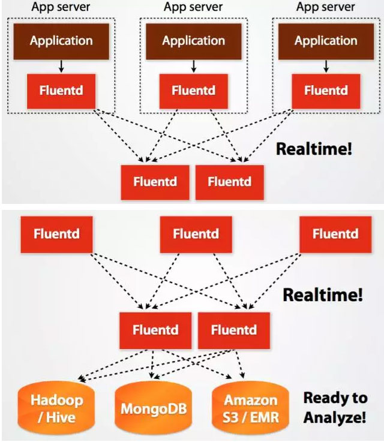

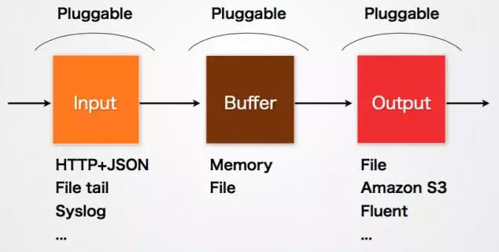
Fluentd的Input／Buffer／Output非常类似于Flume的Source／Channel／Sink。

**Input**

Input负责接收数据或者主动抓取数据。支持syslog，http，file tail等。

**Buffer**

Buffer负责数据获取的性能和可靠性，也有文件或内存等不同类型的Buffer可以配置。

**Output**

Output负责输出数据到目的地例如文件，AWS S3或者其它的Fluentd。

Fluentd的配置非常方便，如下图：

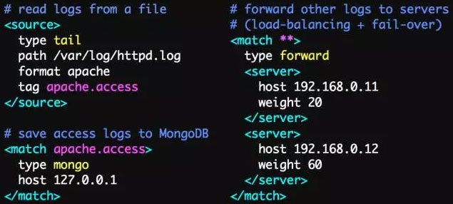

### 3 Logstash

**官方网站:https://github.com/elastic/logstash**

Logstash是著名的开源数据栈ELK （ElasticSearch, Logstash, Kibana）中的那个L。

Logstash用JRuby开发，所有运行时依赖JVM。

Logstash的部署架构如下图，当然这只是一种部署的选项。
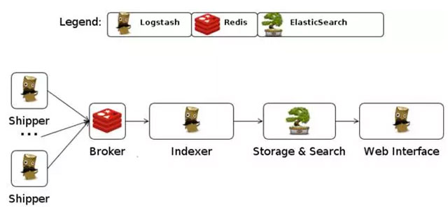
一个典型的Logstash的配置如下，包括了Input，filter的Output的设置。
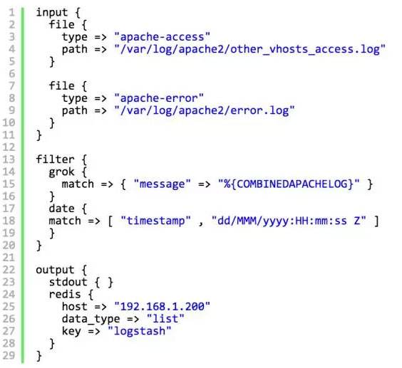

几乎在大部分的情况下ELK作为一个栈是被同时使用的。所有当你的数据系统使用ElasticSearch的情况下，logstash是首选。

### 4 数据采集总结

我们简单讨论了几种流行的数据收集平台，它们大都提供高可靠和高扩展的数据收集。大多平台都抽象出了输入，输出和中间的缓冲的架构。利用分布式的网络连接，大多数平台都能实现一定程度的扩展性和高可靠性。

其中Flume，Fluentd是两个被使用较多的产品。如果你用ElasticSearch，Logstash也许是首选，因为ELK栈提供了很好的集成。Chukwa和Scribe由于项目的不活跃，不推荐使用。

Splunk作为一个优秀的商业产品，它的数据采集还存在一定的限制，相信Splunk很快会开发出更好的数据收集的解决方案。

## 二 爬虫技术方案选择

开发网络爬虫应该选择Nutch、Crawler4j、WebMagic、scrapy、WebCollector还是其他的？这里按照我的经验随便扯淡一下：上面说的爬虫，基本可以分3类：
1. 分布式爬虫：Nutch
2. JAVA单机爬虫：Crawler4j、WebMagic、WebCollector
3. 非JAVA单机爬虫：scrapy

### 1 分布式爬虫
爬虫使用分布式，主要是解决两个问题：
1. 海量URL管理
2. 网速

现在比较流行的分布式爬虫，是Apache的Nutch。但是对于大多数用户来说，Nutch是这几类爬虫里，最不好的选择，理由如下：
1. Nutch是为搜索引擎设计的爬虫，大多数用户是需要一个做精准数据爬取（精抽取）的爬虫。Nutch运行的一套流程里，有三分之二是为了搜索引擎而设计的。对精抽取没有太大的意义。也就是说，用Nutch做数据抽取，会浪费很多的时间在不必要的计算上。而且如果你试图通过对Nutch进行二次开发，来使得它适用于精抽取的业务，基本上就要破坏Nutch的框架，把Nutch改的面目全非，有修改Nutch的能力，真的不如自己重新写一个分布式爬虫框架了。

2. Nutch依赖hadoop运行，hadoop本身会消耗很多的时间。如果集群机器数量较少，爬取速度反而不如单机爬虫快。

3. Nutch虽然有一套插件机制，而且作为亮点宣传。可以看到一些开源的Nutch插件，提供精抽取的功能。但是开发过Nutch插件的人都知道，Nutch的插件系统有多蹩脚。利用反射的机制来加载和调用插件，使得程序的编写和调试都变得异常困难，更别说在上面开发一套复杂的精抽取系统了。而且Nutch并没有为精抽取提供相应的插件挂载点。Nutch的插件有只有五六个挂载点，而这五六个挂载点都是为了搜索引擎服务的，并没有为精抽取提供挂载点。大多数Nutch的精抽取插件，都是挂载在“页面解析”(parser)这个挂载点的，这个挂载点其实是为了解析链接（为后续爬取提供URL），以及为搜索引擎提供一些易抽取的网页信息(网页的meta信息、text文本)。

4. 用Nutch进行爬虫的二次开发，爬虫的编写和调试所需的时间，往往是单机爬虫所需的十倍时间不止。了解Nutch源码的学习成本很高，何况是要让一个团队的人都读懂Nutch源码。调试过程中会出现除程序本身之外的各种问题(hadoop的问题、hbase的问题)。

5. 很多人说Nutch2有gora，可以持久化数据到avro文件、hbase、mysql等。很多人其实理解错了，这里说的持久化数据，是指将URL信息（URL管理所需要的数据）存放到avro、hbase、mysql。并不是你要抽取的结构化数据。其实对大多数人来说，URL信息存在哪里无所谓。

6. Nutch2的版本目前并不适合开发。官方现在稳定的Nutch版本是nutch2.2.1，但是这个版本绑定了gora-0.3。如果想用hbase配合nutch（大多数人用nutch2就是为了用hbase)，只能使用0.90版本左右的hbase，相应的就要将hadoop版本降到hadoop 0.2左右。而且nutch2的官方教程比较有误导作用，Nutch2的教程有两个，分别是Nutch1.x和Nutch2.x，这个Nutch2.x官网上写的是可以支持到hbase 0.94。但是实际上，这个Nutch2.x的意思是Nutch2.3之前、Nutch2.2.1之后的一个版本，这个版本在官方的SVN中不断更新。而且非常不稳定（一直在修改）。
所以，如果你不是要做搜索引擎，尽量不要选择Nutch作为爬虫。有些团队就喜欢跟风，非要选择Nutch来开发精抽取的爬虫，其实是冲着Nutch的名气（Nutch作者是Doug Cutting），当然最后的结果往往是项目延期完成。

如果你是要做搜索引擎，Nutch1.x是一个非常好的选择。Nutch1.x和solr或者es配合，就可以构成一套非常强大的搜索引擎了。如果非要用Nutch2的话，建议等到Nutch2.3发布再看。目前的Nutch2是一个非常不稳定的版本。

###2 JAVA单机爬虫

其实开源网络爬虫（框架）的开发非常简单，难问题和复杂的问题都被以前的人解决了（比如DOM树解析和定位、字符集检测、海量URL去重），可以说是毫无技术含量。包括Nutch，其实Nutch的技术难点是开发hadoop，本身代码非常简单。网络爬虫从某种意义来说，类似遍历本机的文件，查找文件中的信息。没有任何难度可言。之所以选择开源爬虫框架，就是为了省事。比如爬虫的URL管理、线程池之类的模块，谁都能做，但是要做稳定也是需要一段时间的调试和修改的。

对于爬虫的功能来说。用户比较关心的问题往往是：
1. 爬虫支持多线程么、爬虫能用代理么、爬虫会爬取重复数据么、爬虫能爬取JS生成的信息么？

不支持多线程、不支持代理、不能过滤重复URL的，那都不叫开源爬虫，那叫循环执行http请求。能不能爬js生成的信息和爬虫本身没有太大关系。爬虫主要是负责遍历网站和下载页面。爬js生成的信息和网页信息抽取模块有关，往往需要通过模拟浏览器(htmlunit,selenium)来完成。这些模拟浏览器，往往需要耗费很多的时间来处理一个页面。所以一种策略就是，使用这些爬虫来遍历网站，遇到需要解析的页面，就将网页的相关信息提交给模拟浏览器，来完成JS生成信息的抽取。

2. 爬虫可以爬取ajax信息么？

网页上有一些异步加载的数据，爬取这些数据有两种方法：使用模拟浏览器（问题1中描述过了），或者分析ajax的http请求，自己生成ajax请求的url，获取返回的数据。如果是自己生成ajax请求，使用开源爬虫的意义在哪里？其实是要用开源爬虫的线程池和URL管理功能（比如断点爬取）。

如果我已经可以生成我所需要的ajax请求（列表），如何用这些爬虫来对这些请求进行爬取？
爬虫往往都是设计成广度遍历或者深度遍历的模式，去遍历静态或者动态页面。爬取ajax信息属于deep web（深网）的范畴，虽然大多数爬虫都不直接支持。但是也可以通过一些方法来完成。比如WebCollector使用广度遍历来遍历网站。爬虫的第一轮爬取就是爬取种子集合(seeds)中的所有url。简单来说，就是将生成的ajax请求作为种子，放入爬虫。用爬虫对这些种子，进行深度为1的广度遍历（默认就是广度遍历）。

3. 爬虫怎么爬取要登陆的网站？

这些开源爬虫都支持在爬取时指定cookies，模拟登陆主要是靠cookies。至于cookies怎么获取，不是爬虫管的事情。你可以手动获取、用http请求模拟登陆或者用模拟浏览器自动登陆获取cookie。

4. 爬虫怎么抽取网页的信息？

开源爬虫一般都会集成网页抽取工具。主要支持两种规范：CSS SELECTOR和XPATH。至于哪个好，这里不评价。

5. 爬虫怎么保存网页的信息？

有一些爬虫，自带一个模块负责持久化。比如webmagic，有一个模块叫pipeline。通过简单地配置，可以将爬虫抽取到的信息，持久化到文件、数据库等。还有一些爬虫，并没有直接给用户提供数据持久化的模块。比如crawler4j和webcollector。让用户自己在网页处理模块中添加提交数据库的操作。至于使用pipeline这种模块好不好，就和操作数据库使用ORM好不好这个问题类似，取决于你的业务。

6. 爬虫被网站封了怎么办？

爬虫被网站封了，一般用多代理（随机代理）就可以解决。但是这些开源爬虫一般没有直接支持随机代理的切换。所以用户往往都需要自己将获取的代理，放到一个全局数组中，自己写一个代理随机获取（从数组中）的代码。

7. 网页可以调用爬虫么？

爬虫的调用是在Web的服务端调用的，平时怎么用就怎么用，这些爬虫都可以使用。

8. 爬虫速度怎么样？

单机开源爬虫的速度，基本都可以讲本机的网速用到极限。爬虫的速度慢，往往是因为用户把线程数开少了、网速慢，或者在数据持久化时，和数据库的交互速度慢。而这些东西，往往都是用户的机器和二次开发的代码决定的。这些开源爬虫的速度，都很可以。

9. 明明代码写对了，爬不到数据，是不是爬虫有问题，换个爬虫能解决么？

如果代码写对了，又爬不到数据，换其他爬虫也是一样爬不到。遇到这种情况，要么是网站把你封了，要么是你爬的数据是javascript生成的。爬不到数据通过换爬虫是不能解决的。

10. 哪个爬虫可以判断网站是否爬完、那个爬虫可以根据主题进行爬取？

爬虫无法判断网站是否爬完，只能尽可能覆盖。

至于根据主题爬取，爬虫之后把内容爬下来才知道是什么主题。所以一般都是整个爬下来，然后再去筛选内容。如果嫌爬的太泛，可以通过限制URL正则等方式，来缩小一下范围。

11. 哪个爬虫的设计模式和构架比较好？

设计模式纯属扯淡。说软件设计模式好的，都是软件开发完，然后总结出几个设计模式。设计模式对软件开发没有指导性作用。用设计模式来设计爬虫，只会使得爬虫的设计更加臃肿。

至于构架，开源爬虫目前主要是细节的数据结构的设计，比如爬取线程池、任务队列，这些大家都能控制好。爬虫的业务太简单，谈不上什么构架。

所以对于JAVA开源爬虫，我觉得，随便找一个用的顺手的就可以。如果业务复杂，拿哪个爬虫来，都是要经过复杂的二次开发，才可以满足需求。

###3 非JAVA单机爬虫

在非JAVA语言编写的爬虫中，有很多优秀的爬虫。这里单独提取出来作为一类，并不是针对爬虫本身的质量进行讨论，而是针对larbin、scrapy这类爬虫，对开发成本的影响。

先说python爬虫，python可以用30行代码，完成JAVA 50行代码干的任务。python写代码的确快，但是在调试代码的阶段，python代码的调试往往会耗费远远多于编码阶段省下的时间。使用python开发，要保证程序的正确性和稳定性，就需要写更多的测试模块。当然如果爬取规模不大、爬取业务不复杂，使用scrapy这种爬虫也是蛮不错的，可以轻松完成爬取任务。

对于C++爬虫来说，学习成本会比较大。而且不能只计算一个人的学习成本，如果软件需要团队开发或者交接，那就是很多人的学习成本了。软件的调试也不是那么容易。

还有一些ruby、php的爬虫，这里不多评价。的确有一些非常小型的数据采集任务，用ruby或者php很方便。但是选择这些语言的开源爬虫，一方面要调研一下相关的生态圈，还有就是，这些开源爬虫可能会出一些你搜不到的BUG（用的人少、资料也少）

## 三 基于Python的爬虫库
###1 通用
1. urllib -网络库(stdlib)。
2. requests -网络库。
3. grab – 网络库（基于pycurl）。
4. pycurl – 网络库（绑定libcurl）。
5. urllib3 – Python HTTP库，安全连接池、支持文件post、可用性高。
6. httplib2 – 网络库。
7. RoboBrowser – 一个简单的、极具Python风格的Python库，无需独立的浏览器即可浏览网页。
8. MechanicalSoup -一个与网站自动交互Python库。
9. mechanize -有状态、可编程的Web浏览库。
11. socket – 底层网络接口(stdlib)。
12. Unirest for Python – Unirest是一套可用于多种语言的轻量级的HTTP库。
13. hyper – Python的HTTP/2客户端。
14. PySocks – SocksiPy更新并积极维护的版本，包括错误修复和一些其他的特征。作为socket模块的直接替换。

###2 异步
1. treq – 类似于requests的API（基于twisted）。
2. aiohttp – asyncio的HTTP客户端/服务器(PEP-3156)。

###3 功能齐全的爬虫
1. grab – 网络爬虫框架（基于pycurl/multicur）。
2. scrapy – 网络爬虫框架（基于twisted），不支持Python3。
3. pyspider – 一个强大的爬虫系统。
4. cola – 一个分布式爬虫框架。

###4 其他
1. portia – 基于Scrapy的可视化爬虫。
2. restkit – Python的HTTP资源工具包。它可以让你轻松地访问HTTP资源，并围绕它建立的对象。
3. demiurge – 基于PyQuery的爬虫微框架。

###5 HTML/XML解析器
1. lxml – C语言编写高效HTML/ XML处理库。支持XPath。
2. cssselect – 解析DOM树和CSS选择器。
3. pyquery – 解析DOM树和jQuery选择器。
4. BeautifulSoup – 低效HTML/ XML处理库，纯Python实现。
5. html5lib – 根据WHATWG规范生成HTML/ 
6. XML文档的DOM。该规范被用在现在所有的浏览器上。
7. feedparser – 解析RSS/ATOM feeds。
8. MarkupSafe – 为XML/HTML/XHTML提供了安全转义的字符串。
9. xmltodict – 一个可以让你在处理XML时感觉像在处理JSON一样的Python模块。
10. xhtml2pdf – 将HTML/CSS转换为PDF。
11. untangle – 轻松实现将XML文件转换为Python对象。

###6 清理
1. Bleach – 清理HTML（需要html5lib）。
2. sanitize – 为混乱的数据世界带来清明。

###7 解析和操作简单文本的库。

1. difflib – （Python标准库）帮助进行差异化比较。
2. Levenshtein – 快速计算Levenshtein距离和字符串相似度。
3. fuzzywuzzy – 模糊字符串匹配。
4. esmre – 正则表达式加速器。
5. ftfy – 自动整理Unicode文本，减少碎片化。

###8 转换
1. unidecode – 将Unicode文本转为ASCII。

###9 字符编码
1. uniout – 打印可读字符，而不是被转义的字符串。
2. chardet – 兼容 Python的2/3的字符编码器。
3. xpinyin – 一个将中国汉字转为拼音的库。
4. pangu.py – 格式化文本中CJK和字母数字的间距。

###10 Slug化
1. awesome-slugify – 一个可以保留unicode的Python slugify库。
2. python-slugify – 一个可以将Unicode转为ASCII的Python slugify库。
3. unicode-slugify – 一个可以将生成Unicode slugs的工具。
4. pytils – 处理俄语字符串的简单工具（包括pytils.translit.slugify）。

###11 通用解析器
1. PLY – lex和yacc解析工具的Python实现。
2. pyparsing – 一个通用框架的生成语法分析器。

###12 人的名字
1. python-nameparser -解析人的名字的组件。

###13 电话号码
1. phonenumbers -解析，格式化，存储和验证国际电话号码。

###14 用户代理字符串
1. python-user-agents – 浏览器用户代理的解析器。
2. HTTP Agent Parser – Python的HTTP代理分析器。

###15 解析和处理特定文本格式的库。

1. tablib – 一个把数据导出为XLS、CSV、JSON、YAML等格式的模块。
2. textract – 从各种文件中提取文本，比如 Word、PowerPoint、PDF等。
3. messytables – 解析混乱的表格数据的工具。
4. rows – 一个常用数据接口，支持的格式很多（目前支持CSV，HTML，XLS，TXT – 将来还会提供更多！）。

###16 Office
1. python-docx – 读取，查询和修改的Microsoft Word2007/2008的docx文件。
2. xlwt / xlrd – 从Excel文件读取写入数据和格式信息。
3. XlsxWriter – 一个创建Excel.xlsx文件的Python模块。
4. xlwings – 一个BSD许可的库，可以很容易地在Excel中调用Python，反之亦然。
5. openpyxl – 一个用于读取和写入的Excel2010 XLSX/ XLSM/ xltx/ XLTM文件的库。
6. Marmir – 提取Python数据结构并将其转换为电子表格。

###17 PDF
1. PDFMiner – 一个从PDF文档中提取信息的工具。
2. PyPDF2 – 一个能够分割、合并和转换PDF页面的库。
3. ReportLab – 允许快速创建丰富的PDF文档。
4. pdftables – 直接从PDF文件中提取表格。

###18 Markdown
1. Python-Markdown – 一个用Python实现的John Gruber的Markdown。
2. Mistune – 速度最快，功能全面的Markdown纯Python解析器。
3. markdown2 – 一个完全用Python实现的快速的Markdown。

###19 YAML
1. PyYAML – 一个Python的YAML解析器。

###20 CSS
1. cssutils – 一个Python的CSS库。

###21 ATOM/RSS
1. feedparser – 通用的feed解析器。

###22 SQL
1. sqlparse – 一个非验证的SQL语句分析器。

###23 HTTP
1. http-parser – C语言实现的HTTP请求/响应消息解析器。

###24 微格式
1. opengraph – 一个用来解析Open Graph协议标签的Python模块。

###25 可移植的执行体
1. pefile – 一个多平台的用于解析和处理可移植执行体（即PE）文件的模块。

###26 PSD
1. psd-tools – 将Adobe Photoshop PSD（即PE）文件读取到Python数据结构。

###27 自然语言处理

1. NLTK -编写Python程序来处理人类语言数据的最好平台。
2. Pattern – Python的网络挖掘模块。他有自然语言处理工具，机器学习以及其它。
3. TextBlob – 为深入自然语言处理任务提供了一致的API。是基于NLTK以及Pattern的巨人之肩上发展的。
4. jieba – 中文分词工具。
5. SnowNLP – 中文文本处理库。
6. loso – 另一个中文分词库。
7. genius – 基于条件随机域的中文分词。
8. langid.py – 独立的语言识别系统。
9. Korean – 一个韩文形态库。
10. pymorphy2 – 俄语形态分析器（词性标注+词形变化引擎）。
11. PyPLN  – 用Python编写的分布式自然语言处理通道。这个项目的目标是创建一种简单的方法使用NLTK通过网络接口处理大语言库。

###28 浏览器自动化与仿真

1. selenium – 自动化真正的浏览器（Chrome浏览器，火狐浏览器，Opera浏览器，IE浏览器）。
2. Ghost.py – 对PyQt的webkit的封装（需要PyQT）。
3. Spynner – 对PyQt的webkit的封装（需要PyQT）。
4. Splinter – 通用API浏览器模拟器（selenium web驱动，Django客户端，Zope）。

###29 多重处理

1. threading – Python标准库的线程运行。对于I/O密集型任务很有效。对于CPU绑定的任务没用，因为python GIL。
2. multiprocessing – 标准的Python库运行多进程。
3. celery – 基于分布式消息传递的异步任务队列/作业队列。
concurrent-futures – concurrent-futures 模块为调用异步执行提供了一个高层次的接口。

###30 异步网络编程库
1. asyncio – （在Python 3.4 +版本以上的 Python标准库）异步I/O，时间循环，协同程序和任务。
2. Twisted – 基于事件驱动的网络引擎框架。
3. Tornado – 一个网络框架和异步网络库。
4. pulsar – Python事件驱动的并发框架。
5. diesel – Python的基于绿色事件的I/O框架。
6. gevent – 一个使用greenlet 的基于协程的Python网络库。
7. eventlet – 有WSGI支持的异步框架。
8. Tomorrow – 异步代码的奇妙的修饰语法。
队列

9. celery – 基于分布式消息传递的异步任务队列/作业队列。
10. huey – 小型多线程任务队列。
11. mrq – Mr. Queue – 使用redis & Gevent 的Python分布式工作任务队列。
12. RQ – 基于Redis的轻量级任务队列管理器。
13. simpleq – 一个简单的，可无限扩展，基于Amazon SQS的队列。
14. python-gearman – Gearman的Python API。

###31 云计算

1. picloud – 云端执行Python代码。
2. dominoup.com – 云端执行R，Python和matlab代码。

###32 电子邮件
1. flanker – 电子邮件地址和Mime解析库。
2. Talon – Mailgun库用于提取消息的报价和签名。

###33 网址和网络地址操作

1. furl – 一个小的Python库，使得操纵URL简单化。
2. purl – 一个简单的不可改变的URL以及一个干净的用于调试和操作的API。
3. urllib.parse – 用于打破统一资源定位器（URL）的字符串在组件（寻址方案，网络位置，路径等）之间的隔断，为了结合组件到一个URL字符串，并将“相对URL”转化为一个绝对URL，称之为“基本URL”。
4. tldextract – 从URL的注册域和子域中准确分离TLD，使用公共后缀列表。
5. netaddr – 用于显示和操纵网络地址的Python库。
 

###34 提取网页内容的库。

1. newspaper – 用Python进行新闻提取、文章提取和内容策展。
2. html2text – 将HTML转为Markdown格式文本。
3. python-goose – HTML内容/文章提取器。
4. lassie – 人性化的网页内容检索工具
5. micawber – 一个从网址中提取丰富内容的小库。
6. sumy -一个自动汇总文本文件和HTML网页的模块
7. Haul – 一个可扩展的图像爬虫。
8. python-readability – arc90 readability工具的快速Python接口。
9. scrapely – 从HTML网页中提取结构化数据的库。给出了一些Web页面和数据提取的示例，scrapely为所有类似的网页构建一个分析器。

###35 视频
1. youtube-dl – 一个从YouTube下载视频的小命令行程序。
2. you-get – Python3的YouTube、优酷/ Niconico视频下载器。

###36 维基
1. WikiTeam – 下载和保存wikis的工具。

###37 用于WebSocket的库。

1. Crossbar – 开源的应用消息传递路由器（Python实现的用于Autobahn的WebSocket和WAMP）。
2. AutobahnPython – 提供了WebSocket协议和WAMP协议的Python实现并且开源。
3. WebSocket-for-Python – Python 2和3以及PyPy的WebSocket客户端和服务器库。

###38 DNS解析

1. dnsyo – 在全球超过1500个的DNS服务器上检查你的DNS。
2. pycares – c-ares的接口。c-ares是进行DNS请求和异步名称决议的C语言库。

###39 计算机视觉

1. SimpleCV – 用于照相机、图像处理、特征提取、格式转换的简介，可读性强的接口（基于OpenCV）。
2. mahotas – 快速计算机图像处理算法（完全使用 C++ 实现），完全基于 numpy 的数组作为它的数据类型。

###40 代理服务器
1. shadowsocks – 一个快速隧道代理，可帮你穿透防火墙（支持TCP和UDP，TFO，多用户和平滑重启，目的IP黑名单）。
2. tproxy – tproxy是一个简单的TCP路由代理（第7层），基于Gevent，用Python进行配置。
其他Python工具列表

###41 awesome-python
1. pycrumbs
2. python-github-projects
3. python_reference
4. pythonidae