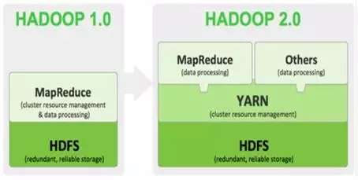

# 第三章 Hadoop是什么?

##Hadoop是什么?
* Hadoop是一个开源的框架，可编写和运行分布式应用处理大规模数据，是专为离线和大规模数据分析而设计的，并不适合那种对几个记录随机读写的在线事务处理模式。Hadoop=HDFS（文件系统，数据存储技术相关）+ Mapreduce（数据处理），Hadoop的数据来源可以是任何形式，在处理半结构化和非结构化数据上与关系型数据库相比有更好的性能，具有更灵活的处理能力，不管任何数据形式最终会转化为key/value，key/value是基本数据单元。用函数式变成Mapreduce代替SQL，SQL是查询语句，而Mapreduce则是使用脚本和代码，而对于适用于关系型数据库，习惯SQL的Hadoop有开源工具hive代替。
* Hadoop就是一个分布式计算的解决方案.

## hadoop能做什么？
* 
hadoop擅长日志分析，facebook就用Hive来进行日志分析，2009年时facebook就有非编程人员的30%的人使用HiveQL进行数据分析；淘宝搜索中的自定义筛选也使用的Hive；利用Pig还可以做高级的数据处理，包括Twitter、LinkedIn上用于发现您可能认识的人，可以实现类似Amazon.com的协同过滤的推荐效果。淘宝的商品推荐也是！在Yahoo！的40%的Hadoop作业是用pig运行的，包括垃圾邮件的识别和过滤，还有用户特征建模。（2012年8月25新更新，天猫的推荐系统是hive，少量尝试mahout！）

> 从现在企业的使用趋势来看,Pig慢慢有点从企业的视野中淡化了.

##Hadoop的版本演进
当前Hadoop有两大版本：Hadoop 1.0和Hadoop 2.0，如下图所示。 

Hadoop版本演进图  

&#160; &#160; &#160; &#160;Hadoop1.0被称为第一代Hadoop，由分布式文件系统HDFS和分布式计算框架MapReduce组成，其中，HDFS由一个NameNode和多个DataNode组成，MapReduce由一个JobTracker和多个TaskTracker组成，对应Hadoop版本为0.20.x、0.21.X，0.22.x和Hadoop 1.x。其中0.20.x是比较稳定的版本，最后演化为1. x，变成稳定版本。0.21.x和0.22.x则增加了NameNode HA等新特性。

&#160; &#160; &#160; &#160;第二代Hadoop被称为Hadoop2.0，是为克服Hadoop 1.0中HDFS和MapReduce存在的各种问题而提出的，对应Hadoop版本为Hadoop 0.23.x和2.x。

&#160; &#160; &#160; &#160;针对Hadoop1.0中NameNode HA不支持自动切换且切换时间过长的风险，Hadoop2.0提出了基于共享存储的HA方式，支持失败自动切换切回。

&#160; &#160; &#160; &#160;针对Hadoop 1.0中的单NameNode制约HDFS的扩展性问题，提出了HDFS Federation机制，它允许多个NameNode各自分管不同的命名空间进而实现数据访问隔离和集群横向扩展。

&#160; &#160; &#160; &#160;针对Hadoop 1.0中的MapReduce在扩展性和多框架支持方面的不足，提出了全新的资源管理框架YARN，它将JobTracker中的资源管理和作业控制功能分开，分别由组件ResourceManager和ApplicationMaster实现。其中，ResourceManager负责所有应用程序的资源分配，而ApplicationMaster仅负责管理一个应用程序。相比于 Hadoop 1.0，Hadoop 2.0框架具有更好的扩展性、可用性、可靠性、向后兼容性和更高的资源利用率以及能支持除了MapReduce计算框架外的更多的计算框架，Hadoop 2.0目前是业界主流使用的Hadoop版本。

##Hadoop的使用场景

项目一：数据整合

&#160; &#160; &#160; &#160;称之为“企业级数据中心”或“数据湖”，这个想法是你有不同的数据源，你想对它们进行数据分析。这类项目包括从所有来源获得数据源（实时或批处理）并且把它们存储在hadoop中。有时，这是成为一个“数据驱动的公司”的第一步；有时，或许你仅仅需要一份漂亮的报告。“企业级数据中心”通常由HDFS文件系统和HIVE或IMPALA中的表组成。未来，HBase和Phoenix在大数据整合方面将大展拳脚，打开一个新的局面，创建出全新的数据美丽新世界。

&#160; &#160; &#160; &#160;销售人员喜欢说“读模式”，但事实上，要取得成功，你必须清楚的了解自己的用例将是什么（Hive模式不会看起来与你在企业数据仓库中所做的不一样）。真实的原因是一个数据湖比Teradata和Netezza公司有更强的水平扩展性和低得多的成本。许多人在做前端分析时使用Tabelu和Excel。许多复杂的公司以“数据科学家”用Zeppelin或IPython笔记本作为前端。

项目二：专业分析

&#160; &#160; &#160; &#160;许多数据整合项目实际上是从你特殊的需求和某一数据集系统的分析开始的。这些往往是令人难以置信的特定领域，如在银行领域的流动性风险/蒙特卡罗模拟分析。在过去，这种专业的分析依赖于过时的，专有的软件包，无法扩大数据的规模经常遭受一个有限的功能集（大部分是因为软件厂商不可能像专业机构那样了解的那么多）。

&#160; &#160; &#160; &#160;在Hadoop和Spark的世界，看看这些系统大致相同的数据整合系统，但往往有更多的HBase，定制非SQL代码，和更少的数据来源（如果不是唯一的）。他们越来越多地以Spark为基础。

项目三：Hadoop作为一种服务

&#160; &#160; &#160; &#160;在“专业分析”项目的任何大型组织（讽刺的是，一个或两个“数据整理”项目）他们会不可避免地开始感觉“快乐”（即，疼痛）管理几个不同配置的Hadoop集群，有时从不同的供应商。接下来，他们会说，“也许我们应该整合这些资源池，”而不是大部分时间让大部分节点处于资源闲置状态。它们应该组成云计算，但许多公司经常会因为安全的原因（内部政治和工作保护）不能或不会。这通常意味着很多Docker容器包。

项目四：流分析

&#160; &#160; &#160; &#160;很多人会把这个“流”，但流分析是不同的，从设备流。通常，流分析是一个组织在批处理中的实时版本。以反洗钱和欺诈检测：为什么不在交易的基础上，抓住它发生而不是在一个周期结束？同样的库存管理或其他任何。

&#160; &#160; &#160; &#160;在某些情况下，这是一种新的类型的交易系统，分析数据位的位，因为你将它并联到一个分析系统中。这些系统证明自己如Spark或Storm与Hbase作为常用的数据存储。请注意，流分析并不能取代所有形式的分析，对某些你从未考虑过的事情而言，你仍然希望分析历史趋势或看过去的数据。

项目五：复杂事件处理

&#160; &#160; &#160; &#160;在这里，我们谈论的是亚秒级的实时事件处理。虽然还没有足够快的超低延迟（皮秒或纳秒）的应用，如高端的交易系统，你可以期待毫秒响应时间。例子包括对事物或事件的互联网电信运营商处理的呼叫数据记录的实时评价。有时，你会看到这样的系统使用Spark和HBase——但他们一般落在他们的脸上，必须转换成Storm，这是基于由LMAX交易所开发的干扰模式。

&#160; &#160; &#160; &#160;在过去，这样的系统已经基于定制的消息或高性能，从货架上，客户端-服务器消息产品-但今天的数据量太多了。我还没有使用它，但Apex项目看起来很有前途，声称要比Storm快。

项目六：ETL流

&#160; &#160; &#160; &#160;有时你想捕捉流数据并把它们存储起来。这些项目通常与1号或2号重合，但增加了各自的范围和特点。（有些人认为他们是4号或5号，但他们实际上是在向磁盘倾倒和分析数据。），这些几乎都是Kafka和Storm项目。Spark也使用，但没有理由，因为你不需要在内存分析。

项目七：更换或增加SAS

&#160; &#160; &#160; &#160;SAS是精细，是好的但SAS也很贵，我们不需要为你的数据科学家和分析师买存储你就可以“玩”数据。此外，除SAS可以做或产生漂亮的图形分析外，你还可以做一些不同的事情。这是你的“数据湖”。这里是IPython笔记本（现在）和Zeppelin（以后）。我们用SAS存储结果。

&#160; &#160; &#160; &#160;当我每天看到其他不同类型的Hadoop，Spark，或Storm项目，这些都是正常的。如果你使用Hadoop，你可能了解它们。几年前我已经实施了这些项目中的部分案例，使用的是其它技术。
&#160; &#160; &#160; &#160;如果你是一个老前辈太害怕“大”或“做”大数据Hadoop，不要担心。事情越变越多，但本质保持不变。你会发现很多相似之处的东西你用来部署和时髦的技术都是围绕Hadooposphere旋转的。

###举个例子
设想一下这样的应用场景.  
&#160; &#160; &#160; &#160;我有一个100M的数据库备份的sql文件.我现在想在不导入到数据库的情况下直接用grep操作通过正则过滤出我想要的内容。  
&#160; &#160; &#160; &#160;例如：某个表中 含有相同关键字的记录那么有几种方式.
* 用linux的命令grep
* 通过编程来读取文件,然后对每行数据进行正则匹配得到结果好了现在是100M的数据库备份.

上述两种方法都可以轻松应对.  
&#160; &#160; &#160; &#160;那么如果是1G,1T甚至1PB的数据呢,上面2种方法还能行得通吗？ 

&#160; &#160; &#160; &#160;答案是不能.毕竟单台服务器的性能总有其上限.那么对于这种超大数据文件怎么得到我们想要的结果呢？

&#160; &#160; &#160; &#160;有种方法 就是分布式计算,分布式计算的核心就在于利用分布式算法把运行在单台机器上的程序扩展到多台机器上并行运行.从而使数据处理能力成倍增加.但是这种分布式计算一般对编程人员要求很高,而且对服务器也有要求.导致了成本变得非常高.

&#160; &#160; &#160; &#160;Haddop 就是为了解决这个问题诞生的.Haddop 可以很轻易的把 很多linux的廉价pc组成分布式结点,然后编程人员也不需要知道分布式算法之类,只需要根据mapreduce的规则定义好接口方法,剩下的就交给Haddop. 它会自动把相关的计算分布到各个结点上去,然后得出结果.

&#160; &#160; &#160; &#160;例如上述的例子 ： Hadoop 要做的事 首先把 1PB的数据文件导入到HDFS中,然后编程人员定义好map和reduce,也就是把文件的行定义为key,每行的内容定义为value , 然后进行正则匹配,匹配成功则把结果 通过reduce聚合起来返回.Hadoop 就会把这个程序分布到N 个结点去并行的操作.
那么原本可能需要计算好几天,在有了足够多的结点之后就可以把时间缩小到几小时之内.

&#160; &#160; &#160; &#160;这也就是所谓的 大数据 云计算了.如果还是不懂的话再举个简单的例子比如  1亿个  1 相加 得出计算结果, 我们很轻易知道结果是1亿.但是计算机不知道.那么单台计算机处理的方式做一个一亿次的循环每次结果+1那么分布式的处理方式则变成我用1万台计算机,每个计算机只需要计算 1万个 1 相加然后再有一台计算机把1万台计算机得到的结果再相加从而得到最后的结果.

&#160; &#160; &#160; &#160;理论上讲,计算速度就提高了1万倍.当然上面可能是一个不恰当的例子.但所谓分布式,大数据,云计算大抵也就是这么回事了.

##引用一篇腾讯大数据的文章
&#160; &#160; &#160; &#160;大数据本身是个很宽泛的概念，Hadoop生态圈（或者泛生态圈）基本上都是为了处理超过单机尺度的数据处理而诞生的。你可以把它比作一个厨房所需要的各种工具。锅碗瓢盆，各有各的用处，互相之间又有重合。你可以用汤锅直接当碗吃饭喝汤，你可以用小刀或者刨子去皮。但是每个工具有自己的特性，虽然奇怪的组合也能工作，但是未必是最佳选择。

### 大数据，首先你要能存的下大数据

&#160; &#160; &#160; &#160;传统的文件系统是单机的，不能横跨不同的机器。HDFS（Hadoop Distributed FileSystem）的设计本质上是为了大量的数据能横跨成百上千台机器，但是你看到的是一个文件系统而不是很多文件系统。比如你说我要获取/hdfs/tmp/file1的数据，你引用的是一个文件路径，但是实际的数据存放在很多不同的机器上。你作为用户，不需要知道这些，就好比在单机上你不关心文件分散在什么磁道什么扇区一样。HDFS为你管理这些数据。  
&#160; &#160; &#160; &#160;存下的数据之后，你就开始考虑怎么处理数据。虽然HDFS可以为你整体管理不同机器上的数据，但是这些数据太大了。一台机器读取成T上P的数据（很大的数据哦，比整个东京热有史以来所有高清电影的大小甚至更大），一台机器慢慢跑也许需要好几天甚至好几周。对于很多公司来说，单机处理是不可忍受的，比如微博要更新24小时热博，它必须在24小时之内跑完这些处理。那么我如果要用很多台机器处理，我就面临了如何分配工作，如果一台机器挂了如何重新启动相应的任务，机器之间如何互相通信交换数据以完成复杂的计算等等。这就是MapReduce/ Tez/Spark的功能。
  
  &#160; &#160; &#160; &#160;MapReduce是第一代计算引擎，Tez和Spark是第二代。MapReduce的设计，采用了很简化的计算模型，只有Map和Reduce两个计算过程（中间用Shuffle串联），用这个模型，已经可以处理大数据领域很大一部分问题了。

### 那什么是Map什么是Reduce？

&#160; &#160; &#160; &#160;考虑如果你要统计一个巨大的文本文件存储在类似HDFS上，你想要知道这个文本里各个词的出现频率。你启动了一个MapReduce程序。Map阶段，几百台机器同时读取这个文件的各个部分，分别把各自读到的部分分别统计出词频，产生类似（hello, 12100次），（world，15214次）等等这样的Pair（我这里把Map和Combine放在一起说以便简化）；这几百台机器各自都产生了如上的集合，然后又有几百台机器启动Reduce处理。Reducer机器A将从Mapper机器收到所有以A开头的统计结果，机器B将收到B开头的词汇统计结果（当然实际上不会真的以字母开头做依据，而是用函数产生Hash值以避免数据串化。因为类似X开头的词肯定比其他要少得多，而你不希望数据处理各个机器的工作量相差悬殊）。然后这些Reducer将再次汇总，（hello，12100）＋（hello，12311）＋（hello，345881）= （hello，370292）。每个Reducer都如上处理，你就得到了整个文件的词频结果。    
&#160; &#160; &#160; &#160;这看似是个很简单的模型，但很多算法都可以用这个模型描述了。Map＋Reduce的简单模型很黄很暴力，虽然好用，但是很笨重。第二代的Tez和Spark除了内存Cache之类的新feature，本质上来说，是让Map/Reduce模型更通用，让Map和Reduce之间的界限更模糊，数据交换更灵活，更少的磁盘读写，以便更方便地描述复杂算法，取得更高的吞吐量。  
&#160; &#160; &#160; &#160;有了MapReduce，Tez和Spark之后，程序员发现，MapReduce的程序写起来真麻烦。他们希望简化这个过程。这就好比你有了汇编语言，虽然你几乎什么都能干了，但是你还是觉得繁琐。你希望有个更高层更抽象的语言层来描述算法和数据处理流程。于是就有了Pig和Hive。Pig是接近脚本方式去描述MapReduce，Hive则用的是SQL。它们把脚本和SQL语言翻译成MapReduce程序，丢给计算引擎去计算，而你就从繁琐的MapReduce程序中解脱出来，用更简单更直观的语言去写程序了。  
&#160; &#160; &#160; &#160;有了Hive之后，人们发现SQL对比Java有巨大的优势。一个是它太容易写了。刚才词频的东西，用SQL描述就只有一两行，MapReduce写起来大约要几十上百行。而更重要的是，非计算机背景的用户终于感受到了爱：我也会写SQL！于是数据分析人员终于从乞求工程师帮忙的窘境解脱出来，工程师也从写奇怪的一次性的处理程序中解脱出来。大家都开心了。Hive逐渐成长成了大数据仓库的核心组件。甚至很多公司的流水线作业集完全是用SQL描述，因为易写易改，一看就懂，容易维护。  
&#160; &#160; &#160; &#160;自从数据分析人员开始用Hive分析数据之后，它们发现，Hive在MapReduce上跑，太慢了！流水线作业集也许没啥关系，比如24小时更新的推荐，反正24小时内跑完就算了。但是数据分析，人们总是希望能跑更快一些。比如我希望看过去一个小时内多少人在可穿戴手环页面驻足，分别停留了多久，对于一个巨型网站海量数据下，这个处理过程也许要花几十分钟甚至很多小时。而这个分析也许只是你万里长征的第一步，你还要看多少人浏览了电子产品多少人看了拉赫曼尼诺夫的CD，以便跟老板汇报，我们的用户是屌丝男闷骚女更多还是文艺青年／少女更多。你无法忍受等待的折磨，只能跟工程师说，快，快，再快一点！  
&#160; &#160; &#160; &#160;于是Impala，Presto，Drill诞生了（当然还有无数非著名的交互SQL引擎，就不一一列举了）。三个系统的核心理念是，MapReduce引擎太慢，因为它太通用，太强壮，太保守，我们SQL需要更轻量，更激进地获取资源，更专门地对SQL做优化，而且不需要那么多容错性保证（因为系统出错了大不了重新启动任务，如果整个处理时间更短的话，比如几分钟之内）。这些系统让用户更快速地处理SQL任务，牺牲了通用性稳定性等特性。如果说MapReduce是大砍刀，砍啥都不怕，那上面三个就是剔骨刀，灵巧锋利，但是不能搞太大太硬的东西。  
&#160; &#160; &#160; &#160;这些系统，说实话，一直没有达到人们期望的流行度。因为这时候又两个异类被造出来了。他们是Hive on Tez /Spark和SparkSQL。它们的设计理念是，MapReduce慢，但是如果我用新一代通用计算引擎Tez或者Spark来跑SQL，那我就能跑的更快。而且用户不需要维护两套系统。这就好比如果你厨房小，人又懒，对吃的精细程度要求有限，那你可以买个电饭煲，能蒸能煲能烧，省了好多厨具。
上面的介绍，基本就是一个数据仓库的构架了。底层HDFS，上面跑MapReduce／Tez／Spark，在上面跑Hive，Pig。或者HDFS上直接跑Impala，Drill，Presto。这解决了中低速数据处理的要求。

### 那如果我要更高速的处理呢？
&#160; &#160; &#160; &#160;如果我是一个类似微博的公司，我希望显示不是24小时热博，我想看一个不断变化的热播榜，更新延迟在一分钟之内，上面的手段都将无法胜任。于是又一种计算模型被开发出来，这就是Streaming（流）计算。Storm是最流行的流计算平台。流计算的思路是，如果要达到更实时的更新，我何不在数据流进来的时候就处理了？比如还是词频统计的例子，我的数据流是一个一个的词，我就让他们一边流过我就一边开始统计了。流计算很牛逼，基本无延迟，但是它的短处是，不灵活，你想要统计的东西必须预先知道，毕竟数据流过就没了，你没算的东西就无法补算了。因此它是个很好的东西，但是无法替代上面数据仓库和批处理系统。  
&#160; &#160; &#160; &#160;还有一个有些独立的模块是KV Store，比如Cassandra，HBase，MongoDB以及很多很多很多很多其他的（多到无法想象）。所以KV Store就是说，我有一堆键值，我能很快速滴获取与这个Key绑定的数据。比如我用身份证号，能取到你的身份数据。这个动作用MapReduce也能完成，但是很可能要扫描整个数据集。而KV Store专用来处理这个操作，所有存和取都专门为此优化了。从几个P的数据中查找一个身份证号，也许只要零点几秒。这让大数据公司的一些专门操作被大大优化了。比如我网页上有个根据订单号查找订单内容的页面，而整个网站的订单数量无法单机数据库存储，我就会考虑用KV Store来存。KV Store的理念是，基本无法处理复杂的计算，大多没法JOIN，也许没法聚合，没有强一致性保证（不同数据分布在不同机器上，你每次读取也许会读到不同的结果，也无法处理类似银行转账那样的强一致性要求的操作）。但是丫就是快。极快。  
&#160; &#160; &#160; &#160;每个不同的KV Store设计都有不同取舍，有些更快，有些容量更高，有些可以支持更复杂的操作。必有一款适合你。
除此之外，还有一些更特制的系统／组件，比如Mahout是分布式机器学习库，Protobuf是数据交换的编码和库，ZooKeeper是高一致性的分布存取协同系统，等等。
有了这么多乱七八糟的工具，都在同一个集群上运转，大家需要互相尊重有序工作。所以另外一个重要组件是，调度系统。现在最流行的是Yarn。你可以把他看作中央管理，好比你妈在厨房监工，哎，你妹妹切菜切完了，你可以把刀拿去杀鸡了。只要大家都服从你妈分配，那大家都能愉快滴烧菜。
你可以认为，大数据生态圈就是一个厨房工具生态圈。为了做不同的菜，中国菜，日本菜，法国菜，你需要各种不同的工具。而且客人的需求正在复杂化，你的厨具不断被发明，也没有一个万用的厨具可以处理所有情况，因此它会变的越来越复杂。